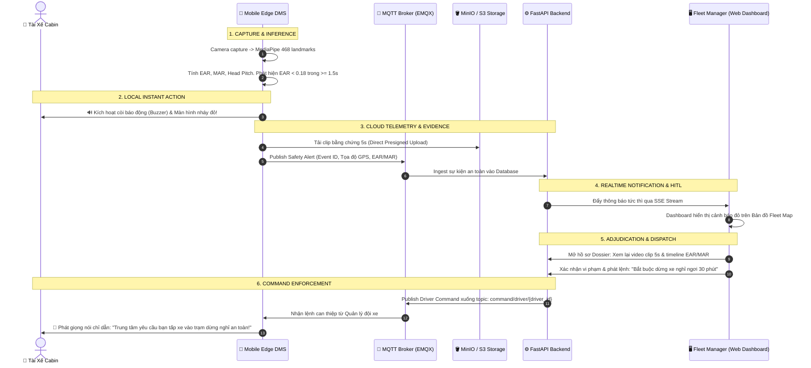

# Kiến Trúc Hệ Thống (Architecture Document) — Đề Tài DEV-02

> **Đề tài:** DriverGuard — Hệ Thống Giám Sát An Toàn Tài Xế & Quản Lý Đội Xe (Driver Monitoring System & Fleet Safety Platform)  
> **Cột mốc:** Gate 2 — Architecture & Pipeline Design  
> **Đội thi:** P-136 (VinAI / AI20K)

---

## 1. Tổng Quan Hệ Thống (System Overview)

DriverGuard là nền tảng an toàn giao thông thông minh end-to-end gồm 2 phân hệ phối hợp chặt chẽ:

1. **Edge DMS (Mobile Device trên cabin xe):** Sử dụng Computer Vision và MediaPipe Face Mesh chạy trực tiếp (Edge Inference) để theo dõi trạng thái tài xế thời gian thực (EAR, MAR, Head Pose), cảnh báo âm thanh tức thì khi phát hiện ngủ gật, mất tập trung.
2. **Central Cloud & Fleet Manager Dashboard (Web App trung tâm):** Hệ thống Backend FastAPI kết hợp MQTT Broker (EMQX) và giao diện Web Dashboard (React/Vite) dành cho Người Quản Lý Đội Xe (Safety Manager) để:
   * Theo dõi vị trí và trạng thái an toàn toàn bộ đội xe theo thời gian thực (Live GPS Map & Fleet KPIs).
   * Tiếp nhận cảnh báo tức thì qua Server-Sent Events (SSE).
   * **Thẩm định vi phạm HITL (Human-in-the-Loop):** Xem lại clip bằng chứng 5s, biểu đồ chuỗi sinh trắc học và gửi lệnh can thiệp (Yêu cầu dừng xe nghỉ ngơi) ngược xuống cabin qua MQTT.

---

## 2. Sơ Đồ Components (Các Thành Phần Hệ Thống)

Sơ đồ phân định rõ ràng giữa **Edge Client (Trên xe)**, **Tầng Truyền Thông & Lưu Trữ**, **Backend Core** và **Fleet Manager Web Dashboard**:

```mermaid
graph TB
    %% PHÂN HỆ 1: CABIN XE
    subgraph Edge_DMS["🚗 PHÂN HỆ CABIN XE (Mobile / Edge Device)"]
        subgraph Input_Module["1. Input Module"]
            CAM["📷 CameraX (Camera Cabin / Webcam)"]
            VIDEO_TEST["🎥 Video File Dataset (Test / Benchmark)"]
        end

        subgraph Processing_Module["2. Vision & Processing Module"]
            PRE_PROC["Tiền Xử Lý: Resize, Luma/Ánh Sáng, Format Bitmap"]
            MEDIAPIPE["🧠 Google MediaPipe FaceLandmarker<br/>(468+ Face Mesh 3D Landmarks)"]
        end

        subgraph AI_Logic_Module["3. AI Logic & Feature Extraction"]
            FEAT_EXT["Khối Trích Xuất (FaceFeatureExtractor)"]
            EAR["👁️ EAR (Eye Aspect Ratio): Mắt Trái / Phải"]
            MAR["👄 MAR (Mouth Aspect Ratio): Ngáp"]
            POSE["📐 Head Pose (Pitch, Yaw, Roll): Gục / Quay Đầu"]
            PERCLOS["⏱️ PERCLOS_3s: Tỉ lệ nhắm mắt 3 giây"]
            DECISION_ENG["⚖️ Decision Engine (DmsDecisionEngine)<br/>So sánh Thresholds & Cửa sổ trượt"]
        end

        subgraph Output_Module["4. Edge Output & Local Action"]
            BUZZER["🔊 Loa Cảnh Báo / Buzzer / Rung (Tức Thì)"]
            OVERLAY_UI["📱 UI Driver App (Viền đỏ, FaceOverlayView)"]
            LOCAL_OUTBOX["💾 SQLite Outbox (Bộ đệm tin cậy QoS 1)"]
        end
    end

    %% PHÂN HỆ 2: TRUYỀN THÔNG & CLOUD STORAGE
    subgraph Transport_Storage["☁️ TẦNG GIAO VẬN & LƯU TRỮ"]
        MQTT_BROKER["📡 EMQX MQTT Broker v5<br/>(Topics: alert/..., command/...)"]
        MINIO_S3["🪣 Object Storage (MinIO / S3)<br/>(Lưu trữ Clip 5s Bằng Chứng Vi Phạm)"]
        DATABASE[("🗄️ Database (PostgreSQL / SQLite)<br/>Users, Vehicles, Alerts, HitlCases")]
    end

    %% PHÂN HỆ 3: BACKEND CORE
    subgraph Backend_Core["⚙️ BACKEND CORE (FastAPI Service)"]
        INGEST["📥 Ingestion Service (MQTT & REST APIs)"]
        HITL_SERVICE["⚖️ HITL Adjudication Service<br/>(Quản lý Case, Lock, Sổ cái Audit Ledger)"]
        SSE_PUSH["⚡ SSE Broadcaster (Đẩy sự kiện Realtime)"]
    end

    %% PHÂN HỆ 4: FLEET MANAGER DASHBOARD
    subgraph Fleet_Dashboard["🖥️ FLEET MANAGER DASHBOARD (Web React / Vite)"]
        MAP_VIEW["🗺️ Bản Đồ Vị Trí Đội Xe (Live Fleet Map & GPS)"]
        KPI_METRICS["📊 Thống Kê An Toàn (Overview KPIs, Vi Phạm)"]
        HITL_REVIEW["🕵️ HITL Review Dossier:<br/>• Xem Clip Video 5s Vi Phạm<br/>• Biểu Đồ Sinh Trắc Học (Timeline EAR/MAR)<br/>• Quyết Định Xử Lý & Ra Lệnh Điều Hành"]
    end

    %% KẾT NỐI LUỒNG
    CAM --> PRE_PROC
    VIDEO_TEST --> PRE_PROC
    PRE_PROC --> MEDIAPIPE
    MEDIAPIPE --> FEAT_EXT

    FEAT_EXT --> EAR
    FEAT_EXT --> MAR
    FEAT_EXT --> POSE
    EAR --> PERCLOS

    EAR --> DECISION_ENG
    MAR --> DECISION_ENG
    POSE --> DECISION_ENG
    PERCLOS --> DECISION_ENG

    DECISION_ENG -->|Kích hoạt cảnh báo| BUZZER
    DECISION_ENG -->|Hiển thị trạng thái| OVERLAY_UI
    DECISION_ENG -->|Ghi nhận sự kiện| LOCAL_OUTBOX

    %% Giao tiếp Edge -> Cloud
    LOCAL_OUTBOX -->|1. Publish Alert (QoS 1)| MQTT_BROKER
    LOCAL_OUTBOX -->|2. Upload Clip 5s (Presigned URL)| MINIO_S3
    
    MQTT_BROKER --> INGEST
    INGEST --> DATABASE
    INGEST --> HITL_SERVICE
    HITL_SERVICE --> DATABASE
    HITL_SERVICE --> SSE_PUSH

    %% Backend -> Dashboard
    SSE_PUSH -->|Realtime Alert Stream| Fleet_Dashboard
    DATABASE <-->|REST APIs| Fleet_Dashboard
    MINIO_S3 -->|Stream Video URL| HITL_REVIEW

    %% Lệnh từ Dashboard ngược về Xe
    HITL_REVIEW -->|Gửi Lệnh Yêu Cầu Nghỉ Ngơi| HITL_SERVICE
    HITL_SERVICE -->|Publish Command| MQTT_BROKER
    MQTT_BROKER -->|Nhận lệnh can thiệp| LOCAL_OUTBOX
    LOCAL_OUTBOX -->|Phát lệnh dừng nghỉ| BUZZER
```

---

## 3. Sơ Đồ Luồng Dữ Liệu Chi Tiết (End-to-End Data Flow)

Chu trình khép kín từ lúc phát hiện tài xế nhắm mắt $\rightarrow$ cảnh báo cabin $\rightarrow$ báo động trung tâm điều hành $\rightarrow$ Quản lý đội xe can thiệp:



---

## 4. Chi Tiết Các Khối Chức Năng (Detailed Modules)

| Phân hệ / Khối | Công nghệ / File thực tế | Chức năng cụ thể |
| :--- | :--- | :--- |
| **Input Module** | Android CameraX (`DmsCameraManager.java`) | Thu nhận luồng hình ảnh 30 FPS từ camera góc rộng cabin xe, hỗ trợ tự động bù sáng. |
| **Vision & Detection** | Google MediaPipe Vision Tasks (`face_landmarker.task`) | Trích xuất 468 tọa độ điểm 3D trên mặt, hoạt động mượt mà với độ trễ cực thấp (< 25ms/frame). |
| **AI Logic & Decision** | `FaceFeatureExtractor.java`, `DmsDecisionEngine.java` | • Tính chỉ số hình học: EAR (mắt), MAR (miệng), Head Pose (Pitch/Yaw/Roll).<br/>• Thuật toán PERCLOS_3s lọc bỏ chớp mắt sinh lý, chỉ kích hoạt khi buồn ngủ thật sự. |
| **Edge Action & Outbox** | `FaceOverlayView.java`, SQLite Outbox | Cảnh báo bằng âm thanh/rung ngay tức khắc (không phụ thuộc mạng); lưu trữ sự kiện vào SQLite Outbox đảm bảo không mất dữ liệu (QoS 1). |
| **IoT Gateway & Storage** | EMQX MQTT v5, MinIO / S3 S3-compatible | Cầu nối truyền tin nhẹ hai chiều (Telemetry lên, Lệnh xuống); lưu trữ clip 5s với chính sách tự động xóa sau 24h (TTL lifecycle). |
| **Backend Core** | FastAPI (`src/api/hitl.py`, `src/services/`) | Quản lý danh mục xe/tài xế, lưu trữ sổ cái an toàn bất biến (Audit Ledger với SHA-256 HMAC), phân phối sự kiện SSE. |
| **Fleet Manager Dashboard** | React, Vite (`web/src/pages/DashboardPage.jsx`, `web/src/components/hitl/`) | Giao diện tập trung: Bản đồ giám sát vị trí đội xe, bảng điều khiển sự cố, màn hình duyệt hồ sơ HITL (video + biểu đồ sinh trắc 5s), nút phát lệnh can thiệp. |

---

## 5. Tham Số Ngưỡng An Toàn (Thresholds Standard)

Hệ thống cho phép cấu hình linh hoạt từ Dashboard và đồng bộ tới toàn bộ đội xe:

```json
{
  "THRESHOLD_EAR_DROWSY": 0.18,
  "THRESHOLD_MAR_YAWN": 0.65,
  "THRESHOLD_HEAD_PITCH_NOD": -20.0,
  "THRESHOLD_PERCLOS_3S": 0.40,
  "SPEED_EXPRESSWAY_MIN": 70.0,
  "S3_VIDEO_TTL_HOURS": 24
}
```

* **Ngủ gật (Drowsiness):** $\text{EAR} < 0.18$ trong hơn $1.5$s hoặc $\text{PERCLOS} \ge 40\%$ trong 3s.
* **Ngáp mệt mỏi (Yawn):** $\text{MAR} > 0.65$ duy trì hơn $2.0$s.
* **Gục đầu (Head Nod):** $\text{Pitch} < -20^\circ$ (tài xế cúi gập đầu).

---

> [!NOTE]
> **Về công cụ AI Logging (`.ai-log/` - Phoenix Hook):**  
> Đây là công cụ phục vụ việc giám sát quy trình phát triển mã nguồn của học viên theo yêu cầu của ban tổ chức khóa học AI20K, hoàn toàn độc lập với luồng vận hành sản phẩm (Runtime System) của DriverGuard.
