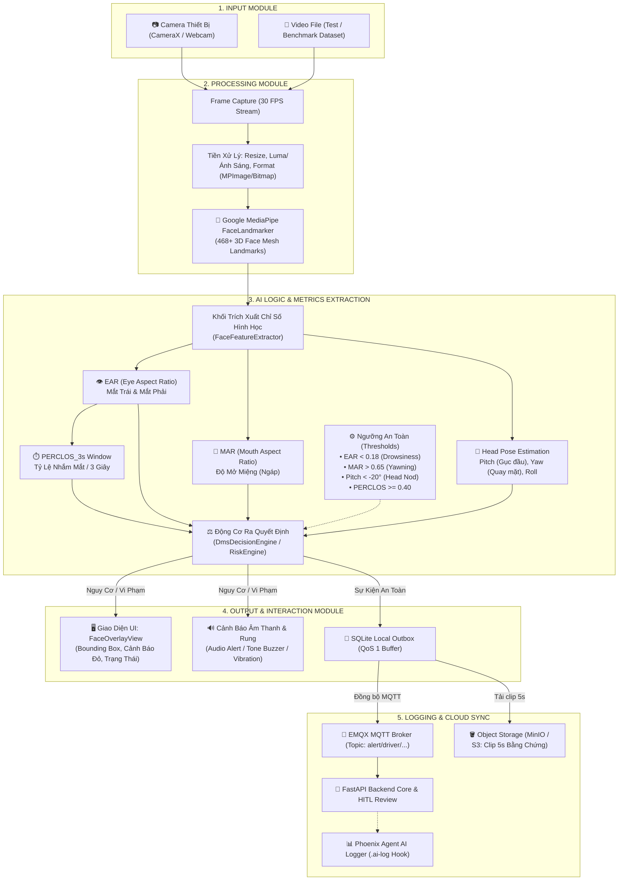
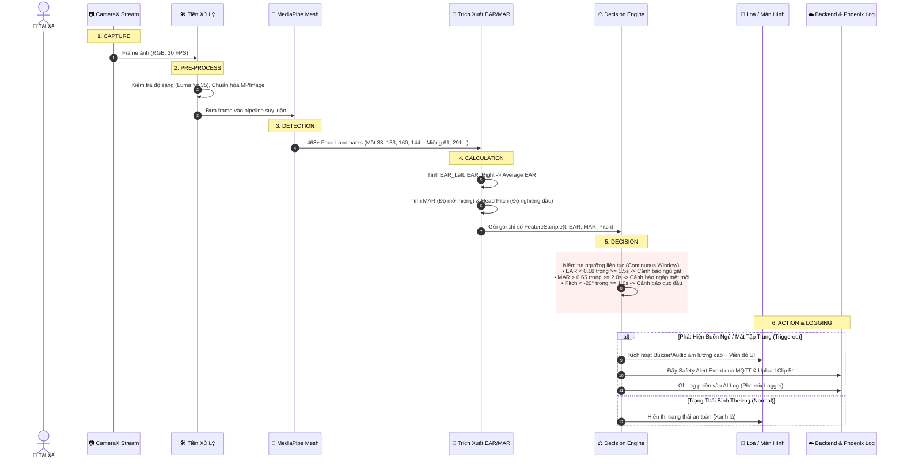

# Kiến Trúc Hệ Thống (Architecture Document) — Đề Tài DEV-02

> **Đề tài:** DriverGuard — Hệ thống Cảnh báo Ngủ gật và Mất tập trung Tài xế (Driver Monitoring System - DMS)  
> **Cột mốc:** Gate 2 — Architecture & Pipeline Design  
> **Đội thi:** P-136 (VinAI / AI20K)

---

## 1. Tổng Quan Hệ Thống (System Overview)

DriverGuard là hệ thống giám sát an toàn tài xế thông minh (DMS) kết hợp giữa **Edge AI (Inference trực tiếp trên thiết bị di động/camera gắn trên xe)** và **Cloud Management (Giám sát đội xe tập trung qua Backend FastAPI & MQTT Broker)**. 

Hệ thống theo dõi liên tục khuôn mặt tài xế trong thời gian thực qua Camera, trích xuất các điểm mốc sinh trắc học (Face Mesh Landmarks) để phát hiện sớm các dấu hiệu buồn ngủ (nhắm mắt kéo dài EAR, ngáp nhiều lần MAR, gục đầu Head Pitch), từ đó lập tức kích hoạt cảnh báo âm thanh đa tầng trên cabin xe và đồng bộ dữ liệu vi phạm về trung tâm điều hành.

---

## 2. Sơ Đồ Components (Các Thành Phần Hệ Thống)

Sơ đồ thể hiện đầy đủ các khối chức năng từ Input, Xử lý thị giác máy tính, Mô hình AI/Logic phán đoán, đến Output và Hệ thống ghi log.



---

## 3. Sơ Đồ Luồng Dữ Liệu (Data Flow)

Mô tả chi tiết 6 bước xử lý từ khi camera thu nhận frame ảnh cho đến khi kích hoạt cảnh báo và đồng bộ nhật ký:



---

## 4. Bảng Chi Tiết Từng Khối Chức Năng (Component Details)

| Module | Công nghệ / Thư viện | Nhiệm vụ chính trong code |
| :--- | :--- | :--- |
| **Input Module** | Android CameraX / Camera2 / Video File | Cung cấp luồng khung hình độ trễ thấp (30 FPS), tự động điều chỉnh tiêu cự và phơi sáng. |
| **Processing Module** | Google MediaPipe Vision Tasks (`face_landmarker.task`), BitmapImageBuilder | Phát hiện vùng mặt, trích xuất 468 tọa độ điểm 3D (Landmarks) trong thời gian thực (< 25ms/frame trên mobile). |
| **AI Logic / Feature Extractor** | `FaceFeatureExtractor.java`, `RiskEngine.java` | • **EAR (Eye Aspect Ratio):** Tính toán độ mở mi mắt qua khoảng cách Euclidean.<br/>• **MAR (Mouth Aspect Ratio):** Tính tỷ lệ mở miệng theo chiều dọc/ngang.<br/>• **Head Pose:** Trích xuất góc nghiêng (Pitch) qua ma trận biến đổi không gian. |
| **Decision Module** | `DmsDecisionEngine.java` | Áp dụng cửa sổ trượt thời gian (Sliding Window / PERCLOS_3s) để lọc bỏ chớp mắt tự nhiên (~200ms) và chỉ báo động khi nhắm mắt kéo dài. |
| **Output Module** | `FaceOverlayView.java`, Android SoundPool / MediaPlayer | Phát tín hiệu âm thanh tần số cao (Buzzer/Tone), rung phản hồi và vẽ bounding box trực quan cho tài xế. |
| **Cloud & Logging** | Paho MQTT v5, FastAPI, SQLite Outbox, Phoenix Hook | Đảm bảo tính tin cậy (QoS 1, lưu SQLite khi mất mạng) và gửi toàn bộ dữ liệu phiên chạy về hệ sinh thái chấm điểm Phoenix. |

---

## 5. Bảng Tham Số Ngưỡng Nghiệp Vụ (Safety Thresholds)

Các thông số này được cấu hình tập trung tại backend và đồng bộ xuống ứng dụng:

```json
{
  "THRESHOLD_EAR_DROWSY": 0.18,
  "THRESHOLD_MAR_YAWN": 0.65,
  "THRESHOLD_HEAD_PITCH_NOD": -20.0,
  "THRESHOLD_PERCLOS_3S": 0.40,
  "SPEED_EXPRESSWAY_MIN": 70.0,
  "S3_VIDEO_TTL_HOURS": 24
}
```

* **Mắt nhắm (Drowsiness):** $\text{EAR} < 0.18$ trong hơn $1.5$ giây hoặc $\text{PERCLOS} \ge 40\%$ trong cửa sổ 3 giây.
* **Ngáp (Yawn):** $\text{MAR} > 0.65$ duy trì hơn $2.0$ giây.
* **Gục đầu (Head Nod):** $\text{Pitch} < -20^\circ$ (đầu chúi xuống vô lăng).
