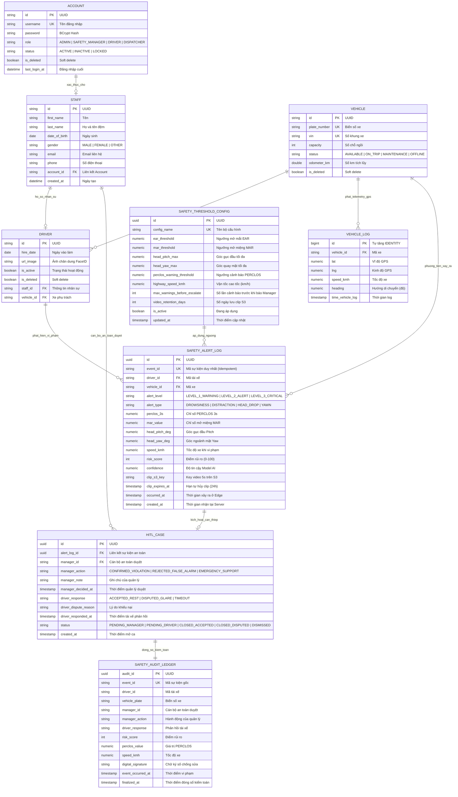

# BẢN THIẾT KẾ CƠ SỞ DỮ LIỆU HỆ THỐNG DRIVERGUARD

## (DriverGuard Master Database Architecture & Design Specification)

> **Phiên bản:** 3.0 Master Standard  
> **Hệ quản trị CSDL mục tiêu:** PostgreSQL 16+ (PostGIS & Time-series Partitioning)  
> **Quy mô đáp ứng:** 100.000 phương tiện kết nối đồng thời qua giao thức MQTT over TLS  
> **Căn cứ thiết kế:**
>
> - [00_DRIVERGUARD_MASTER_AI_CONTEXT.md](file:///c:/Users/Phung%20Quoc%20Viet/Desktop/AI_in_Action/Detect_APP/00_DRIVERGUARD_MASTER_AI_CONTEXT.md) (Quy tắc bất biến & 5 bài toán thực tế)
> - [PRD_DriverGuard.md](file:///c:/Users/Phung%20Quoc%20Viet/Desktop/AI_in_Action/Detect_APP/PRD_DriverGuard.md) (Yêu cầu chức năng FR-01 -> FR-06 & NFR)
> - [Mentor_require.md](file:///c:/Users/Phung%20Quoc%20Viet/Desktop/AI_in_Action/Detect_APP/Mentor_require.md) (Biên bản Mentor Private 2: Ngưỡng động, Audit log, S3 retention)
> - [chia viec 4 ae.md](file:///c:/Users/Phung%20Quoc%20Viet/Desktop/AI_in_Action/Detect_APP/chia%20viec%204%20ae.md) (Phân rã nghiệp vụ & tinh giản schema non-MVP)

---

## 1. TỔNG QUAN TRIẾT LÝ THIẾT KẾ & TẠI SAO LẠI CÓ KIẾN TRÚC NÀY?

### 1.1. Bối cảnh chuyển đổi kiến trúc (Loại bỏ các bảng dư thừa xe buýt)

Trước đây, hệ thống có chứa các bảng như `route`, `stop`, `route_stop`, `trip_progress`, `address`, `license_class` (mô hình tuyến xe buýt công cộng cố định). Theo chỉ đạo chiến lược từ Mentor và bản PRD v3.0, nhóm đã thực hiện migration (`V1__remove_non_mvp_schema.sql`) để **loại bỏ hoàn toàn các bảng rác không thuộc Core Safety**, chuyển hướng toàn lực sang **Nền tảng Giám sát An toàn Đội xe Taxi Công nghệ (Connected Fleet IoT & Edge AI)**.

### 1.2. Giải thích chi tiết: Vì sao lại có những bảng này?

Mỗi bảng trong cơ sở dữ liệu DriverGuard được sinh ra để giải quyết chính xác một bài toán thực tế buồng lái và đáp ứng đúng các nguyên tắc bất biến của hệ thống:

```
┌────────────────────────────────────────────────────────────────────────────────────────┐
│                   MỐI LIÊN HỆ GIỮA 5 BÀI TOÁN THỰC TẾ VÀ CÁC BẢNG CSDL                  │
├────────────────────────────────┬───────────────────────────────────────────────────────┤
│ BÀI TOÁN THỰC TẾ BUỒNG LÁI     │ BẢNG CƠ SỞ DỮ LIỆU GIẢI QUYẾT                         │
├────────────────────────────────┼───────────────────────────────────────────────────────┤
│ 1. Tai nạn trong tích tắc      │ safety_alert_log (Lưu metadata vi phạm sau khi còi hú)│
│ 2. Cảnh báo sai gây ức chế     │ safety_threshold_config (Cấu hình ngưỡng linh hoạt)   │
│ 3. 100.000 xe làm sập server   │ vehicle_log (Tối ưu kiểu BIGINT, Partition theo tháng)│
│ 4. Bùng nổ chi phí & Đời tư    │ safety_alert_log (Chỉ lưu clip 5s S3, auto-expire 24h)│
│ 5. Tranh chấp & Pháp lý        │ hitl_case (Duyệt 2 cấp) & safety_audit_ledger (3-5 năm)│
└────────────────────────────────┴───────────────────────────────────────────────────────┘
```

1. **Bảng `account` (Tài khoản người dùng):**
   - *Vì sao cần?* Hệ thống phục vụ 3 nhóm đối tượng: Quản trị viên, Cán bộ an toàn (`ADMIN/SAFETY_MANAGER`), Tài xế buồng lái (`DRIVER`), và Nhân viên điều phối (`DISPATCHER`).
   - *Thiết kế:* Tách biệt bảng `account` với bảng thông tin cá nhân (`staff`) nhằm chuẩn hóa bảo mật theo chuẩn Spring Security 6 / JWT, cho phép khóa/mở tài khoản độc lập mà không ảnh hưởng tới dữ liệu hồ sơ.

2. **Bảng `staff` (Hồ sơ nhân sự):**
   - *Vì sao cần?* Cán bộ an toàn (Safety Manager) là người trực tiếp bấm duyệt/bác bỏ các cảnh báo nguy hiểm Cấp 3. Cần lưu trữ danh tính đầy đủ (họ tên, CCCD/ngày sinh, số điện thoại) để xác định rõ trách nhiệm pháp lý khi xảy ra tai nạn giao thông.

3. **Bảng `vehicle` (Phương tiện đội xe):**
   - *Vì sao cần?* Đại diện cho 100.000 xe taxi (như đội xe điện Xanh SM). Quản lý biển số xe, số khung VIN, tình trạng hoạt động và số km tích lũy.

4. **Bảng `driver` (Tài xế buồng lái):**
   - *Vì sao cần?* Là cầu nối giữa con người (`staff`) và phương tiện (`vehicle`).
   - *Đặc thù:* Chứa đường dẫn `url_image` phục vụ thuật toán nhận diện khuôn mặt tài xế (Face ID) khi bắt đầu ca trực, đảm bảo đúng người đúng xe.

5. **Bảng `vehicle_log` (Nhật ký Telemetry GPS):**
   - *Vì sao cần?* Nhận dữ liệu định vị GPS gửi về mỗi 3 giây/lần từ 100.000 xe qua MQTT topic `telemetry/gps/{vehicleId}` chuẩn QoS 0.
   - *Vì sao dùng BIGINT thay vì UUID?* Với 33.000 bản ghi/giây, việc dùng UUID sẽ gây phân mảnh index nghiêm trọng (B-Tree index fragmentation) và làm cạn kiệt RAM. Khóa chính `BIGINT GENERATED ALWAYS AS IDENTITY` giúp việc ghi dữ liệu đạt tốc độ tối đa.

6. **Bảng `safety_alert_log` (Nhật ký sự cố an toàn buồng lái):**
   - *Vì sao cần?* Tiếp nhận gói tin JSON sự cố từ Edge AI qua MQTT QoS 1.
   - *Vì sao lưu chi tiết $PERCLOS, MAR, Head Pitch, Head Yaw, Speed, Risk Score, Confidence$?*
     - Đáp ứng phản biện của Mentor: Không chỉ lưu sự cố ở lần thứ 4 mà phải lưu đầy đủ cả các lần trước đó kèm `confidence` và `timestamp` để phục vụ **Evaluation Report** và phân tích nhân quả.
     - Trường `event_id` đóng vai trò **Idempotency Key** chống trùng lặp dữ liệu khi xe đi qua vùng mất sóng 4G rồi đồng bộ lại (Outbox Sync).
     - Trường `clip_s3_key` và `clip_expires_at`: Chỉ lưu clip 5 giây khi có vi phạm Cấp 3, tự động tiêu hủy sau 24h nhằm bảo vệ quyền riêng tư buồng lái và giữ chi phí S3 $< 20\text{ USD/tháng}$.

7. **Bảng `hitl_case` (Quản lý quy trình can thiệp 2 cấp Human-in-the-Loop):**
   - *Vì sao cần?* Tuân thủ Nguyên tắc bất biến số 3: **AI không có quyền tự động phạt tài xế**.
   - *Cơ chế 2 cấp:*
     - **Cấp 1 (Manager Review):** Lưu quyết định của quản lý an toàn (`CONFIRMED_VIOLATION`, `REJECTED_FALSE_ALARM`, `EMERGENCY_SUPPORT`).
     - **Cấp 2 (Driver Feedback):** Lưu phản hồi của tài xế buồng lái qua ứng dụng di động (`ACCEPTED_REST` - đồng ý nghỉ 30 phút, hoặc `DISPUTED_GLARE` - khiếu nại do chói nắng phản chiếu).
   - Tách riêng bảng này khỏi `safety_alert_log` giúp theo dõi SLA xử lý can thiệp và tránh làm phình bảng log cảnh báo.

8. **Bảng `safety_audit_ledger` (Sổ cái kiểm toán bất biến 3–5 năm):**
   - *Vì sao cần?* Đáp ứng bài toán số 5: Giải quyết tranh chấp lao động và cung cấp chứng cứ cho cơ quan Công an/CSGT hoặc đơn vị bảo hiểm sau tai nạn.
   - *Đặc tính kỹ thuật:*
     - Bảng thiết kế theo chuẩn **WORM (Write Once, Read Many)**: Cấm tuyệt đối thao tác `UPDATE` và `DELETE` thông qua Database Trigger.
     - Lưu trường `digital_signature` (băm toàn bộ dữ liệu sự kiện bằng thuật toán HMAC/SHA-256) đảm bảo không ai, kể cả Admin hệ thống, có thể sửa đổi lịch sử vi phạm.

9. **Bảng `safety_threshold_config` (Cấu hình ngưỡng an toàn linh hoạt):**
   - *Vì sao cần?* Giải quyết triệt để yêu cầu của Mentor trong buổi Private 2: **"Tuyệt đối không hard-code ngưỡng trong code"**.
   - Cho phép điều chỉnh ngưỡng $EAR$ (độ mở mắt), $MAR$ (độ mở miệng ngáp), góc quay đầu, ngưỡng vận tốc cao tốc ($70\text{ km/h}$) và thời gian lưu trữ video ($1\text{ ngày}$ ở MVP, $30 - 90\text{ ngày}$ ở Production) ngay trong cơ sở dữ liệu mà không cần deploy lại ứng dụng.

---

## 2. SƠ ĐỒ THỰC THỂ QUAN HỆ (MERMAID ERD)



---

## 3. TỪ ĐIỂN DỮ LIỆU CHI TIẾT (DATA DICTIONARY)

### 3.1. Phân hệ Định danh & Quản trị Nhân sự (Auth & Identity Management)

#### Bảng `account`

*Quản lý danh tính đăng nhập và phân quyền hệ thống.*

| Tên cột | Kiểu dữ liệu | Nullable | Ràng buộc / Mặc định | Ý nghĩa nghiệp vụ |
| :--- | :--- | :---: | :--- | :--- |
| `id` | `VARCHAR(36)` | NO | `PRIMARY KEY` | Khóa chính dạng UUID |
| `username` | `VARCHAR(64)` | NO | `UNIQUE` | Tên đăng nhập (Mã nhân viên / SĐT) |
| `password` | `VARCHAR(255)` | NO | | Mật khẩu băm chuẩn BCrypt |
| `role` | `VARCHAR(32)` | NO | | Vai trò: `ADMIN`, `SAFETY_MANAGER`, `DRIVER`, `DISPATCHER` |
| `status` | `VARCHAR(32)` | NO | `'ACTIVE'` | Trạng thái: `ACTIVE`, `INACTIVE`, `LOCKED` |
| `is_deleted` | `BOOLEAN` | NO | `FALSE` | Đánh dấu xóa mềm |
| `last_login_at` | `TIMESTAMPTZ` | YES | | Thời gian đăng nhập gần nhất |

#### Bảng `staff`

*Hồ sơ thông tin nhân sự (Cán bộ an toàn, điều hành).*

| Tên cột | Kiểu dữ liệu | Nullable | Ràng buộc / Mặc định | Ý nghĩa nghiệp vụ |
| :--- | :--- | :---: | :--- | :--- |
| `id` | `VARCHAR(36)` | NO | `PRIMARY KEY` | Khóa chính UUID |
| `first_name` | `VARCHAR(64)` | NO | | Tên |
| `last_name` | `VARCHAR(64)` | NO | | Họ và tên đệm |
| `date_of_birth` | `DATE` | NO | | Ngày tháng năm sinh |
| `gender` | `VARCHAR(16)` | YES | | Giới tính: `MALE`, `FEMALE`, `OTHER` |
| `email` | `VARCHAR(128)` | YES | | Thư điện tử |
| `phone` | `VARCHAR(20)` | NO | | Số điện thoại liên lạc |
| `account_id` | `VARCHAR(36)` | YES | `UNIQUE`, `FK(account.id)` | Tài khoản liên kết |
| `created_at` | `TIMESTAMPTZ` | NO | `NOW()` | Thời gian tạo bản ghi |

---

### 3.2. Phân hệ Phương tiện & Tài xế (Fleet & Driver Management)

#### Bảng `vehicle`

*Quản lý danh sách phương tiện đội xe (100.000 xe taxi).*

| Tên cột | Kiểu dữ liệu | Nullable | Ràng buộc / Mặc định | Ý nghĩa nghiệp vụ |
| :--- | :--- | :---: | :--- | :--- |
| `id` | `VARCHAR(36)` | NO | `PRIMARY KEY` | Khóa chính UUID |
| `plate_number` | `VARCHAR(16)` | NO | `UNIQUE` | Biển số xe (ví dụ: `29E-888.99`) |
| `vin` | `VARCHAR(32)` | YES | `UNIQUE` | Số khung phương tiện (VIN) |
| `capacity` | `INT` | YES | `5` | Số chỗ ngồi quy định |
| `status` | `VARCHAR(32)` | NO | `'AVAILABLE'` | Trạng thái: `AVAILABLE`, `ON_TRIP`, `MAINTENANCE`, `OFFLINE` |
| `odometer_km` | `DOUBLE PRECISION` | YES | `0.0` | Số km xe đã vận hành |
| `is_deleted` | `BOOLEAN` | NO | `FALSE` | Xóa mềm |

#### Bảng `driver`

*Hồ sơ tài xế trực tiếp điều khiển phương tiện trên buồng lái.*

| Tên cột | Kiểu dữ liệu | Nullable | Ràng buộc / Mặc định | Ý nghĩa nghiệp vụ |
| :--- | :--- | :---: | :--- | :--- |
| `id` | `VARCHAR(36)` | NO | `PRIMARY KEY` | Khóa chính UUID |
| `staff_id` | `VARCHAR(36)` | NO | `UNIQUE`, `FK(staff.id)` | Hồ sơ nhân sự gốc |
| `vehicle_id` | `VARCHAR(36)` | YES | `FK(vehicle.id)` | Xe đang được phân công |
| `hire_date` | `DATE` | NO | | Ngày ký hợp đồng |
| `url_image` | `TEXT` | YES | | Ảnh chân dung mẫu Face ID |
| `is_active` | `BOOLEAN` | NO | `TRUE` | Có đang hoạt động hay không |
| `is_deleted` | `BOOLEAN` | NO | `FALSE` | Xóa mềm |

---

### 3.3. Phân hệ Telemetry Vận hành (High-throughput GPS Ingestion)

#### Bảng `vehicle_log`

*Nhật ký tọa độ và tốc độ định kỳ qua MQTT QoS 0 (3s/lần).*

| Tên cột | Kiểu dữ liệu | Nullable | Ràng buộc / Mặc định | Ý nghĩa nghiệp vụ |
| :--- | :--- | :---: | :--- | :--- |
| `id` | `BIGINT` | NO | `GENERATED ALWAYS AS IDENTITY` | PK tự tăng (tối ưu hóa B-Tree cho bảng kích thước lớn) |
| `vehicle_id` | `VARCHAR(36)` | NO | `FK(vehicle.id)` | Mã phương tiện |
| `lat` | `NUMERIC(10, 7)` | NO | | Vĩ độ GPS |
| `lng` | `NUMERIC(10, 7)` | NO | | Kinh độ GPS |
| `speed_kmh` | `NUMERIC(5, 2)` | YES | `0.0` | Tốc độ tức thời |
| `heading` | `NUMERIC(5, 2)` | YES | | Góc phương vị la bàn (0° – 360°) |
| `time_vehicle_log` | `TIMESTAMPTZ` | NO | `NOW()` | Thời gian phát sóng telemetry |

---

### 3.4. Phân hệ Giám sát An toàn Edge AI (Safety Events & Alerts)

#### Bảng `safety_alert_log`

*Ghi nhận tất cả các sự cố buồn ngủ / mất tập trung từ buồng lái qua MQTT QoS 1.*

| Tên cột | Kiểu dữ liệu | Nullable | Ràng buộc / Mặc định | Ý nghĩa nghiệp vụ |
| :--- | :--- | :---: | :--- | :--- |
| `id` | `UUID` | NO | `PRIMARY KEY`, `gen_random_uuid()` | Khóa chính |
| `event_id` | `VARCHAR(64)` | NO | `UNIQUE` | Khóa sự kiện duy nhất (Idempotency Key chống trùng lặp) |
| `driver_id` | `VARCHAR(36)` | NO | `FK(driver.id)` | Tài xế vi phạm |
| `vehicle_id` | `VARCHAR(36)` | NO | `FK(vehicle.id)` | Phương tiện xảy ra vi phạm |
| `alert_level` | `VARCHAR(20)` | NO | | Mức: `LEVEL_1_WARNING`, `LEVEL_2_ALERT`, `LEVEL_3_CRITICAL` |
| `alert_type` | `VARCHAR(32)` | NO | | Loại: `DROWSINESS`, `DISTRACTION`, `HEAD_DROP`, `YAWN` |
| `perclos_3s` | `NUMERIC(4, 3)` | NO | | Tỷ lệ nhắm mắt cửa sổ 3s |
| `mar_value` | `NUMERIC(4, 3)` | YES | | Độ mở miệng MAR |
| `head_pitch_deg` | `NUMERIC(5, 2)` | YES | | Góc gục đầu (Pitch $\le -20^\circ$) |
| `head_yaw_deg` | `NUMERIC(5, 2)` | YES | | Góc quay mặt (đã bù trừ taplo) |
| `speed_kmh` | `NUMERIC(5, 2)` | NO | | Vận tốc xe tại thời điểm vi phạm |
| `risk_score` | `INT` | NO | `CHECK (0 <= score <= 100)` | Điểm rủi ro tổng hợp (0 – 100) |
| `confidence` | `NUMERIC(4, 3)` | YES | | Độ tin cậy của thuật toán AI (0.000 – 1.000) |
| `clip_s3_key` | `VARCHAR(255)` | YES | | Đường dẫn lưu clip 5s trên S3 (chỉ có ở Cấp 3) |
| `clip_expires_at` | `TIMESTAMPTZ` | YES | | Hạn xóa vĩnh viễn clip (mặc định sau 24h) |
| `occurred_at` | `TIMESTAMPTZ` | NO | | Thời điểm vi phạm thực tế tại buồng lái |
| `created_at` | `TIMESTAMPTZ` | NO | `NOW()` | Thời điểm lưu vào máy chủ |

---

### 3.5. Phân hệ Quy trình Can thiệp 2 Cấp (2-Tier HITL Interventions)

#### Bảng `hitl_case`

*Theo dõi tiến trình xử lý can thiệp giữa Quản lý an toàn và Tài xế buồng lái.*

| Tên cột | Kiểu dữ liệu | Nullable | Ràng buộc / Mặc định | Ý nghĩa nghiệp vụ |
| :--- | :--- | :---: | :--- | :--- |
| `id` | `UUID` | NO | `PRIMARY KEY`, `gen_random_uuid()` | Khóa chính vụ việc |
| `alert_log_id` | `UUID` | NO | `UNIQUE`, `FK(safety_alert_log.id)` | Sự kiện an toàn kích hoạt |
| `manager_id` | `VARCHAR(36)` | YES | `FK(staff.id)` | Cán bộ an toàn tiếp nhận ca |
| `manager_action` | `VARCHAR(32)` | YES | | Quyết định Cấp 1: `CONFIRMED_VIOLATION`, `REJECTED_FALSE_ALARM`, `EMERGENCY_SUPPORT` |
| `manager_note` | `TEXT` | YES | | Ghi chú của quản lý khi xem clip 5s |
| `manager_decided_at` | `TIMESTAMPTZ` | YES | | Thời điểm quản lý bấm quyết định |
| `driver_response` | `VARCHAR(32)` | YES | | Phản hồi Cấp 2: `ACCEPTED_REST`, `DISPUTED_GLARE`, `TIMEOUT` |
| `driver_dispute_reason` | `TEXT` | YES | | Lý do khiếu nại (ví dụ: "Chói nắng", "Mỏi mắt cơ học") |
| `driver_responded_at` | `TIMESTAMPTZ` | YES | | Thời điểm tài xế bấm nút trên app |
| `status` | `VARCHAR(32)` | NO | `'PENDING_MANAGER'` | Trạng thái vụ việc: `PENDING_MANAGER`, `PENDING_DRIVER`, `CLOSED_ACCEPTED`, `CLOSED_DISPUTED`, `DISMISSED` |
| `created_at` | `TIMESTAMPTZ` | NO | `NOW()` | Thời điểm mở vụ việc |

---

### 3.6. Phân hệ Sổ Cái Kiểm Toán Bất Biến (Immutable Audit Trail / Ledger)

#### Bảng `safety_audit_ledger`

*Lưu vết chứng cứ pháp lý 3–5 năm, không hỗ trợ UPDATE hay DELETE.*

| Tên cột | Kiểu dữ liệu | Nullable | Ràng buộc / Mặc định | Ý nghĩa nghiệp vụ |
| :--- | :--- | :---: | :--- | :--- |
| `audit_id` | `UUID` | NO | `PRIMARY KEY`, `gen_random_uuid()` | Khóa chính sổ cái |
| `event_id` | `VARCHAR(64)` | NO | `UNIQUE` | Khóa sự kiện gốc |
| `driver_id` | `VARCHAR(36)` | NO | | Mã tài xế (Lưu snapshot, không ràng buộc FK cứng tránh cascade) |
| `vehicle_plate` | `VARCHAR(16)` | NO | | Biển số xe thực tế |
| `manager_id` | `VARCHAR(36)` | YES | | Cán bộ an toàn xử lý |
| `manager_action` | `VARCHAR(32)` | NO | | Quyết định của quản lý |
| `driver_response` | `VARCHAR(32)` | YES | | Phản hồi từ tài xế |
| `risk_score` | `INT` | NO | | Điểm rủi ro ghi nhận |
| `perclos_value` | `NUMERIC(4, 3)` | NO | | Giá trị PERCLOS |
| `speed_kmh` | `NUMERIC(5, 2)` | NO | | Vận tốc xe tại thời điểm xảy ra |
| `digital_signature` | `TEXT` | NO | | Chữ ký số băm SHA-256 bảo vệ tính toàn vẹn |
| `event_occurred_at` | `TIMESTAMPTZ` | NO | | Thời điểm sự cố |
| `finalized_at` | `TIMESTAMPTZ` | NO | `NOW()` | Thời điểm đóng sổ kiểm toán |

---

### 3.7. Phân hệ Cấu hình Ngưỡng Linh hoạt (Dynamic Configuration)

#### Bảng `safety_threshold_config`

*Cho phép điều chỉnh các ngưỡng thuật toán và chính sách lưu trữ linh hoạt theo yêu cầu Mentor.*

| Tên cột | Kiểu dữ liệu | Nullable | Ràng buộc / Mặc định | Ý nghĩa nghiệp vụ |
| :--- | :--- | :---: | :--- | :--- |
| `id` | `UUID` | NO | `PRIMARY KEY`, `gen_random_uuid()` | Khóa chính |
| `config_name` | `VARCHAR(64)` | NO | `UNIQUE` | Tên bộ tham số (ví dụ: `CONFIG_XANH_SM_DEFAULT`) |
| `ear_threshold` | `NUMERIC(4, 3)` | NO | `0.200` | Ngưỡng mở mắt EAR |
| `mar_threshold` | `NUMERIC(4, 3)` | NO | `0.600` | Ngưỡng mở miệng ngáp MAR |
| `head_pitch_max` | `NUMERIC(5, 2)` | NO | `-20.00` | Góc gục đầu tối đa cho phép |
| `head_yaw_max` | `NUMERIC(5, 2)` | NO | `30.00` | Góc quay mặt tối đa cho phép |
| `perclos_warning_threshold` | `NUMERIC(4, 3)` | NO | `0.500` | Ngưỡng PERCLOS kích hoạt Cấp 2 |
| `highway_speed_kmh` | `NUMERIC(5, 2)` | NO | `70.00` | Ngưỡng vận tốc cao tốc để nhân hệ số $1.5\times$ |
| `max_warnings_before_escalate` | `INT` | NO | `10` | Số lần cảnh báo nhẹ trong 30p trước khi báo Quản lý |
| `video_retention_days` | `INT` | NO | `1` | Thời gian lưu video clip trên S3 (MVP: 1 ngày, Prod: 30-90 ngày) |
| `is_active` | `BOOLEAN` | NO | `TRUE` | Bộ cấu hình đang kích hoạt |
| `updated_at` | `TIMESTAMPTZ` | NO | `NOW()` | Thời điểm cập nhật |

---

## 4. MÃ DDL POSTGRESQL 16+ HOÀN CHỈNH (EXECUTABLE SCHEMA SCRIPT)

```sql
-- =============================================================================
-- DRIVERGUARD — MASTER DATABASE DDL SPECIFICATION (PostgreSQL 16+)
-- Kiến trúc: 100.000 Xe • High-throughput MQTT • HITL Workflow • Immutable Audit
-- =============================================================================

CREATE EXTENSION IF NOT EXISTS "uuid-ossp";
CREATE EXTENSION IF NOT EXISTS "pgcrypto";

-- 1. BẢNG TÀI KHOẢN (ACCOUNT)
CREATE TABLE account (
    id VARCHAR(36) PRIMARY KEY,
    username VARCHAR(64) NOT NULL UNIQUE,
    password VARCHAR(255) NOT NULL,
    role VARCHAR(32) NOT NULL,
    status VARCHAR(32) NOT NULL DEFAULT 'ACTIVE',
    is_deleted BOOLEAN NOT NULL DEFAULT FALSE,
    last_login_at TIMESTAMPTZ,
    CONSTRAINT chk_account_role CHECK (role IN ('ADMIN', 'SAFETY_MANAGER', 'DRIVER', 'DISPATCHER')),
    CONSTRAINT chk_account_status CHECK (status IN ('ACTIVE', 'INACTIVE', 'LOCKED'))
);

-- 2. BẢNG NHÂN SỰ / CÁN BỘ AN TOÀN (STAFF)
CREATE TABLE staff (
    id VARCHAR(36) PRIMARY KEY,
    first_name VARCHAR(64) NOT NULL,
    last_name VARCHAR(64) NOT NULL,
    date_of_birth DATE NOT NULL,
    gender VARCHAR(16) CHECK (gender IN ('MALE', 'FEMALE', 'OTHER')),
    email VARCHAR(128),
    phone VARCHAR(20) NOT NULL,
    account_id VARCHAR(36) UNIQUE,
    created_at TIMESTAMPTZ NOT NULL DEFAULT NOW(),
    CONSTRAINT fk_staff_account FOREIGN KEY (account_id) REFERENCES account(id) ON DELETE SET NULL
);

-- 3. BẢNG PHƯƠNG TIỆN (VEHICLE)
CREATE TABLE vehicle (
    id VARCHAR(36) PRIMARY KEY,
    plate_number VARCHAR(16) NOT NULL UNIQUE,
    vin VARCHAR(32) UNIQUE,
    capacity INT DEFAULT 5,
    status VARCHAR(32) NOT NULL DEFAULT 'AVAILABLE',
    odometer_km DOUBLE PRECISION DEFAULT 0.0,
    is_deleted BOOLEAN NOT NULL DEFAULT FALSE,
    CONSTRAINT chk_vehicle_status CHECK (status IN ('AVAILABLE', 'ON_TRIP', 'MAINTENANCE', 'OFFLINE'))
);

-- 4. BẢNG TÀI XẾ (DRIVER)
CREATE TABLE driver (
    id VARCHAR(36) PRIMARY KEY,
    staff_id VARCHAR(36) NOT NULL UNIQUE,
    vehicle_id VARCHAR(36),
    hire_date DATE NOT NULL,
    url_image TEXT,
    is_active BOOLEAN NOT NULL DEFAULT TRUE,
    is_deleted BOOLEAN NOT NULL DEFAULT FALSE,
    CONSTRAINT fk_driver_staff FOREIGN KEY (staff_id) REFERENCES staff(id) ON DELETE RESTRICT,
    CONSTRAINT fk_driver_vehicle FOREIGN KEY (vehicle_id) REFERENCES vehicle(id) ON DELETE SET NULL
);

-- 5. BẢNG TELEMETRY VẬN HÀNH (VEHICLE_LOG)
-- Tối ưu cho tốc độ ghi cực đại từ MQTT QoS 0
CREATE TABLE vehicle_log (
    id BIGINT GENERATED ALWAYS AS IDENTITY PRIMARY KEY,
    vehicle_id VARCHAR(36) NOT NULL,
    lat NUMERIC(10, 7) NOT NULL,
    lng NUMERIC(10, 7) NOT NULL,
    speed_kmh NUMERIC(5, 2) DEFAULT 0.0,
    heading NUMERIC(5, 2) DEFAULT 0.0,
    time_vehicle_log TIMESTAMPTZ NOT NULL DEFAULT NOW(),
    CONSTRAINT fk_vehicle_log_vehicle FOREIGN KEY (vehicle_id) REFERENCES vehicle(id) ON DELETE CASCADE
);

CREATE INDEX idx_vehicle_log_vehicle_time ON vehicle_log (vehicle_id, time_vehicle_log DESC);

-- 6. BẢNG CẤU HÌNH NGƯỠNG AN TOÀN LINH HOẠT (SAFETY_THRESHOLD_CONFIG)
CREATE TABLE safety_threshold_config (
    id UUID PRIMARY KEY DEFAULT gen_random_uuid(),
    config_name VARCHAR(64) NOT NULL UNIQUE,
    ear_threshold NUMERIC(4, 3) NOT NULL DEFAULT 0.200,
    mar_threshold NUMERIC(4, 3) NOT NULL DEFAULT 0.600,
    head_pitch_max NUMERIC(5, 2) NOT NULL DEFAULT -20.00,
    head_yaw_max NUMERIC(5, 2) NOT NULL DEFAULT 30.00,
    perclos_warning_threshold NUMERIC(4, 3) NOT NULL DEFAULT 0.500,
    highway_speed_kmh NUMERIC(5, 2) NOT NULL DEFAULT 70.00,
    max_warnings_before_escalate INT NOT NULL DEFAULT 10,
    video_retention_days INT NOT NULL DEFAULT 1,
    is_active BOOLEAN NOT NULL DEFAULT TRUE,
    updated_at TIMESTAMPTZ NOT NULL DEFAULT NOW()
);

-- 7. BẢNG NHẬT KÝ SỰ CỐ AN TOÀN (SAFETY_ALERT_LOG)
CREATE TABLE safety_alert_log (
    id UUID PRIMARY KEY DEFAULT gen_random_uuid(),
    event_id VARCHAR(64) NOT NULL UNIQUE,
    driver_id VARCHAR(36) NOT NULL,
    vehicle_id VARCHAR(36) NOT NULL,
    alert_level VARCHAR(20) NOT NULL,
    alert_type VARCHAR(32) NOT NULL,
    perclos_3s NUMERIC(4, 3) NOT NULL,
    mar_value NUMERIC(4, 3),
    head_pitch_deg NUMERIC(5, 2),
    head_yaw_deg NUMERIC(5, 2),
    speed_kmh NUMERIC(5, 2) NOT NULL,
    risk_score INT NOT NULL CHECK (risk_score BETWEEN 0 AND 100),
    confidence NUMERIC(4, 3),
    clip_s3_key VARCHAR(255),
    clip_expires_at TIMESTAMPTZ,
    occurred_at TIMESTAMPTZ NOT NULL,
    created_at TIMESTAMPTZ NOT NULL DEFAULT NOW(),
    CONSTRAINT fk_safety_alert_driver FOREIGN KEY (driver_id) REFERENCES driver(id) ON DELETE RESTRICT,
    CONSTRAINT fk_safety_alert_vehicle FOREIGN KEY (vehicle_id) REFERENCES vehicle(id) ON DELETE RESTRICT,
    CONSTRAINT chk_alert_level CHECK (alert_level IN ('LEVEL_1_WARNING', 'LEVEL_2_ALERT', 'LEVEL_3_CRITICAL')),
    CONSTRAINT chk_alert_type CHECK (alert_type IN ('DROWSINESS', 'DISTRACTION', 'HEAD_DROP', 'YAWN'))
);

CREATE INDEX idx_safety_alert_driver_time ON safety_alert_log (driver_id, occurred_at DESC);
CREATE INDEX idx_safety_alert_level ON safety_alert_log (alert_level);

-- 8. BẢNG QUY TRÌNH CAN THIỆP 2 CẤP (HITL_CASE)
CREATE TABLE hitl_case (
    id UUID PRIMARY KEY DEFAULT gen_random_uuid(),
    alert_log_id UUID NOT NULL UNIQUE,
    manager_id VARCHAR(36),
    manager_action VARCHAR(32),
    manager_note TEXT,
    manager_decided_at TIMESTAMPTZ,
    driver_response VARCHAR(32),
    driver_dispute_reason TEXT,
    driver_responded_at TIMESTAMPTZ,
    status VARCHAR(32) NOT NULL DEFAULT 'PENDING_MANAGER',
    created_at TIMESTAMPTZ NOT NULL DEFAULT NOW(),
    CONSTRAINT fk_hitl_alert FOREIGN KEY (alert_log_id) REFERENCES safety_alert_log(id) ON DELETE CASCADE,
    CONSTRAINT fk_hitl_manager FOREIGN KEY (manager_id) REFERENCES staff(id) ON DELETE SET NULL,
    CONSTRAINT chk_hitl_manager_action CHECK (manager_action IN ('CONFIRMED_VIOLATION', 'REJECTED_FALSE_ALARM', 'EMERGENCY_SUPPORT')),
    CONSTRAINT chk_hitl_driver_response CHECK (driver_response IN ('ACCEPTED_REST', 'DISPUTED_GLARE', 'TIMEOUT')),
    CONSTRAINT chk_hitl_status CHECK (status IN ('PENDING_MANAGER', 'PENDING_DRIVER', 'CLOSED_ACCEPTED', 'CLOSED_DISPUTED', 'DISMISSED'))
);

CREATE INDEX idx_hitl_status ON hitl_case (status);

-- 9. SỔ CÁI KIỂM TOÁN BẤT BIẾN (SAFETY_AUDIT_LEDGER - 3 ĐẾN 5 NĂM)
CREATE TABLE safety_audit_ledger (
    audit_id UUID PRIMARY KEY DEFAULT gen_random_uuid(),
    event_id VARCHAR(64) NOT NULL UNIQUE,
    driver_id VARCHAR(36) NOT NULL,
    vehicle_plate VARCHAR(16) NOT NULL,
    manager_id VARCHAR(36),
    manager_action VARCHAR(32) NOT NULL,
    driver_response VARCHAR(32),
    risk_score INT NOT NULL,
    perclos_value NUMERIC(4, 3) NOT NULL,
    speed_kmh NUMERIC(5, 2) NOT NULL,
    digital_signature TEXT NOT NULL,
    event_occurred_at TIMESTAMPTZ NOT NULL,
    finalized_at TIMESTAMPTZ NOT NULL DEFAULT NOW()
);

CREATE INDEX idx_audit_driver_time ON safety_audit_ledger (driver_id, finalized_at DESC);
CREATE INDEX idx_audit_plate ON safety_audit_ledger (vehicle_plate);

-- Trigger bảo vệ tính bất biến của Sổ cái Kiểm toán (WORM: Write Once, Read Many)
CREATE OR REPLACE FUNCTION prevent_audit_ledger_mutation()
RETURNS TRIGGER AS $$
BEGIN
    RAISE EXCEPTION 'SAFETY_AUDIT_LEDGER là sổ cái bất biến. Nghiêm cấm mọi thao tác UPDATE hoặc DELETE.';
END;
$$ LANGUAGE plpgsql;

CREATE TRIGGER trg_protect_audit_ledger
BEFORE UPDATE OR DELETE ON safety_audit_ledger
FOR EACH ROW EXECUTE FUNCTION prevent_audit_ledger_mutation();
```

---

## 5. CHIẾN LƯỢC TỐI ƯU CƠ SỞ DỮ LIỆU CHO QUY MÔ 100.000 XE

### 5.1. Phân vùng Bảng Telemetry theo Thời gian (Range Partitioning)

Với 100.000 xe gửi GPS định kỳ 3 giây/lần:
$$\text{Lượng bản ghi/ngày} = \frac{100.000 \times 86.400}{3} \approx 2.88 \times 10^9\text{ rows/ngày}$$
Để hệ cơ sở dữ liệu không bị nghẽn I/O, bảng `vehicle_log` cần được cấu hình **Partitioning theo Tháng**:

```sql
CREATE TABLE vehicle_log_partitioned (
    id BIGINT GENERATED ALWAYS AS IDENTITY,
    vehicle_id VARCHAR(36) NOT NULL,
    lat NUMERIC(10, 7) NOT NULL,
    lng NUMERIC(10, 7) NOT NULL,
    speed_kmh NUMERIC(5, 2),
    heading NUMERIC(5, 2),
    time_vehicle_log TIMESTAMPTZ NOT NULL,
    PRIMARY KEY (id, time_vehicle_log)
) PARTITION BY RANGE (time_vehicle_log);

-- Tạo partition cho Tháng 10 năm 2026:
CREATE TABLE vehicle_log_2026_10 PARTITION OF vehicle_log_partitioned
    FOR VALUES FROM ('2026-10-01 00:00:00+07') TO ('2026-11-01 00:00:00+07');
```

### 5.2. Chính sách Lưu trữ & Dọn dẹp Tự động (Data Retention & Janitor Jobs)

1. **Dữ liệu GPS Telemetry (`vehicle_log`):** Tự động truncate/drop các partition cũ hơn 30 ngày để tái tạo không gian ổ đĩa.
2. **Video Clip Bằng chứng (`S3 5s clip`):** Được cấu hình thông qua AWS S3 Lifecycle Rule tiêu hủy vĩnh viễn file sau $24\text{ giờ}$ (hoặc theo cấu hình `video_retention_days` trong bảng `safety_threshold_config`).
3. **Dữ liệu Sổ cái Kiểm toán (`safety_audit_ledger`):** Lưu trữ tối thiểu $3 - 5\text{ năm}$ phục vụ điều tra tai nạn và kiểm toán bảo hiểm.
