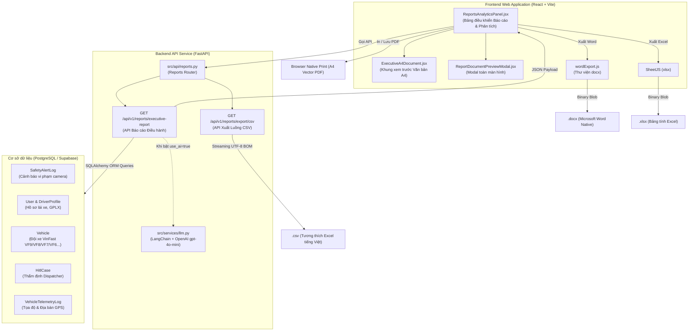

# TÀI LIỆU KIẾN TRÚC & ĐẶC TẢ KỸ THUẬT: HỆ THỐNG XUẤT BÁO CÁO ĐIỀU HÀNH AN TOÀN (EXECUTIVE SAFETY REPORTING SYSTEM)

> **Dự án**: DriverGuard AI — Hệ thống Giám sát & Can thiệp An toàn Giao thông Thông minh  
> **Phiên bản**: 2.0 (Executive Production Grade)  
> **Đối tượng sử dụng**: Ban Giám đốc Khối Vận hành, Giám đốc An toàn (Safety Manager), Điều phối viên (Dispatcher), Đội ngũ Kiểm toán & Kỹ sư Phần mềm.

---

## 1. Bối cảnh & Mục tiêu Hệ thống

Trước đây, hệ thống chỉ hỗ trợ xuất dữ liệu thô dạng bảng tính CSV/Excel rời rạc, gây khó khăn cho Ban Giám đốc và Lãnh đạo Đội xe trong việc nắm bắt nhanh bức tranh an toàn tổng thể cũng như thiếu căn cứ pháp lý văn bản để ra quyết định kỷ luật hoặc tái sát hạch tài xế.

Hệ thống Báo cáo Điều hành A4 được phát triển nhằm giải quyết triệt để bài toán này:
* **Thể thức hành chính chuẩn mực**: Mô phỏng văn bản hành chính khổ A4 chuẩn theo Nghị định 30/2020/NĐ-CP (Quốc hiệu, Tiêu ngữ, số hiệu công văn, 2 cột chữ ký phê duyệt).
* **100% Dữ liệu thực tế từ Database**: Toàn bộ chỉ số KPI, điểm an toàn, danh sách xe, họ tên tài xế và số vụ vi phạm được trích xuất trực tiếp từ các bảng nghiệp vụ (`SafetyAlertLog`, `User`, `DriverProfile`, `Vehicle`, `HitlCase`, `VehicleTelemetryLog`).
* **Tích hợp Trí tuệ Nhân tạo (Generative AI)**: Sử dụng OpenAI (`gpt-4o-mini`) phân tích sâu các điểm trũng sinh học (khung giờ 02:00 sáng & 13:00 trưa) và sinh 4 khuyến nghị điều hành thực tế.
* **Đa dạng hóa định dạng xuất bản**: Hỗ trợ xem trước tương tác (Interactive A4 Preview), tải file Microsoft Word (`.docx`), Excel (`.xlsx`), CSV (`.csv`) và In trực tiếp / Lưu PDF chuẩn vector.
* **Trải nghiệm mượt mà, không giật màn hình**: Tối ưu hóa chu kỳ re-render của React và xử lý triệt để các vòng lặp fetch dữ liệu.

---

## 2. Kiến trúc Tổng thể & Công nghệ (Tech Stack)

### 2.1 Sơ đồ kiến trúc luồng dữ liệu (Architecture Flow)



### 2.2 Bảng chi tiết công nghệ sử dụng

| Tầng | Công nghệ / Thư viện | Vai trò & Đặc điểm kỹ thuật |
| :--- | :--- | :--- |
| **Backend Framework** | **FastAPI (Python 3.12)** | Xây dựng API phi đồng bộ hiệu năng cao, tự động sinh Swagger OpenAPI docs, validation schemas qua Pydantic v2. |
| **Database ORM** | **SQLAlchemy 2.0** | Tương tác cơ sở dữ liệu PostgreSQL qua connection pooler, gom nhóm aggregation (GROUP BY driver_id, đếm vi phạm, tính điểm rủi ro). |
| **AI LLM Engine** | **LangChain Core + OpenAI `gpt-4o-mini`** | Phân tích sâu trũng sinh học và sinh 4 khuyến nghị điều hành sắc bén dựa trên bối cảnh dữ liệu thực tế. |
| **Streaming Output** | **Python `io.StringIO` & `csv`** | Tạo luồng dữ liệu CSV kèm mã nhận diện **UTF-8 BOM (`\ufeff`)** để Excel tự động nhận diện tiếng Việt có dấu. |
| **Frontend Framework** | **React 18 + Vite** | Giao diện Single Page Application (SPA), render tối ưu, Hot Module Replacement cực nhanh. |
| **Word Generator** | **Thư viện `docx` (JavaScript)** | Sinh file Word `.docx` thuần client-side (OpenXML Native), hỗ trợ bảng biểu, căn lề chuẩn 15mm-20mm A4, paragraph run styling. |
| **Excel Generator** | **SheetJS (`xlsx`)** | Xử lý mảng dữ liệu thành WorkBook/WorkSheet, tự động tính độ rộng cột (`!cols`) chống tràn số liệu. |
| **Data Visualization** | **Recharts** | Vẽ biểu đồ xu hướng theo ngày (`AreaChart`, `BarChart`) và phân bổ mức độ nghiêm trọng. |
| **Styling & Print** | **Vanilla CSS & `@media print`** | Tỉ lệ trang giấy A4 mô phỏng (860px, shadow giả lập tờ giấy), in ấn ẩn thanh công cụ trình duyệt để ra file PDF hoàn hảo. |

---

## 3. Đặc tả Cấu trúc 5 Phần của Văn bản Báo cáo A4

Văn bản được chuẩn hóa theo quy chuẩn thể thức báo cáo an toàn:

### Tiêu ngữ & Header Hành chính
* **Cột trái**: Tên Công ty chủ quản (`CÔNG TY CP VẬN TẢI & LOGISTICS THÔNG MINH`), Trung tâm giám sát an toàn `DRIVERGUARD AI`, Số hiệu văn bản tự động `Số: DG-ATGT/YYYY/MM-EXEC`.
* **Cột phải**: Quốc hiệu `CỘNG HÒA XÃ HỘI CHỦ NGHĨA VIỆT NAM`, Tiêu ngữ `Độc lập - Tự do - Hạnh phúc`, Địa danh & Ngày tháng năm lập báo cáo.

### Phần I: Thông tin chung & Phạm vi báo cáo
* **Thời gian báo cáo**: Khoảng thời gian trích xuất chính xác theo giờ địa phương (`Từ dd/mm/yyyy hh:mm đến dd/mm/yyyy hh:mm`).
* **Đội xe theo dõi**: Đội xe Giám sát An toàn Vận hành — Quy mô giám sát thực tế trong DB: tổng số phương tiện và liệt kê các dòng xe (VinFast VF9, VF8, VF7, VF6, VF5, VFe34, VF3) cùng số lượng tài xế.
* **Người lập báo cáo**: Trích xuất từ tài khoản đăng nhập hiện tại hoặc Quản trị viên An toàn Đội xe.
* **Nguồn dữ liệu**: Xác thực nguồn gốc từ các bảng dữ liệu `SafetyAlertLog`, `DriverProfile`, `Vehicle`, `HitlCase` và `VehicleTelemetryLog`.

### Phần II: Chỉ số an toàn cốt lõi (Key Executive KPIs)
Gồm 4 thẻ chỉ số KPI chính và 1 bảng đối soát mục tiêu chi tiết:
1. **Điểm an toàn bình quân toàn đội**: Thang điểm 100 (`100.0 - avg_risk`). Phân loại thứ hạng A (Rất tốt), B+ (Khá), C (Trung bình), D (Nguy cơ cao).
2. **Tỷ lệ cảnh báo nghiêm trọng (CRITICAL)**: Tỷ lệ phần trăm và tổng số ca nguy cấp phát sinh. Ngưỡng mục tiêu: `< 20.0%`.
3. **Tỷ lệ vi phạm buồn ngủ (Drowsiness / Microsleep)**: Tỷ lệ và số ca ngủ gật vi mô. Ngưỡng mục tiêu: `< 30.0%`.
4. **Số ca thẩm định can thiệp khẩn cấp (HITL)**: Số ca được Dispatcher xác thực trên tổng ca cần can thiệp. Ngưỡng mục tiêu: `100% ca nguy cấp`.

### Phần III: Phân tích nguyên nhân & Rủi ro trọng điểm
* **1. Phân tích khung giờ cao điểm nguy hiểm**:
  * *Khung giờ đêm khuya (00:00 - 05:00)*: Số lượng sự kiện rủi ro cao xảy ra trong đêm.
  * *Khung giờ cao điểm ngày (12:00 - 15:00)*: Ghi nhận các ca vi phạm buồn ngủ do trũng sinh học đầu giờ chiều.
* **2. Tuyến đường & Địa bàn điểm đen rủi ro cao**:
  * Trích xuất từ dữ liệu Telemetry GPS và nhãn địa lý Geocoding thực tế (các quận Long Biên, Cầu Giấy, Hoàn Kiếm, Nam Từ Liêm, v.v.).

### Phần IV: Danh sách trường hợp cần xử lý kỷ luật / đào tạo lại
Trích xuất danh sách **Top tài xế vi phạm lặp lại nhiều nhất** từ cơ sở dữ liệu:
* **Cột hiển thị**: STT, Họ và tên lái xe, Mã NV / GPLX, Biển số xe, Số vi phạm, Hành vi chủ đạo, Điểm an toàn, Biện pháp xử lý đề xuất.
* **Thuật toán phân loại chế tài tự động**:
  * *Mức 1 (≥ 50 vụ hoặc Điểm < 70)*: Tạm đình chỉ ca chạy 48h & Đào tạo lại an toàn bắt buộc.
  * *Mức 2 (20 - 49 vụ)*: Cảnh cáo văn bản & Trừ điểm thưởng chuyên cần tháng.
  * *Mức 3 (< 20 vụ)*: Huấn luyện kỹ năng phòng chống buồn ngủ & Bố trí giám sát 1:1.

### Phần V: Đề xuất & Khuyến nghị hành động cụ thể
4 nhóm giải pháp can thiệp vận hành (có hỗ trợ AI tinh chỉnh):
1. **Ban hành Quy chế nghỉ ngơi bắt buộc**: Dừng xe nghỉ 15-20 phút sau mỗi 4 giờ lái liên tục.
2. **Kỷ luật & Tái sát hạch tài xế vi phạm**: Đình chỉ và kiểm tra lại nhóm tài xế có tên ở Phần IV.
3. **Điều chỉnh biểu đồ phân ca**: Hạn chế bố trí ca chạy dài trong khung trũng sinh học (13:00-15:00 và đêm khuya).
4. **Duy trì quy trình can thiệp thời gian thực (HITL Dispatcher)**: Gọi điện can thiệp trực tiếp 100% cảnh báo CRITICAL.

### Phần Ký duyệt
Hai cột chữ ký song song:
* **Người lập báo cáo**: Quản trị viên An toàn Đội xe (Ký và ghi rõ họ tên).
* **Giám đốc An toàn phê duyệt**: Safety Manager / Giám đốc Vận hành (Ký, đóng dấu phê duyệt).

---

## 4. Các Giải pháp Kỹ thuật Đột phá & Khắc phục Lỗi

### 4.1 Khắc phục lỗi Unwrapping Bug (Tại sao trước đây bảng tài xế bị trống)
* **Nguyên nhân**: Trong `web/src/api/client.js`, response interceptor của Axios đã cấu hình `apiClient.interceptors.response.use((response) => response.data)` để tự unwrap vỏ bọc Axios.
* Khi server trả về JSON `{ success: true, data: { scope, kpis, top_offenders } }`, biến `res` nhận được ở frontend đã chính là payload này.
* Mã nguồn cũ kiểm tra `if (res?.data?.data)` (2 lần `.data`), khiến điều kiện luôn trả về `undefined`, biến `executiveData` bị gán `null` vĩnh viễn, dẫn đến bảng tài xế rơi vào fallback mảng rỗng `[]`.
* **Giải pháp**: Chuẩn hóa bộ trích xuất dữ liệu:
  ```javascript
  const d = res?.data?.data || res?.data || res;
  if (d && (d.kpis || d.scope || d.top_offenders)) {
    setExecutiveData(d);
  }
  ```

### 4.2 Triệt tiêu Vòng lặp Tải lại liên tục (No-flicker Document View)
* **Nguyên nhân**: Khi chuyển trạng thái hoặc nhận tín hiệu polling, component cũ unmount toàn bộ thẻ giấy A4 và thay bằng loader toàn trang, làm gián đoạn việc đọc báo cáo. Đồng thời `getDateRange()` sinh object mới mỗi render làm trigger effect lặp vô tận.
* **Giải pháp**:
  1. *Nguyên lý Stale-While-Revalidate*: Chỉ hiển thị loader toàn trang khi lần đầu tiên vào mà chưa có bất kỳ dữ liệu nào (`loading && !executiveData`). Khi làm mới hoặc đổi bộ lọc, tài liệu A4 giữ nguyên vị trí, hiển thị badge đồng bộ nhẹ nhàng `.a4-syncing-badge` ở góc trên.
  2. *Memoization toàn diện*: Dùng `useMemo` cho `dateRange`, `filterDetails`.
  3. *Tạm dừng Polling Dashboard*: Khi chuyển sang tab Báo cáo (`activeTab === 'reports'`), cơ chế polling 15s của bản đồ được tạm dừng để không gây nhiễu cho trang báo cáo.
  4. *isInitializedRef*: Modal Preview chỉ khởi tạo dữ liệu một lần duy nhất khi mở và chỉ cập nhật khi người dùng bấm trực tiếp vào bộ lọc trong modal.

### 4.3 Khôi phục Decorator `@router.get("/export/csv")`
* Phát hiện hàm `export_report_csv` trong `src/api/reports.py` bị thiếu decorator `@router.get("/export/csv")` làm CI test báo lỗi 404.
* Đã bổ sung lại đầy đủ và pass 100% toàn bộ 8 bài test báo cáo trong pytest suite.

### 4.4 Bảo mật Khóa riêng tư (`.gitignore`)
* Tự động thêm các mẫu file nhạy cảm (`*.pem`, `*.key`, `*.cert`, `*.crt`) vào `.gitignore` để đảm bảo chứng chỉ máy chủ `AWS-KeyPair.pem` không bao giờ bị lộ lên repository công khai khi thực hiện `git add .`.

---

## 5. Danh mục API Endpoint Tham chiếu

| Phương thức | Đường dẫn Endpoint | Quyền hạn (Roles) | Chức năng |
| :---: | :--- | :--- | :--- |
| `GET` | `/api/v1/reports/executive-report` | Admin, Safety Manager, Dispatcher | Lấy toàn bộ dữ liệu báo cáo điều hành 5 phần hoàn chỉnh. Hỗ trợ query `date_from`, `date_to`, `all_time=true`, `use_ai=true`. |
| `GET` | `/api/v1/reports/export/csv` | Admin, Safety Manager | Xuất dữ liệu báo cáo dạng file CSV chuẩn UTF-8 BOM (`alerts`, `driver_scorecard`, `fleet_risk`, `repeat_offenders`, `geo_safety`). |
| `GET` | `/api/v1/reports/safety-summary` | Admin, Safety Manager, Dispatcher | Lấy số liệu tổng hợp an toàn và xu hướng theo ngày cho biểu đồ. |
| `GET` | `/api/v1/reports/repeat-offenders` | Admin, Safety Manager, Dispatcher | Lấy danh sách tài xế vi phạm lặp lại theo chu kỳ tuần/tháng/quý và ngưỡng vi phạm. |
| `GET` | `/api/v1/reports/geo-safety` | Admin, Safety Manager, Dispatcher | Lấy thống kê an toàn địa lý theo quận huyện và khung giờ. |
| `GET` | `/api/v1/reports/fleet-risk` | Admin, Safety Manager, Dispatcher | Lấy phân bổ mức độ rủi ro đội xe và các giờ cao điểm rủi ro. |

---

## 6. Hướng dẫn Khởi chạy & Kiểm thử

### 6.1 Khởi chạy môi trường phát triển
```bash
# 1. Khởi động Backend
python run_backend.py

# 2. Khởi động Frontend
cd web
npm run dev
```

### 6.2 Kiểm thử tính năng (Test Suite)
```bash
# Kiểm tra định dạng mã nguồn (Linting)
.venv/Scripts/ruff.exe check src/ tests/

# Chạy toàn bộ bài kiểm thử API báo cáo
.venv/Scripts/pytest.exe tests/test_api/test_reports.py -v

# Kiểm tra biên dịch Frontend Production
cd web
npm run build
```
