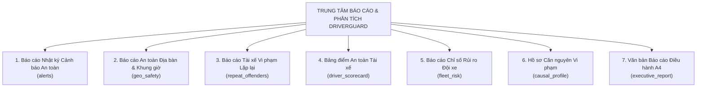

# TÀI LIỆU KIẾN TRÚC & ĐẶC TẢ TOÀN DIỆN: HỆ THỐNG BÁO CÁO THỐNG KÊ & VĂN BẢN ĐIỀU HÀNH AN TOÀN (DRIVERGUARD SAFETY REPORTS & ANALYTICS SPECIFICATION)

> **Dự án**: DriverGuard AI — Hệ thống Giám sát & Can thiệp An toàn Giao thông Thời gian thực  
> **Phân hệ**: Báo cáo & Phân tích Thống kê Toàn diện (Safety Reports & Executive Analytics)  
> **Phiên bản**: 2.0 (Executive Production Grade)  
> **Phạm vi tài liệu**: Đặc tả đầy đủ tất cả các chủ đề báo cáo thống kê, biểu đồ phân tích, cơ chế lọc đa chiều, xuất bản đa định dạng và văn bản báo cáo hành chính khổ A4.

---

## 1. Tổng quan Hệ thống Báo cáo Thống kê DriverGuard

Phân hệ **Báo cáo & Phân tích Thống kê** trong DriverGuard là trung tâm dữ liệu thông minh giúp Ban Lãnh đạo Khối Vận hành, Giám đốc An toàn (Safety Manager), Đội trưởng Đội xe và Dispatcher chuyển đổi hàng trăm nghìn tín hiệu cảm biến vi mô (Microsleep, ngáp dài, lệch mắt, vận tốc GPS, gia tốc) thành bức tranh quản trị trực quan, có giá trị pháp lý và phục vụ trực tiếp việc ra quyết định can thiệp.

Hệ thống được thiết kế theo cấu trúc **2 chế độ xem linh hoạt (Dual-Mode Interface)**:
1. **Chế độ Biểu đồ & Dữ liệu Phân tích (Interactive Visual Analytics)**: Trực quan hóa dữ liệu theo thời gian thực qua biểu đồ Recharts, phân tích đa chiều theo địa bàn, khung giờ, chu kỳ vi phạm và bảng điểm lái xe.
2. **Chế độ Văn bản Báo cáo Hành chính A4 (Executive A4 Document Preview)**: Tự động tổng hợp dữ liệu thành 1 trang văn bản hành chính khổ A4 chuẩn thể thức Nhà nước (Nghị định 30/2020/NĐ-CP), tích hợp phân tích AI và hai cột chữ ký phê duyệt để in ấn hoặc trình ký.

---

## 2. Danh mục 5 Chủ đề Báo cáo Thống kê Chuyên sâu



---

### 2.1 Chủ đề 1: Báo cáo Nhật ký Cảnh báo An toàn (`alerts`)

* **Mục tiêu**: Cung cấp bức tranh toàn diện về toàn bộ sự kiện cảnh báo phát sinh trên toàn đội xe theo chu kỳ thời gian.
* **Chỉ số theo dõi**:
  * **Tổng số cảnh báo (`total_alerts`)**: Tổng số lần camera DMS và cảm biến phát hiện sự kiện bất thường.
  * **Phân bổ mức độ nghiêm trọng (`severity_breakdown`)**:
    * Cảnh báo nguy cấp (`CRITICAL`): Ngủ gật liên tục > 1.5s, mắt nhắm hoàn toàn ở tốc độ cao.
    * Cảnh báo nhắc nhở (`WARNING`): Ngáp dài lặp lại (Yawn), mất tập trung rời mắt khỏi đường > 2.0s.
    * Cảnh báo thông tin (`INFO`): Trạng thái bắt đầu ca chạy, kết nối thiết bị.
  * **Xu hướng theo ngày (`daily_trends`)**: Thống kê số lượng vi phạm mỗi ngày kèm tỷ lệ ca nghiêm trọng để nhận diện các ngày có biến động rủi ro bất thường.
  * **Top loại vi phạm phổ biến (`top_violations`)**: Xếp hạng các hành vi phổ biến nhất (`MICROSLEEP`, `YAWN`, `DISTRACTION`, `SPEEDING`).
* **Trực quan hóa**:
  * Biểu đồ miền xếp chồng (`Stacked AreaChart`) hoặc Biểu đồ cột (`BarChart`) thể hiện tổng vi phạm so với ca nguy cấp qua từng ngày.
* **Cột dữ liệu xuất bản**:
  `Mã sự kiện`, `Thời gian (UTC)`, `Thời gian (Giờ VN UTC+7)`, `Mã xe`, `Biển số`, `Mã tài xế`, `Tên tài xế`, `Loại vi phạm`, `Mức độ`, `Điểm rủi ro`, `Tốc độ (km/h)`, `Số hành vi tiền đề`.

---

### 2.2 Chủ đề 2: Báo cáo An toàn theo Địa bàn & Khung giờ Chạy (`geo_safety`)

* **Mục tiêu**: Nhận diện các "điểm đen" giao thông và phân tích tương quan giữa địa bàn hoạt động với các khung giờ trũng sinh học của tài xế.
* **Phạm vi địa bàn hỗ trợ (Bounding Boxes & Geocoding)**:
  * 12 Quận/Huyện trọng điểm tại Hà Nội: **Long Biên, Đống Đa, Cầu Giấy, Hoàn Kiếm, Nam Từ Liêm, Bắc Từ Liêm, Hà Đông, Hai Bà Trưng, Ba Đình, Hoàng Mai, Thanh Xuân, Tây Hồ**.
* **Chỉ số theo dõi**:
  * **Phân bổ theo 24 khung giờ trong ngày (`hourly_breakdown`)**: Đếm số vụ vi phạm và số ca buồn ngủ tại từng khung giờ từ `00:00` đến `23:00`.
  * **Tỷ lệ buồn ngủ theo địa bàn (`drowsiness_rate_percent`)**: Đo lường tỷ lệ các ca ngủ gật trên tổng vi phạm tại khu vực được chọn.
  * **Hành lang / Tuyến đường điểm đen (`top_blackspot_routes`)**: Tự động tổng hợp từ dữ liệu định vị Telemetry GPS (`address_label` và tọa độ Lat/Lon) để chỉ ra các tuyến đường có mật độ vi phạm cao nhất (ví dụ: Tuyến Nguyễn Văn Cừ - Cầu Chương Dương, Tuyến Vành Đai 3 trên cao, Tuyến Phạm Hùng - Cầu Giấy).
* **Trực quan hóa**:
  * Biểu đồ đường kép hoặc cột đôi so sánh tổng vi phạm với ca buồn ngủ theo 24 khung giờ. Khung giờ từ `01:00 - 04:00` (đêm) và `13:00 - 15:00` (trưa) được đánh dấu cảnh báo trũng sinh học.
* **Cột dữ liệu xuất bản**:
  `Mã sự kiện`, `Thời gian (UTC)`, `Thời gian (Giờ VN UTC+7)`, `Mã xe`, `Biển số`, `Mã tài xế`, `Tên tài xế`, `Loại vi phạm`, `Khung giờ (UTC+7)`, `Vận tốc (km/h)`.

---

### 2.3 Chủ đề 3: Báo cáo Tài xế Vi phạm Lặp lại & Đánh giá Tác động (`repeat_offenders`)

* **Mục tiêu**: Phát hiện sớm các tài xế có thói quen lái xe nguy hiểm lặp đi lặp lại để ngăn chặn tai nạn trước khi xảy ra (nguyên lý kiểm soát rủi ro chủ động).
* **Bộ lọc nghiệp vụ đặc thù**:
  * **Chu kỳ thống kê (`period`)**: Theo Tuần (`week`), Theo Tháng (`month`), Theo Quý (`quarter`), hoặc Tùy chọn ngày (`custom`).
  * **Ngưỡng vi phạm tối thiểu (`min_violations`)**: Tùy chỉnh lọc tài xế vi phạm `≥ 5 lần`, `≥ 10 lần`, `≥ 20 lần`, `≥ 50 lần`.
  * **Phân loại hành vi (`violation_type`)**: Lọc riêng hành vi Buồn ngủ (`DROWSINESS`), Mất tập trung (`DISTRACTION`), Sử dụng điện thoại (`PHONE_USAGE`).
* **Đánh giá mức độ ảnh hưởng (Severity Impact Assessment)**:
  * `HIGH_COLLISION_RISK` (Nguy cơ va chạm rất cao): Tài xế có từ **≥ 3 cảnh báo cấp CRITICAL**.
  * `MODERATE_FATIGUE` (Mệt mỏi tích lũy đáng kể): Tài xế có từ **≥ 5 ca buồn ngủ**.
  * `MONITORED` (Nhóm cần theo dõi): Tài xế vi phạm lặp lại mức độ cảnh báo nhắc nhở.
* **Cột dữ liệu xuất bản**:
  `Mã tài xế`, `Họ tên`, `Số điện thoại`, `Tổng vi phạm`, `Buồn ngủ (Drowsiness)`, `Mất tập trung`, `Dùng điện thoại`, `Nguy cấp (CRITICAL)`, `Nhắc nhở (WARNING)`, `Điểm rủi ro TB`, `Đánh giá ảnh hưởng (Impact Assessment)`.

---

### 2.4 Chủ đề 4: Bảng điểm An toàn Tài xế (`driver_scorecard`)

* **Mục tiêu**: Đánh giá hiệu suất và xếp loại văn hóa an toàn của từng lái xe trong đội, phục vụ việc bình xét thi đua, trừ điểm chuyên cần hoặc khen thưởng.
* **Công thức tính điểm An toàn (`Safety Score`)**:
  $$\text{Safety Score} = \max\left(100.0 - \overline{\text{Risk Score}}, 0.0\right)$$
  *(Trong đó $\overline{\text{Risk Score}}$ là điểm rủi ro trung bình của tất cả các sự kiện phát sinh từ tài xế trong kỳ).*
* **Hệ thống Xếp loại An toàn chuẩn Doanh nghiệp**:
  * **Hạng A (Rất tốt - Xuất sắc)**: Điểm an toàn $\ge 90.0$ điểm.
  * **Hạng B+ / B (Khá - Đạt chuẩn)**: Điểm an toàn từ $75.0$ đến $89.9$ điểm.
  * **Hạng C (Trung bình - Cần cải thiện)**: Điểm an toàn từ $60.0$ đến $74.9$ điểm.
  * **Hạng D (Nguy cơ cao - Cần chấn chỉnh/đào tạo lại)**: Điểm an toàn $< 60.0$ điểm.
* **Số hành vi tiền đề (`Precursor Events`)**:
  * Thống kê các chuỗi hành vi vi mô dẫn đến cảnh báo (như nhấp nháy mắt nhanh, ngáp ngắn, lắc đầu) được camera AI ghi nhận trước khi bùng phát thành cảnh báo chính thức.
* **Cột dữ liệu xuất bản**:
  `Mã tài xế`, `Họ tên`, `Số điện thoại`, `Tổng cảnh báo`, `Cảnh báo nghiêm trọng`, `Cảnh báo nhắc nhở`, `Tổng hành vi tiền đề`, `Điểm rủi ro TB`, `Điểm an toàn`, `Xếp loại`.

---

### 2.5 Chủ đề 5: Báo cáo Chỉ số Rủi ro Đội xe (`fleet_risk`)

* **Mục tiêu**: Cung cấp bức tranh toàn cảnh cấp chiến lược cho Giám đốc Khối Vận hành về mức độ an toàn của toàn bộ dàn xe.
* **Chỉ số theo dõi cốt lõi**:
  * **Điểm an toàn toàn đội (`fleet_safety_score`)**: Điểm số trung bình trọng số của toàn bộ phương tiện đang vận hành.
  * **Chỉ số rủi ro đội xe (`overall_fleet_risk_index`)**: Điểm rủi ro tích lũy trên mỗi 100km lăn bánh.
  * **Phân bổ cấp độ rủi ro (`risk_level_distribution`)**: Tỷ lệ phần trăm xe thuộc mức An toàn (Safe), Chú ý (Warning), và Nguy cấp (Critical).
  * **Khung giờ cao điểm rủi ro (`peak_risk_hours`)**: Top các giờ trong ngày có chỉ số rủi ro bình quân cao nhất.
  * **Top phương tiện có nguy cơ cao nhất (`top_high_risk_vehicles`)**: Danh sách 5 xe có nhiều cảnh báo CRITICAL nhất, biển số xe, dòng xe (VinFast VF8, VF9, VF6...) để kỹ thuật kiểm tra camera và bố trí tài xế khác.
* **Cột dữ liệu xuất bản**:
  `Chỉ số`, `Giá trị`, `Thời gian từ`, `Thời gian đến`, `Tổng số cảnh báo`, `Cảnh báo nghiêm trọng`, `Cảnh báo nhắc nhở`.

---

### 2.6 Chủ đề 6: Hồ sơ Căn nguyên Vi phạm của Tài xế (`causal_profile`)

* **Mục tiêu**: Phân tích nguyên nhân gốc rễ (Root Cause Analysis) tại sao một tài xế cụ thể lại thường xuyên vi phạm buồn ngủ.
* **Mô hình 3 yếu tố căn nguyên**:
  1. **Yếu tố thời gian lái xe liên tục (`Driving Hours Exhaustion`)**: Tương quan giữa số giờ cầm lái liên tục (> 4 giờ không nghỉ) với tần suất ngủ gật vi mô.
  2. **Yếu tố nhịp sinh học (`Circadian Rhythm Vulnerability`)**: Tỷ lệ vi phạm rơi vào các khung giờ trũng sinh học tự nhiên của cơ thể người (đêm khuya 01:00-04:00 và đầu giờ chiều 13:00-15:00).
  3. **Yếu tố hành trình & Tuyến đường (`Trip Duration & Monotony`)**: Rủi ro phát sinh trên các đoạn đường cao tốc thẳng tắp, đơn điệu gây ra hiện tượng thôi miên xa lộ (Highway Hypnosis).

---

### 2.7 Chủ đề 7: Văn bản Báo cáo Điều hành 5 Phần Khổ A4 (`executive_report`)

* **Mục tiêu**: Văn bản hành chính tích hợp 100% số liệu thực tế từ Database, được định dạng chuẩn khổ giấy A4, có tích hợp trí tuệ nhân tạo OpenAI `gpt-4o-mini` và hỗ trợ đầy đủ chữ ký phê duyệt.
* **Cấu trúc 5 phần**:
  * **Header**: Quốc hiệu, Tiêu ngữ, Tên đơn vị, Số hiệu `Số: DG-ATGT/YYYY/MM-EXEC`, Ngày tháng năm.
  * **Phần I**: Thông tin chung & Quy mô phương tiện đội xe (các dòng xe VinFast, số lượng tài xế).
  * **Phần II**: Key Executive KPIs (Điểm an toàn, % Nghiêm trọng, % Buồn ngủ, % Can thiệp HITL).
  * **Phần III**: Phân tích nguyên nhân trũng sinh học & Địa bàn điểm đen GPS.
  * **Phần IV**: Danh sách Top tài xế vi phạm lặp lại & Biện pháp chế tài đề xuất tự động.
  * **Phần V**: 4 Đề xuất can thiệp vận hành (Quy chế nghỉ ngơi, Tái sát hạch, Phân ca, HITL).
  * **Chữ ký**: 2 Cột song song: Người lập báo cáo & Giám đốc An toàn phê duyệt.

---

## 3. Hệ thống Bộ lọc Đa chiều (Multi-dimensional Filtering Engine)

Hệ thống cung cấp thanh điều khiển lọc thông minh [`ReportFilterBar.jsx`](file:///c:/Users/Phung%20Quoc%20Viet/Desktop/AI_in_Action/Project/P-136/web/src/components/dashboard/reports/ReportFilterBar.jsx):

```
┌────────────────────────────────────────────────────────────────────────────────────────┐
│ [7 ngày qua] [30 ngày qua] [Hôm nay] [Tất cả DB] [Tùy chọn ngày: Từ ... Đến ...]       │
│ Phân loại: [Nhật ký cảnh báo] [Vi phạm lặp lại] [An toàn địa bàn] [Bảng điểm] [Đội xe]  │
│ Đặc thù:   [Quận: Long Biên ▾] [Giờ: Tất cả ▾] [Chu kỳ: Tháng ▾] [Ngưỡng: ≥ 10 lần ▾]   │
└────────────────────────────────────────────────────────────────────────────────────────┘
```

1. **Bộ lọc thời gian (Time Presets)**:
   * `today`: Từ 00:00:00 sáng đến thời điểm hiện tại.
   * `7d`: 7 ngày gần nhất (168 giờ qua).
   * `30d`: 30 ngày gần nhất (1 tháng qua).
   * `all`: Quét toàn bộ lịch sử dữ liệu từ ngày thành lập hệ thống.
   * `custom`: Cho phép người dùng chọn chính xác ngày bắt đầu và ngày kết thúc từ date picker.
2. **Bộ lọc theo khu vực / địa bàn**:
   * Dropdown chọn 12 quận/huyện nội ngoại thành Hà Nội để trích xuất dữ liệu GPS vi phạm.
3. **Bộ lọc theo khung giờ (Hourly Filter)**:
   * Cho phép lọc cụ thể từng khung giờ (00:00, 01:00, ..., 23:00) hoặc xem toàn bộ 24 giờ.
4. **Bộ lọc chu kỳ & Ngưỡng vi phạm**:
   * Chu kỳ: Tuần, Tháng, Quý, Tùy chọn.
   * Ngưỡng vi phạm tối thiểu: 5, 10, 20, 50 vụ vi phạm.

---

## 4. Cơ chế Xuất bản Đa định dạng (Multi-Format Export Engine)

```
                              ┌──► Tải file Word (.docx)    (Thư viện docx JS Native)
                              ├──► Tải file Excel (.xlsx)   (SheetJS + Auto-fit cột)
HỆ THỐNG XUẤT BÁO CÁO ────────┼──► Tải file CSV (.csv)      (FastAPI Streaming + UTF-8 BOM)
                              └──► In / Lưu file PDF (A4)   (CSS @media print vector chuẩn)
```

### 4.1 Xuất file Word (`.docx`)
* **Công nghệ**: Thư viện `docx` (JavaScript).
* **Đặc điểm**:
  * Tạo tệp nhị phân OpenXML `.docx` trực tiếp trên trình duyệt, không cần gửi file qua server trung gian hay cần cài đặt MS Word trên máy chủ.
  * Căn lề khổ giấy A4 chuẩn hành chính (Top: 20mm, Bottom: 20mm, Left: 25mm, Right: 15mm).
  * Định dạng bảng biểu có header màu xanh thương hiệu (`#0D9488`), độ rộng cột xác định theo đơn vị `DXA`, đường kẻ mờ phân cách, chữ ký 2 cột thẳng hàng.
  * Tương thích 100% với Microsoft Word 2016-2024, Office 365, Google Docs và LibreOffice.

### 4.2 Xuất file Excel (`.xlsx`)
* **Công nghệ**: Thư viện SheetJS (`xlsx`).
* **Đặc điểm**:
  * Tự động quét chiều dài dữ liệu lớn nhất của từng cột để áp dụng thuộc tính `!cols` (auto-fit width), đảm bảo văn bản tiếng Việt và các con số không bị tràn ô hoặc hiển thị lỗi `###`.
  * Tên sheet thân thiện giới hạn tối đa 31 ký tự theo chuẩn Microsoft Excel.

### 4.3 Xuất luồng file CSV (`.csv`)
* **Công nghệ**: Python `io.StringIO`, `csv.writer`, FastAPI `StreamingResponse`.
* **Đặc tính kỹ thuật then chốt**:
  * Ghi mã **Byte Order Mark `\ufeff` (UTF-8 BOM)** ở đầu file.
  * Điều này đảm bảo khi người dùng click đúp mở tệp CSV trực tiếp bằng Microsoft Excel trên Windows, Excel sẽ tự động nhận diện bảng mã UTF-8 tiếng Việt có dấu hoàn hảo, không bị vỡ font hay biến thành ký tự lạ.
  * Hỗ trợ tùy chọn ký tự phân cách dấu phẩy (`,`) hoặc chấm phẩy (`;`).

### 4.4 In trực tiếp & Lưu file PDF (`window.print`)
* **Công nghệ**: Trình render in ấn CSS Vector `@media print`.
* **Đặc tính kỹ thuật**:
  * Ẩn toàn bộ thanh điều hướng, nút bấm, header trình duyệt khi in.
  * Đặt kích thước trang in đúng chuẩn `size: A4 portrait`.
  * Thiết lập thuộc tính `page-break-inside: avoid` để các bảng biểu và khối chữ ký không bị cắt ngang giữa trang giấy.
  * Người dùng có thể in trực tiếp ra máy in văn phòng hoặc chọn máy in ảo `Save as PDF` để có file PDF sắc nét chuẩn 100%.

---

## 5. Danh mục API Endpoint Tham chiếu

| Method | Endpoint URL | Roles cho phép | Chức năng nghiệp vụ |
| :---: | :--- | :--- | :--- |
| `GET` | `/api/v1/reports/executive-report` | Admin, Safety Manager, Dispatcher | Lấy toàn bộ dữ liệu báo cáo điều hành 5 phần hoàn chỉnh. Hỗ trợ query `date_from`, `date_to`, `all_time`, `use_ai`. |
| `GET` | `/api/v1/reports/safety-summary` | Admin, Safety Manager, Dispatcher | Lấy dữ liệu tổng hợp cảnh báo an toàn và xu hướng theo ngày cho biểu đồ Recharts. |
| `GET` | `/api/v1/reports/geo-safety` | Admin, Safety Manager, Dispatcher | Lấy thống kê an toàn địa lý theo quận huyện, 24 khung giờ và danh sách điểm đen. |
| `GET` | `/api/v1/reports/repeat-offenders` | Admin, Safety Manager, Dispatcher | Lấy danh sách tài xế vi phạm lặp lại theo chu kỳ (tuần/tháng/quý) và đánh giá tác động. |
| `GET` | `/api/v1/reports/fleet-risk` | Admin, Safety Manager, Dispatcher | Lấy chỉ số rủi ro đội xe, phân bổ cấp độ và danh sách xe có nguy cơ cao nhất. |
| `GET` | `/api/v1/reports/driver-scorecard` | Admin, Safety Manager, Dispatcher | Lấy bảng điểm an toàn tài xế, điểm rủi ro, phân hạng A/B/C/D có phân trang. |
| `GET` | `/api/v1/reports/drivers/{id}/causal-profile` | Admin, Safety Manager, Dispatcher | Lấy hồ sơ phân tích căn nguyên vi phạm của một tài xế cụ thể. |
| `GET` | `/api/v1/reports/export/csv` | Admin, Safety Manager | Xuất dữ liệu báo cáo dạng tệp CSV chuẩn UTF-8 BOM cho cả 5 chủ đề. |

---

## 6. Hướng dẫn Khởi chạy & Kiểm thử Tự động (CI/CD)

### 6.1 Khởi chạy môi trường
```bash
# Khởi động Backend API (Port 8000)
python run_backend.py

# Khởi động Frontend Web (Port 5173)
cd web
npm run dev
```

### 6.2 Kiểm thử chất lượng (Test Suite)
```bash
# 1. Kiểm tra Linting & Định dạng code Python
.venv/Scripts/ruff.exe check src/ tests/

# 2. Chạy toàn bộ 8 bài test API Báo cáo
.venv/Scripts/pytest.exe tests/test_api/test_reports.py -v

# 3. Kiểm tra biên dịch Frontend Production
cd web
npm run build
```
