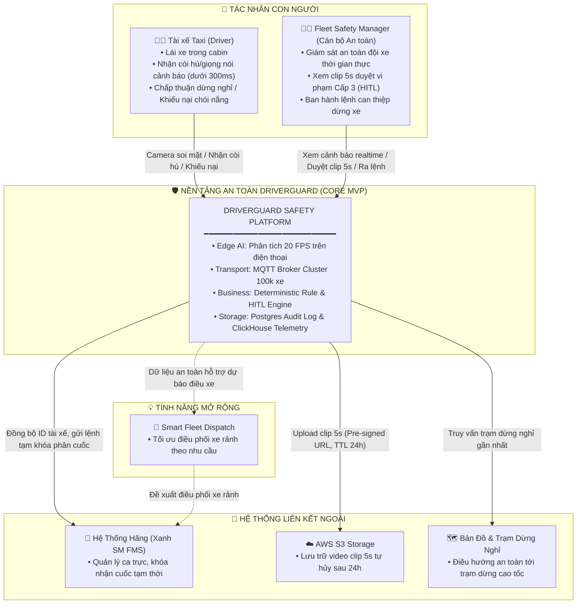
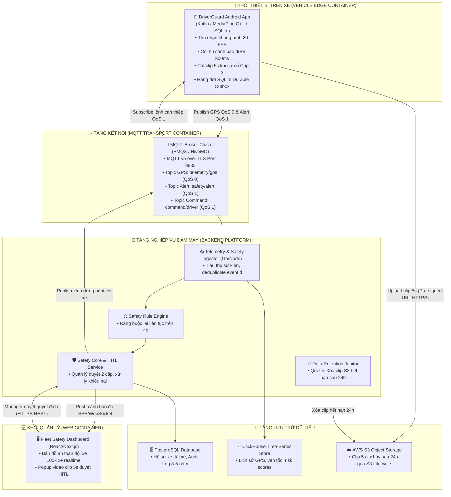

# DRIVERGUARD — BÁO CÁO TỔNG QUAN DỰ ÁN (PHẦN 1)
## PRD CỐT LÕI • LUỒNG SAD TỔNG QUAN • DEMO WIREFRAME • KẾ HOẠCH HÀNH ĐỘNG

> **Dành cho:** Báo cáo & Trình bày Định hướng với Hội đồng Mentor  
> **Dự án:** Hệ thống Giám sát & Bảo vệ An toàn Đội xe DriverGuard  
> **Quy mô mục tiêu:** 100.000 phương tiện (Đội xe Taxi điện Xanh SM)  
> **Trọng tâm sản phẩm:** Core Safety (Giám sát On-device & Can thiệp tức thì ≤ 300ms)

---

## 1. TỔNG QUAN PRD CỐT LÕI (PRODUCT REQUIREMENTS)

### 1.1. Mục đích và Định vị Sản phẩm
**DriverGuard** là giải pháp công nghệ an toàn giao thông và tối ưu vận hành dành riêng cho đội xe taxi quy mô lớn. Hệ thống phân định rõ ranh giới hai phân hệ:
1. **Safety Core (MVP Trọng tâm số 1):** Ứng dụng AI thị giác xử lý trực tiếp trên thiết bị biên (On-device Edge AI) để phát hiện sớm các dấu hiệu tài xế ngủ gật, mất tập trung; lập tức cảnh báo bằng âm thanh/giọng nói trong cabin trong vòng **≤ 300ms** ngay cả khi hoàn toàn mất kết nối Internet.
2. **Fleet Safety & HITL (MVP Trọng tâm số 2):** Cung cấp giao diện bảng điều khiển thời gian thực cho Cán bộ An toàn (Fleet Safety Manager) với quy trình duyệt video clip 5s hai cấp (Human-in-the-Loop) nhằm ngăn ngừa tuyệt đối việc phạt oan tài xế.
3. **Smart Fleet Dispatch (Phase 2 Roadmap - Tính năng mở rộng):** Sử dụng dữ liệu an toàn và mô hình dự báo nhu cầu để hỗ trợ điều phối xe rảnh tới khu vực có nhu cầu cao. Đây là tính năng thuộc lộ trình tương lai, không nằm trong Core MVP.

```
┌────────────────────────────────────────────────────────────────────────┐
│                   HỆ THỐNG DRIVERGUARD TOÀN DIỆN                       │
│                                                                        │
│  ┌─────────────────────────────────┐   ┌────────────────────────────┐  │
│  │     CORE MVP (AN TOÀN CỐT LÕI)   │   │ PHASE 2 (LỘ TRÌNH MỞ RỘNG) │  │
│  │  • Edge AI On-device (20 FPS)   │   │  • Smart Fleet Dispatch    │  │
│  │  • Cảnh báo cứu mạng ≤ 300ms   │───►│  • Demand Forecasting AI   │  │
│  │  • Duyệt an toàn 2 cấp (HITL)   │   │  • Tối ưu cuốc rỗng xe điện│  │
│  │  • Hạ tầng MQTT 100.000 xe      │   │  • Điều hướng sạc pin thông│  │
│  │  • Sổ cái Audit Log 3-5 năm     │   │    minh theo ca trực       │  │
│  └─────────────────────────────────┘   └────────────────────────────┘  │
└────────────────────────────────────────────────────────────────────────┘
```

---

### 1.2. Mục tiêu Định lượng & Chỉ số Thành công (Success Metrics)

| Nhóm chỉ số | Chỉ số cụ thể (KPI) | Mục tiêu MVP (Target) | Cơ chế đo lường & Đánh giá |
| :--- | :--- | :--- | :--- |
| **Hiệu năng Biên (Edge AI)** | Tốc độ xử lý khung hình | **≥ 15 - 20 FPS** | Đo trên chip Snapdragon / MediaTek tầm trung phổ biến |
| **Độ trễ Cứu mạng** | Latency từ khi thỏa ngưỡng tới khi còi hú | **≤ 300 ms** | Đo bằng timestamp nội bộ từ Camera2 frame đến AudioTrack |
| **Độ tin cậy AI** | Recall sự kiện nguy hiểm (buồn ngủ thật) | **≥ 90%** | Benchmark trên tập dữ liệu chuẩn UTA-RLDD và NTHU-DDD |
| | Precision sự kiện phát hiện | **≥ 85%** | Giảm thiểu tối đa báo sai do chói nắng, ngáp sinh học |
| | Tỷ lệ cảnh báo sai (False Positive Rate) | **≤ 1 lần / 30 phút** | Kiểm thử trên video thực tế tài xế lái ban ngày và ban đêm |
| **Khả dụng Mạng** | Khả năng cảnh báo khi mất sóng 4G/Internet | **100% Offline-first** | Cắt hoàn toàn kết nối Wi-Fi/4G, còi hú vẫn phát bình thường |
| **Chịu tải Hệ thống** | Dung lượng RAM máy chủ Broker cho 100k xe | **≤ 2.5 GB RAM** | Benchmark chịu tải giao thức MQTT v5 over TLS (EMQX) |
| **Chi phí Lưu trữ** | Chi phí lưu trữ Cloud S3 cho 100.000 xe | **≤ 20 USD / tháng** | Nhờ cơ chế chỉ lưu clip 5s vi phạm và tự hủy sau 24 giờ |

---

### 1.3. Phạm vi Thực hiện (Scope Management)

#### A. Trong phạm vi MVP (In-Scope):
* Nhận diện 3 hành vi rủi ro then chốt: **Nhắm mắt kéo dài (PERCLOS)**, **Quay mặt khỏi hướng đường (Yaw)**, **Gục đầu (Pitch)**.
* Thuật toán cửa sổ trượt 3 giây (60 frames) tích hợp 5 lớp Multimodal Confidence Fusion.
* Phân cấp 3 mức cảnh báo nội bộ: Cấp 1 (Rung/Beep), Cấp 2 (Còi hú vừa), Cấp 3 (Còi max volume + Giọng nói ép bật Hazard).
* Bộ đệm cuốn chiếu 5s video trong RAM; tự động đẩy lên S3 qua Pre-signed URL khi vi phạm Cấp 3.
* Hàng đợi ngoại tuyến SQLite Durable Outbox giúp xe gửi lại sự kiện ngay khi có sóng 4G.
* Bảng điều khiển Web Dashboard hiển thị bản đồ đội xe và popup video clip 5s duyệt an toàn cho Fleet Manager.
* Cơ chế duyệt 2 cấp (HITL): Manager xác thực vi phạm, Tài xế có quyền bấm Chấp thuận hoặc Khiếu nại chói nắng.

#### B. Nằm ngoài phạm vi MVP (Out-of-Scope):
* Không can thiệp vật lý vào hệ thống phanh, ga, vô-lăng của xe (Không làm ADAS Actuator).
* Không stream video trực tiếp 24/7 từ cabin lên máy chủ (Tránh nghẽn mạng và vi phạm đời tư).
* Không tự động phạt tiền tài xế mà không có sự phê duyệt của con người (Zero Blackbox Penalty).
* Không xây dựng hệ thống điều phối xe buýt công cộng.

---

## 2. LUỒNG SAD TỔNG QUAN (SYSTEM ARCHITECTURE OVERVIEW)

### 2.1. Sơ đồ Mức C1: System Context (Bối cảnh Hệ thống)

Sơ đồ C1 làm rõ vị trí của DriverGuard trong hệ sinh thái vận hành của hãng taxi Xanh SM:



---

### 2.2. Sơ đồ Mức C2: Container Diagram (Các Khối Công Nghệ Độc Lập)

Phân tách các khối công nghệ độc lập theo nguyên tắc hướng vi dịch vụ (Microservices) và hướng sự kiện (Event-driven):



---

## 3. DEMO — WIREFRAME GIAO DIỆN HỆ THỐNG

### 3.1. Wireframe 1: Màn Hình Tài Xế (Driver Mobile App UI)

Ứng dụng chạy nền trên điện thoại gắn trên taplo xe của tài xế taxi Xanh SM. Giao diện ưu tiên tương phản cao, nút bấm cực lớn để tài xế thao tác an toàn bằng một chạm:

```
┌────────────────────────────────────────────────────────┐
│  [● REC 20 FPS]   DriverGuard Active        4G [||||] │
│  Tài xế: Nguyễn Văn A (TX-1042) • Xe: VF e34 (29E-888)  │
├────────────────────────────────────────────────────────┤
│                                                        │
│               [ MINI CAMERA PREVIEW ]                  │
│             ┌─────────────────────────┐                │
│             │  [👁️ EAR: 0.28 - OK]    │                │
│             │  [📐 YAW:  2° - NHÌN THẲNG]              │
│             └─────────────────────────┘                │
│                                                        │
│   TRẠNG THÁI HIỆN TẠI:                                │
│   ┌────────────────────────────────────────────────┐   │
│   │  🟢 AN TOÀN TUYỆT ĐỐI (Điểm Rủi Ro: 12 / 100)  │   │
│   │  Tốc độ: 82 km/h  •  Thời gian lái ca: 2h 15m  │   │
│   └────────────────────────────────────────────────┘   │
│                                                        │
│ ─── KHI KÍCH HOẠT CẢNH BÁO CẤP 3 (NGỦ GẬT CAO TỐC) ─── │
│ ┌────────────────────────────────────────────────────┐ │
│ │  🚨 CẢNH BÁO NGUY HIỂM: BÁC TÀI ĐANG NGỦ GẬT!      │ │
│ │  [ 🔊 CÒI HÚ MAX VOLUME + GIỌNG NÓI ÉP BẬT HAZARD ]│ │
│ ├────────────────────────────────────────────────────┤ │
│ │  Khuyến nghị từ Cán bộ An toàn:                     │ │
│ │  "Yêu cầu dừng xe nghỉ 30 phút tại Trạm dừng chân" │ │
│ │                                                    │ │
│ │  ┌──────────────────────┐  ┌─────────────────────┐ │ │
│ │  │   🟢 ĐỒNG Ý DỪNG XE   │  │  🟡 KHIẾU NẠI      │ │ │
│ │  │ (Điều hướng trạm nghỉ│  │ (Tôi bị chói nắng)  │ │ │
│ │  │      cách 2km)       │  │                     │ │ │
│ │  └──────────────────────┘  └─────────────────────┘ │ │
│ └────────────────────────────────────────────────────┘ │
│                                                        │
│  [ Trạng thái bộ đệm: Đã khóa 5s video bằng chứng ]   │
│  [ SQLite Outbox: Đã gửi gói tin an toàn lên Cloud ]  │
└────────────────────────────────────────────────────────┘
```

---

### 3.2. Wireframe 2: Bảng Điều Khiển An Toàn (Fleet Safety Dashboard UI)

Dành cho Cán bộ Quản lý An toàn tại trung tâm điều hành hãng taxi:

```
┌──────────────────────────────────────────────────────────────────────────────────────────┐
│ 🛡️ DRIVERGUARD FLEET SAFETY COMMAND CENTER (100.000 XE)                  Admin: Tran B (Logout)│
├──────────────────────┬──────────────────────────────────────────┬────────────────────────┤
│ 📊 TỔNG QUAN ĐỘI XE  │ 🗺️ BẢN ĐỒ AN TOÀN THỜI GIAN THỰC         │ 🚨 HÀNG ĐỢI DUYỆT HITL │
│                      │                                          │                        │
│ • Tổng xe chạy:      │   [ Bản đồ vệ tinh Hà Nội - Cao tốc ]   │ ⚠️ Cần duyệt ngay (1) │
│   94.120 xe          │                                          │ ────────────────────── │
│ • Bình thường (Xanh):│    🟢 TX-1088 (85 km/h - An toàn)        │ 🔴 TX-1042 (VF e34)    │
│   93.850 xe (99.7%)  │    🟢 TX-2014 (40 km/h - An toàn)        │ Cao tốc NB-LC (Km 42)  │
│ • Cảnh báo Cấp 2:    │    🟡 TX-3301 (65 km/h - Mệt mỏi nhẹ)    │ Score: 88 • 85 km/h    │
│   240 xe (0.25%)     │    🔴 TX-1042 (85 km/h - NGUY CƠ CAO)    │ Mắt nhắm 3.2s liên tục │
│ • Khẩn cấp Cấp 3:    │          ▲                               │ [Xem Clip 5s Bằng Chứng]
│   30 xe (0.03%)      │          └── (Đang nhấp nháy đỏ)         │                        │
├──────────────────────┴──────────────────────────────────────────┴────────────────────────┤
│ 🎬 POPUP DUYỆT XÁC THỰC VIDEO CLIP 5 GIÂY (MODAL WINDOW)                                │
│ ┌──────────────────────────────────────────────────────────────────────────────────────┐ │
│ │ Clip ID: CLP-HN-9942 • Xe: TX-1042 • Thời gian: 02:15:30 AM • Vận tốc: 85 km/h       │ │
│ ├─────────────────────────────────────────┬────────────────────────────────────────────┤ │
│ │ [ VIDEO PLAYER 5 GIÂY TỪ AWS S3 ]       │ 📋 PHÂN TÍCH CHỈ SỐ SINH TRẮC (BIOMETRICS)  │ │
│ │  ▶ [■■■■■■■■■■■■■■■■■■■■] 00:03 / 00:05 │ • PERCLOS: 82% (Ngưỡng nguy hiểm > 25%)    │ │
│ │  [ Hình ảnh: Tài xế sụp mi mắt 3s       │ • Góc gục đầu Pitch: -24° (Lệch baseline) │ │
│ │    và đầu gục dần về vô lăng ]          │ • Điểm chất lượng ảnh: 0.94 (Không chói)   │ │
│ ├─────────────────────────────────────────┴────────────────────────────────────────────┤ │
│ │ HÀNH ĐỘNG CỦA CÁN BỘ AN TOÀN (HITL DECISION):                                        │ │
│ │ ┌────────────────────────────────────────┐ ┌───────────────────────────────────────┐ │ │
│ │ │ 🔴 [XÁC NHẬN VI PHẠM & ĐỀ XUẤT NGHỈ]   │ │ 🟢 [BÁC BỎ - PHÁT HIỆN SAI/CHÓI NẮNG] │ │ │
│ │ │ • Gửi lệnh dừng nghỉ 30 phút tới xe    │ │ • Xóa clip ngay lập tức trên S3       │ │ │
│ │ │ • Tạm khóa nhận cuốc trên Xanh SM FMS  │ │ • Không ghi vi phạm cho tài xế        │ │ │
│ │ └────────────────────────────────────────┘ └───────────────────────────────────────┘ │ │
│ └──────────────────────────────────────────────────────────────────────────────────────┘ │
└──────────────────────────────────────────────────────────────────────────────────────────┘
```

---

## 4. TIẾN TRÌNH LÀM VIỆC CỦA CẢ NHÓM (WORK PLAN & ROADMAP)

### 4.1. Mục Tiêu Trọng Tâm Từ Giờ Tới Cuối Tuần: Thông Sơ Bộ 1 Luồng Chính MVP (Walking Skeleton)

> [!IMPORTANT]
> **Cam kết cốt tử từ giờ tới cuối tuần:** Nhóm không làm dàn trải hay phân mảnh từng phần độc lập, mà tập trung 100% nguồn lực để **kết nối thông trọn vẹn 1 luồng chính từ đầu đến cuối (End-to-End Vertical Slice)**. Đảm bảo đến hết Chủ Nhật tuần này, hệ thống có thể chạy demo được một kịch bản hoàn chỉnh từ buồng lái đến màn hình quản lý.

```
┌────────────────────────────────────────────────────────────────────────────────────────┐
│             LUỒNG CHÍNH E2E CẦN THÔNG TỪ GIỜ TỚI CUỐI TUẦN (WALKING SKELETON)          │
│                                                                                        │
│  [1. Camera / Video Feed] ──► [2. MediaPipe C++] ──► [3. Risk Score > 85]              │
│                                                            │                           │
│  ┌─────────────────────────────────────────────────────────┴────────────────────────┐  │
│  │                                                                                  │  │
│  ▼ (Cứu mạng tại chỗ ≤ 300ms)                                                       ▼  │
│ [Loa Hú Còi Cục Bộ]                                                  [Gói Tin MQTT]     │
│                                                                             │          │
│                                                                             ▼ (Port 8883)│
│ [7. App Nhận Lệnh Dừng] ◄── [6. Manager Bấm Duyệt] ◄── [5. Web SSE] ◄── [4. MQTT Broker]│
└────────────────────────────────────────────────────────────────────────────────────────┘
```

#### Tiêu chí Nghiệm thu Cuối tuần này (Definition of Done — DoD):
1. **Bước 1 (Edge Input):** Camera điện thoại (hoặc luồng video test thực tế) quay cảnh tài xế nhắm mắt quá 2 giây.
2. **Bước 2 (Inference):** MediaPipe trích xuất được tọa độ mắt, `SlidingWindowRiskScorer` tính điểm rủi ro vượt ngưỡng Cấp 3 (Risk Score ≥ 85).
3. **Bước 3 (Local Alert):** Điện thoại lập tức phát còi hú cảnh báo tại chỗ (đạt mốc ≤ 300 ms, không phụ thuộc mạng).
4. **Bước 4 (Transport):** Điện thoại đóng gói bản tin JSON `safety/alert` và publish thành công lên MQTT Broker qua topic an toàn.
5. **Bước 5 (Ingestion):** Backend Ingestion Worker tiêu thụ được bản tin từ Broker, ghi nhận vào cơ sở dữ liệu.
6. **Bước 6 (Web Dashboard):** Server-Sent Events (SSE) lập tức đẩy popup cảnh báo đỏ nhấp nháy lên màn hình Web Dashboard của Manager.
7. **Bước 7 (HITL Action):** Manager bấm nút [Xác nhận vi phạm] → Hệ thống gửi thông điệp MQTT `command/driver` phản hồi ngược lại màn hình điện thoại tài xế.

---

### 4.2. Kế Hoạch Tác Chiến Hàng Ngày Từ Giờ Đến Cuối Tuần (Daily Sprint Plan)

| Thời gian | Trọng tâm công việc (Focus) | Phân công phụ trách | Kết quả cần đạt trong ngày |
| :--- | :--- | :--- | :--- |
| **Thứ 3 — Thứ 4**<br>*(Ngày 1 - 2)* | **Chốt luồng On-device Edge:**<br>• Tích hợp MediaPipe C++ vào Android App.<br>• Thuật toán tính PERCLOS 3s và kích hoạt còi hú `AudioTrack` tức thì.<br>• Tích hợp thư viện MQTT Client (Paho/HiveMQ) trên Android. | **Thành viên 1** (AI/Edge)<br>**Thành viên 4** (Test video) | Cầm điện thoại nhắm mắt 2s → Còi hú ngay lập tức ≤ 300ms; log được gói JSON sẵn sàng gửi. |
| **Thứ 5**<br>*(Ngày 3)* | **Dựng Hạ tầng Broker & Backend Ingestor:**<br>• Triển khai cụm MQTT Broker (EMQX Docker) cấu hình TLS.<br>• Viết Worker Go/Node.js lắng nghe topic `safety/alert`.<br>• Lưu bản ghi sự cố vào PostgreSQL. | **Thành viên 2** (Cloud/Backend)<br>**Thành viên 1** (Edge) | Điện thoại publish gói tin → Backend Ingestor in ra terminal và lưu thành công vào Postgres. |
| **Thứ 6**<br>*(Ngày 4)* | **Dựng Web Dashboard & Kênh SSE Realtime:**<br>• Dựng giao diện Web Dashboard (React/Next.js) hiển thị danh sách xe.<br>• Mở kết nối SSE giữa Backend và Web Dashboard.<br>• Hiển thị popup đỏ khi có sự cố. | **Thành viên 3** (Fullstack)<br>**Thành viên 2** (Backend) | Backend nhận event → Màn hình Web lập tức hiện popup cảnh báo đỏ trong < 100ms. |
| **Thứ 7 — CN**<br>*(Ngày 5 - 6)* | **Ghép nối toàn diện & Test thông 1 luồng E2E:**<br>• Nối luồng hai chiều: Manager bấm duyệt trên Web → Điện thoại nhận lệnh.<br>• Quay video màn hình và kịch bản Demo hoàn chỉnh.<br>• Báo cáo nghiệm thu luồng chính với Mentor. | **Cả 4 thành viên** (Tích hợp toàn diện) | **THÔNG 1 LUỒNG CHÍNH HOÀN CHỈNH TỪ BUỒNG LÁI ĐẾN WEB DASHBOARD.** |

---

### 4.3. Lộ Trình Tổng Thể 4 Tuần Nghiệm Thu Đồ Án

Sau khi hoàn thành thông luồng chính vào cuối tuần này, nhóm sẽ tiếp tục tối ưu và mở rộng theo lộ trình:

```
┌────────────────────────────────────────────────────────────────────────────────────────┐
│                        LỘ TRÌNH 4 TUẦN TRIỂN KHAI DỰ ÁN DRIVERGUARD                    │
│                                                                                        │
│ [Tuần 1: Thông Luồng E2E] ──► [Tuần 2: Hoàn Thiện HITL] ──► [Tuần 3: Stress Testing] ─►│
│ • Hoàn thành sơ bộ MVP     • Clip 5s S3 tự hủy 24h       • Test mất mạng cao tốc       │
│ • Còi hú On-device ≤ 300ms • Bù trừ góc yaw taplo        • Test tải 10.000 xe vào EMQX │
│ • Thông 7 bước buồng lái   • Lọc chói nắng WDR           • Đóng băng mã nguồn          │
│                                                                                        │
│                                                   [Tuần 4: Nghiệm thu & Bảo vệ] ───────┘
│                                                   • Đóng gói Dockerfile                │
│                                                   • Diễn tập Demo kịch bản thực tế     │
│                                                   • Bảo vệ thuyết phục trước Mentor    │
└────────────────────────────────────────────────────────────────────────────────────────┘
```

---

### 4.4. Bảng Phân Công Trách Nhiệm Thành Viên (RACI Matrix)

| Thành viên / Vai trò | Phụ trách kỹ thuật chính | Nhiệm vụ ưu tiên tuần này (Thông luồng) | Trách nhiệm cam kết |
| :--- | :--- | :--- | :--- |
| **Thành viên 1**<br>*(AI & Edge Lead)* | Android Native, MediaPipe C++, AudioTrack HAL | Tối ưu MediaPipe GPU, tính điểm PERCLOS 3s, còi hú tại chỗ ≤ 300ms, gửi gói tin MQTT từ điện thoại. | Hoàn thành APK chạy còi hú và bắn MQTT trước Thứ 5. |
| **Thành viên 2**<br>*(Backend & Cloud Lead)* | MQTT Broker EMQX, Ingestion Worker, PostgreSQL | Dựng EMQX Docker, viết Worker Ingestion tiêu thụ MQTT, thiết lập PostgreSQL lưu vết sự kiện. | Dựng xong Broker và Worker thông tin trước Thứ 5. |
| **Thành viên 3**<br>*(Fullstack & HITL Lead)* | Web Dashboard, SSE Realtime, REST API | Dựng Web UI Dashboard, thiết lập kênh SSE nhận cảnh báo thời gian thực, nút bấm duyệt gửi lệnh an toàn. | Dashboard nhận popup đỏ realtime trước Thứ 6. |
| **Thành viên 4**<br>*(QA, Test & Doc Lead)* | Dataset Test, Kịch bản Demo, SAD/PRD Docs | Chuẩn bị video mẫu tài xế buồn ngủ/chói nắng, đo đạc độ trễ các bước, quay clip demo kiểm chứng thông luồng. | Hoàn thành video test và báo cáo kết quả trước Chủ Nhật. |

---

> [!TIP]
> Chiến lược **"Thông 1 luồng chính ngay tuần đầu tiên"** giúp nhóm triệt tiêu hoàn toàn rủi ro nghẽn tích hợp ở giai đoạn cuối, giúp Mentor tận mắt thấy hệ thống thực tế hoạt động và tăng tính thuyết phục tuyệt đối cho đồ án.
