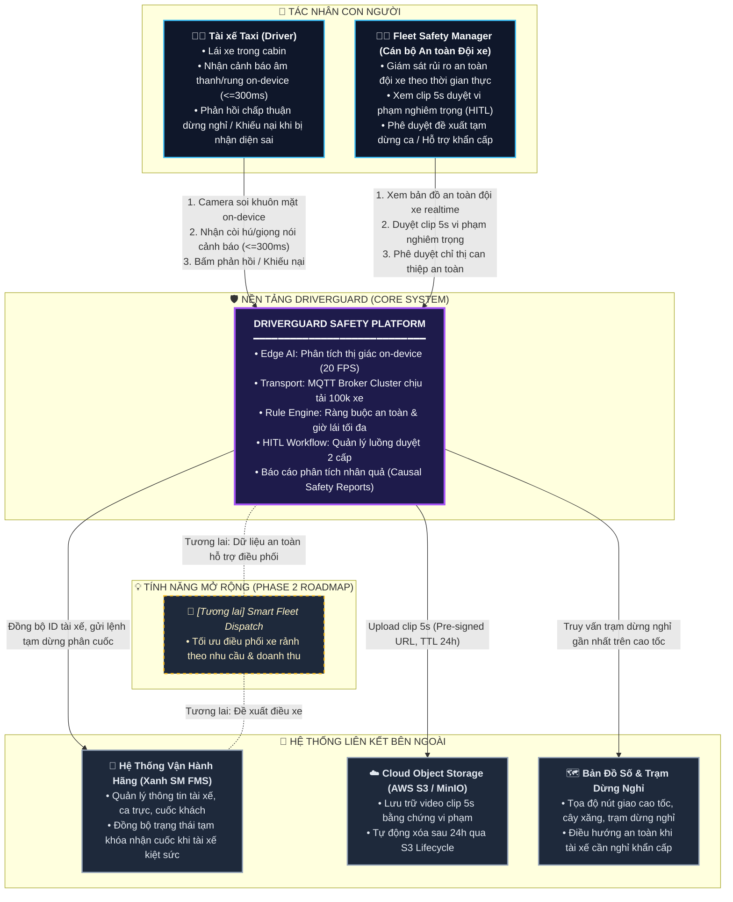
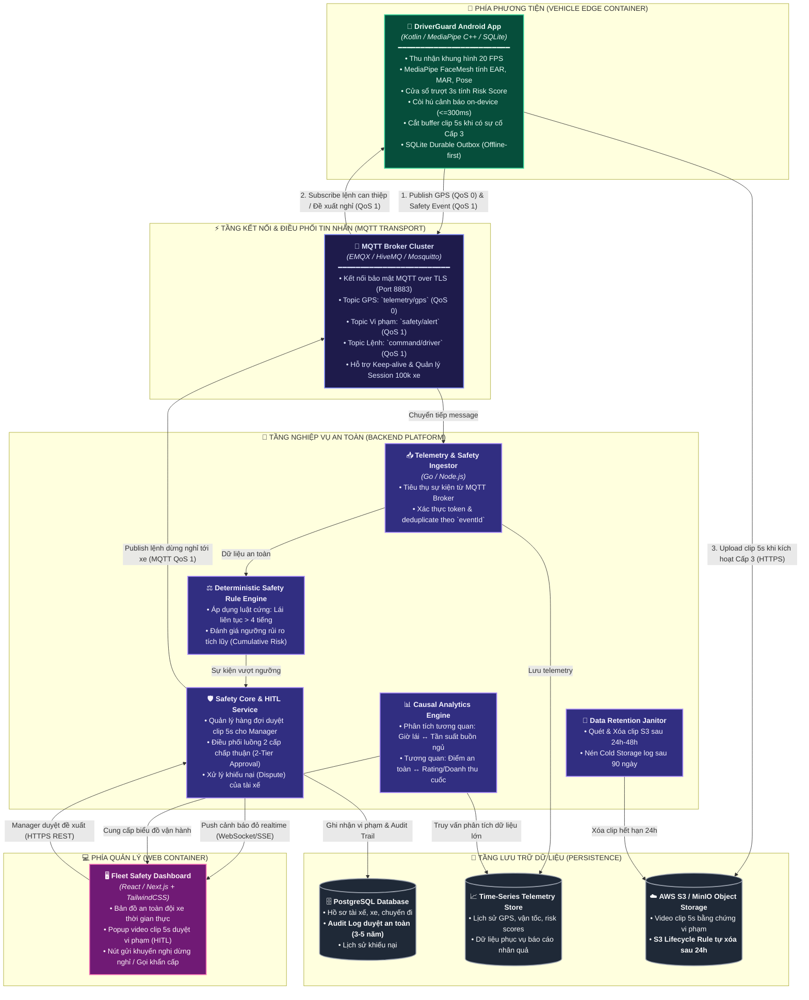
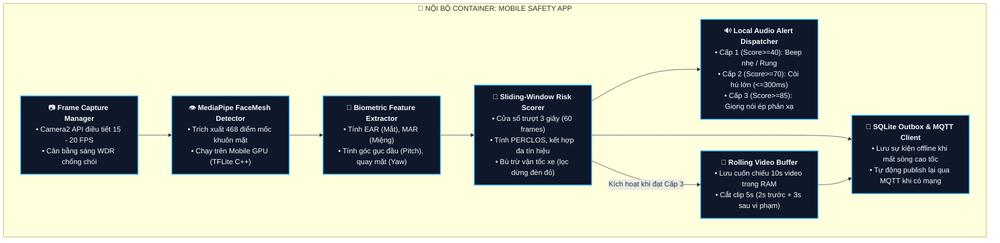
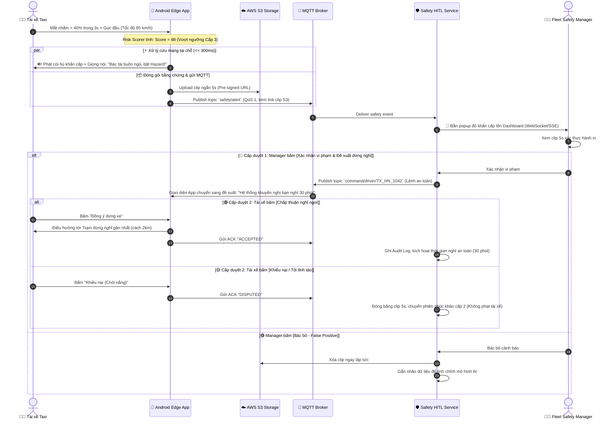

# DRIVERGUARD SOFTWARE ARCHITECTURE DOCUMENT (SAD)
## Tài Liệu Thiết Kế Kiến Trúc Phần Mềm Thống Nhất — Chuẩn C4 Model & Nền Tảng MQTT

| Thuộc tính | Nội dung |
| :--- | :--- |
| **Dự án** | **DriverGuard** — Nền tảng Giám sát An toàn Tài xế & Vận hành Đội xe |
| **Trọng tâm cốt lõi (Core Scope)** | **Safety Core:** Giám sát camera on-device, cảnh báo vi ngủ/buồn ngủ $\le 300\text{ ms}$, luồng duyệt an toàn 2 cấp (HITL) |
| **Phạm vi mở rộng (Phase 2 Roadmap)** | **Smart Fleet Dispatch:** Tối ưu hóa điều phối xe theo nhu cầu và doanh thu (Non-core) |
| **Quy mô mục tiêu** | 100.000 phương tiện kết nối đồng thời (Điển hình: Đội xe điện Xanh SM) |
| **Nền tảng công nghệ chính** | Android Edge AI (MediaPipe), **MQTT over TLS (QoS 0/1)**, Deterministic Rule Engine, PostgreSQL + S3 |
| **Phiên bản tài liệu** | **3.0 — Unified Master Edition** (Hợp nhất triết lý bài toán an toàn & hạ tầng kỹ thuật v2) |
| **Trạng thái** | Sẵn sàng cho Architecture & MVP Review |

---

## 1. BÀI TOÁN CỐT LÕI & NGUYÊN TẮC THIẾT KẾ (PROBLEM FRAMING)

### 1.1. Tuyên bố Bài toán & Sứ mệnh
Tài xế taxi vận hành theo ca dài (8–10 tiếng), đặc biệt ca tối hoặc đi cao tốc, thường bị suy giảm mức độ tỉnh táo sinh học dẫn đến hiện tượng **vi ngủ (micro-sleep)** trong 2–3 giây. Ở vận tốc $80\text{ km/h}$, 2 giây xe trôi tự do gần $50\text{ mét}$.

Hệ thống **DriverGuard** được xây dựng với sứ mệnh:
> **"Bảo vệ tính mạng tài xế và hành khách bằng hệ thống cảnh báo tức thời tại biên (On-device Edge AI), đồng thời chuyển đổi dữ liệu an toàn thành hành động can thiệp có kiểm soát của con người (Human-in-the-Loop) thông qua giao thức kết nối MQTT tối ưu cho 100.000 xe."**

### 1.2. Phân định Ranh giới Phạm vi (Scope Boundary)
* 🔴 **TRỌNG TÂM CỐT LÕI (CORE MVP):**
  1. *Edge Safety:* Camera AI phát hiện nhắm mắt kéo dài ($PERCLOS$), gục đầu, ngáp ngủ; còi hú cảnh báo tại chỗ $\le 300\text{ ms}$ (Offline-first, không phụ thuộc mạng).
  2. *Connected Fleet Transport:* Sử dụng **MQTT over TLS** để truyền telemetry và sự kiện an toàn nhẹ, bền bỉ, tiết kiệm pin.
  3. *Quy trình Duyệt 2 Cấp (2-Tier Approval):* Quản lý duyệt can thiệp an toàn $\rightarrow$ Tài xế tự nguyện chấp thuận dừng nghỉ.
  4. *Chính sách Dữ liệu An toàn:* Clip 5s tự hủy sau 24h, Audit log lưu trữ 3–5 năm phục vụ phân tích nhân quả và kiểm toán.
* ⚪ **TÍNH NĂNG MỞ RỘNG (PHASE 2 ROADMAP):**
  * Tự động dự báo nhu cầu khách (Demand Model) và gợi ý điều phối xe rảnh tăng doanh thu. (Module này tách riêng, không nằm trong luồng core MVP).

### 1.3. Nguyên tắc Bất biến (Architectural Invariants)
1. **An toàn tại biên là tối thượng:** Cảnh báo cứu mạng trên xe không bao giờ được chờ phản hồi từ Cloud hoặc kết nối mạng.
2. **Không stream video liên tục:** 99% dữ liệu là JSON metadata. Chỉ trích xuất clip ngắn 5 giây khi có vi phạm khẩn cấp.
3. **Quyền quyết định thuộc về con người:** AI chỉ phát hiện và đề xuất; Manager duyệt chiến thuật; Tài xế có quyền chấp thuận/từ chối hành động áp dụng cho bản thân.
4. **Kỷ luật bằng chứng:** Mọi cảnh báo, quyết định can thiệp và phản hồi của tài xế đều được lưu vết bất biến trong Audit Log.

---

## 2. KIẾN TRÚC MỨC C1: SYSTEM CONTEXT (BỐI CẢNH HỆ THỐNG)

Biểu đồ C1 định vị DriverGuard trong môi trường vận hành thực tế, tương tác với Tài xế, Quản lý đội xe và các hệ thống ngoài.



---

## 3. KIẾN TRÚC MỨC C2: CONTAINER DIAGRAM (CÁC KHỐI ỨNG DỤNG)

Phân rã hệ thống thành các Container độc lập. Kiến trúc chuyển đổi toàn diện sang **MQTT over TLS** để giải quyết triệt để bài toán 100.000 xe.



---

## 4. KIẾN TRÚC MỨC C3: COMPONENT DIAGRAM (CHI TIẾT NỘI BỘ)

### 4.1. Nội bộ Mobile Safety App (On-Vehicle Edge)
Trách nhiệm xử lý camera on-device, tính Risk Score và điều phối còi báo cục bộ $\le 300\text{ ms}$:



---

## 5. THIẾT KẾ MỨC C4: CODE LEVEL DESIGN & DATA CONTRACTS

### 5.1. Thuật toán Cốt lõi: Cửa Sổ Trượt Tính Risk Score (`AggregateRiskScorer.ts`)

```typescript
export interface FrameBiometrics {
  timestampMs: number;
  ear: number;            // Eye Aspect Ratio (Mắt mở bình thường ~0.3; Nhắm mắt < 0.20)
  mar: number;            // Mouth Aspect Ratio (Miệng bình thường < 0.35; Ngáp > 0.60)
  headPitchDeg: number;   // Góc cúi gục đầu (Gục xuống: < -20 độ)
  headYawDeg: number;     // Góc ngoảnh mặt khỏi đường (Quay trái/phải: > 30 độ)
  isPhoneDetected: boolean;
  vehicleSpeedKmh: number;// Vận tốc xe từ GPS
}

export enum SafetyAlertLevel {
  NORMAL = "NORMAL",                     // 0 - 39 điểm
  LEVEL_1_WARNING = "LEVEL_1_WARNING",   // 40 - 69 điểm (Beep nhẹ on-device)
  LEVEL_2_CRITICAL = "LEVEL_2_CRITICAL", // 70 - 84 điểm (Còi to on-device <=300ms)
  LEVEL_3_ESCALATION = "LEVEL_3_HITL"    // 85 - 100 điểm (Gửi Clip 5s duyệt HITL)
}

export class AggregateRiskScorer {
  private readonly WINDOW_FRAMES = 60; // 3 giây ở tần số 20 FPS
  private buffer: FrameBiometrics[] = [];

  public processFrame(current: FrameBiometrics): { score: number; level: SafetyAlertLevel } {
    this.buffer.push(current);
    if (this.buffer.length > this.WINDOW_FRAMES) {
      this.buffer.shift();
    }

    // 1. Tính toán PERCLOS (% thời gian mắt nhắm trong 3s)
    const closedEyesFrames = this.buffer.filter(f => f.ear < 0.20).length;
    const perclos = closedEyesFrames / this.buffer.length;

    // 2. Kiểm tra gục đầu hoặc quay mặt kéo dài
    const headDeviationFrames = this.buffer.filter(
      f => f.headPitchDeg < -20 || Math.abs(f.headYawDeg) > 30
    ).length;
    const headDeviationRatio = headDeviationFrames / this.buffer.length;

    // 3. Hệ số bù trừ tốc độ GPS (Lọc kẹt xe / dừng đèn đỏ)
    const speedFactor = current.vehicleSpeedKmh < 5.0 ? 0.35 : 1.0;

    // 4. Cộng dồn thang điểm rủi ro đa biến (0 - 100)
    let score = 0;
    if (perclos >= 0.40) score += 40;
    else if (perclos >= 0.25) score += 20;

    if (headDeviationRatio >= 0.50) score += Math.round(30 * speedFactor);
    if (current.mar > 0.60 && perclos > 0.15) score += 15; // Ngáp thật khi mắt nheo
    if (current.isPhoneDetected) score += Math.round(25 * speedFactor);

    score = Math.min(100, Math.max(0, score));

    // 5. Xác định cấp độ cảnh báo
    let level = SafetyAlertLevel.NORMAL;
    if (score >= 85) level = SafetyAlertLevel.LEVEL_3_ESCALATION;
    else if (score >= 70) level = SafetyAlertLevel.LEVEL_2_CRITICAL;
    else if (score >= 40) level = SafetyAlertLevel.LEVEL_1_WARNING;

    return { score, level };
  }
}
```

---

### 5.2. Data Contract: MQTT Payload Sự Kiện An Toàn (`safety/alert`)

```json
{
  "eventId": "evt_98f4c2e1-7b0a-4a21-9d22-12f5a8901bca",
  "eventType": "safety.drowsiness.escalation.v1",
  "occurredAt": "2026-09-28T15:30:00.120Z",
  "deviceId": "DEV_ANDROID_8841",
  "driverId": "TX_HN_1042",
  "vehiclePlate": "29E-888.99",
  "tripId": "TRIP_20260928_88412",
  "telemetry": {
    "latitude": 21.028511,
    "longitude": 105.854444,
    "speedKmh": 85.5,
    "roadType": "HIGHWAY_EXPRESSWAY"
  },
  "metrics": {
    "perclos3s": 0.55,
    "headPitchDeg": -24.5,
    "headYawDeg": 3.8,
    "riskScore": 88
  },
  "evidence": {
    "hasVideoClip": true,
    "clipDurationSec": 5,
    "clipS3Url": "https://s3.fleet.driverguard.io/clips/20260928/TX_HN_1042_evt_98f4c2e1.mp4",
    "clipExpiresAt": "2026-09-29T15:30:00.120Z"
  }
}
```

---

## 6. SƠ ĐỒ LUỒNG RUNTIME: QUY TRÌNH DUYỆT 2 CẤP (2-TIER HITL APPROVAL)

Minh họa quy trình xử lý nhân văn và chặt chẽ khi tài xế ngủ gật trên cao tốc:



---

## 7. CHÍNH SÁCH LƯU TRỮ DỮ LIỆU & BẢO VỆ RIÊNG TƯ (RETENTION POLICY)

| Loại dữ liệu | Vị trí lưu trữ | Vòng đời (TTL) | Cơ chế xóa / chuyển vùng | Mục đích sử dụng |
| :--- | :--- | :--- | :--- | :--- |
| **Video Clip ngắn (5s)** | AWS S3 / MinIO | **24 giờ – 48 giờ** | Tự động xóa (Auto-expire qua S3 Lifecycle) | Phục vụ Manager xác thực vi phạm, xóa ngay để bảo vệ quyền riêng tư |
| **Raw Telemetry (GPS thô)** | Time-Series DB | **30 ngày** | Sau 30 ngày tự động nén hoặc downsampling | Phục vụ đối soát sự cố và đánh giá ca chạy |
| **Audit Log (Lịch sử duyệt & Khiếu nại)** | PostgreSQL (Append-only) | **3 – 5 năm** | Không xóa tự động; lưu vết ID tài xế, quyết định duyệt | Phục vụ kiểm toán an toàn, pháp lý giao thông |
| **Aggregated Metrics** | Data Warehouse | **Vĩnh viễn** | Dữ liệu dạng số đã ẩn danh: heat-map mệt mỏi, điểm an toàn tuần | Phục vụ nghiên cứu nhân quả và báo cáo vận hành |

---

## 8. NĂNG LỰC HỆ THỐNG VỚI KỊCH BẢN 100.000 XE (CAPACITY SCENARIO)

* **Giao thức MQTT:** 100.000 kết nối thường trực duy trì keep-alive (60 giây/lần) chỉ tiêu tốn khoảng **$1.667\text{ pings/giây}$**, RAM trên cụm EMQX/HiveMQ chỉ mất khoảng **$1.5 - 2\text{ GB RAM}$** (hoàn toàn chịu tải nhẹ nhàng so với việc duy trì 100k kết nối WebSocket truyền thống).
* **Băng thông Video:** Chỉ có tối đa $0.5\% - 1\%$ số xe vi phạm Cấp 3 mỗi ngày. Trung bình 1 ngày hệ thống chỉ tiếp nhận khoảng $500 - 1.000$ clip 5s (mỗi clip ~1.5MB $\approx 1.5\text{ GB/ngày}$), chi phí lưu trữ S3 chỉ tốn vài chục nghìn VNĐ/tháng.

---

## 9. ĐÁNH GIÁ ĐÁP ỨNG TOÀN DIỆN CÁC RÀNG BUỘC CỦA MENTOR

1. **Khắc phục triệt để lỗi WebSocket quá tải:** Sử dụng **MQTT over TLS (Port 8883)** phân chia rõ ràng QoS 0 cho GPS và QoS 1 cho vi phạm an toàn.
2. **Khắc phục lỗi cảnh báo phiền hà (False Alarms):** Áp dụng thuật toán **Cửa sổ trượt 3 giây** tính điểm rủi ro tổng hợp ($PERCLOS + Head Pose + GPS Speed$).
3. **Giải quyết bài toán Chi phí & Quyền riêng tư:** Áp dụng cơ chế **Buffer 5s upload S3 tự hủy sau 24h** thay cho WebRTC cồng kềnh.
4. **Bảo đảm quyền con người:** Luồng **HITL 2 cấp chấp thuận** đảm bảo hệ thống không độc đoán phạt oan tài xế.
5. **Tiến độ khả thi cho MVP tuần tới:** Tập trung 100% tài nguyên làm xong **Safety Core** chạy thông luồng từ Mobile $\rightarrow$ MQTT $\rightarrow$ Dashboard.
