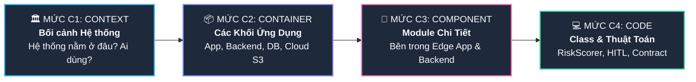
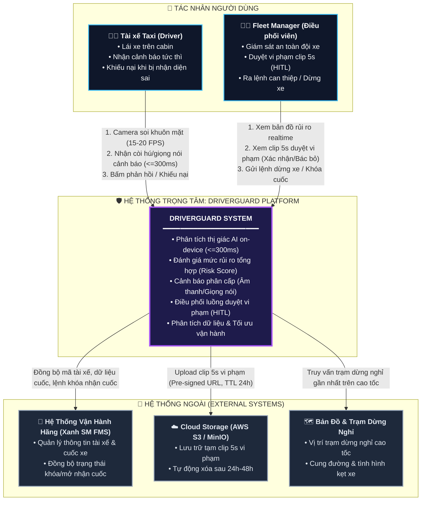
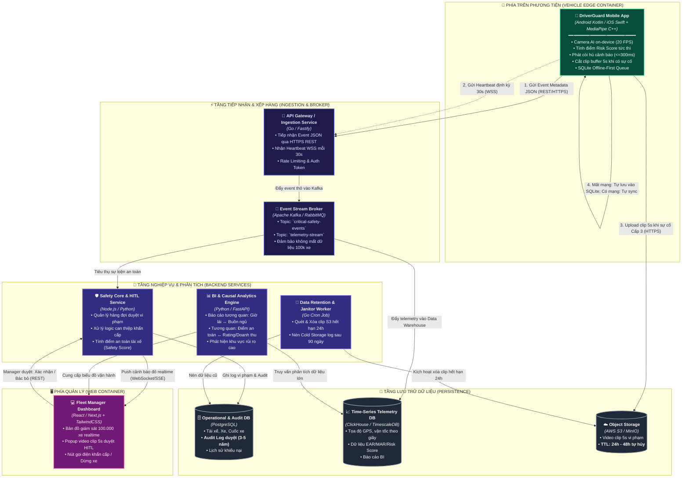
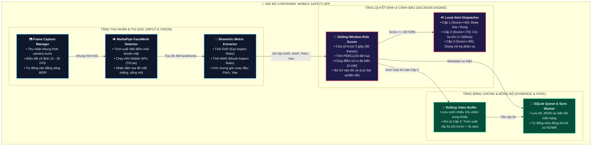
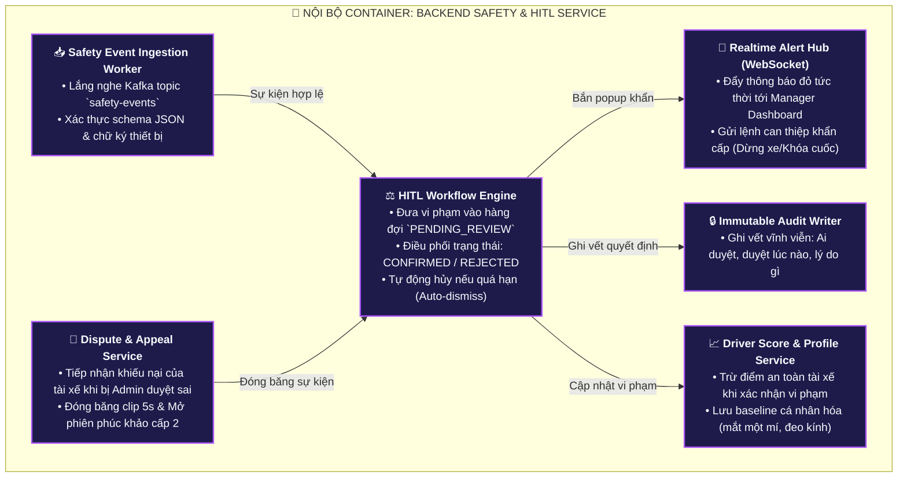
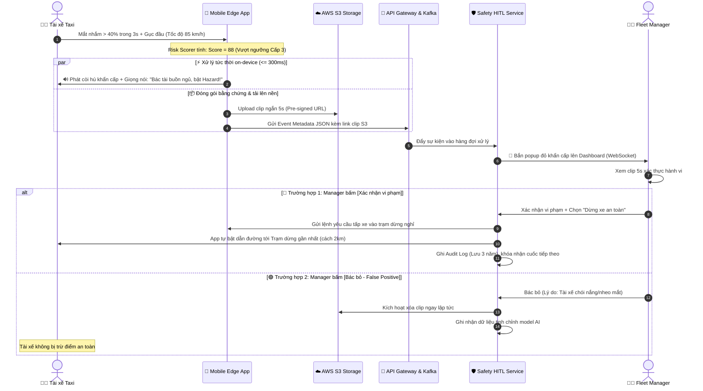

# SOFTWARE ARCHITECTURE DOCUMENT (SAD) — HỆ THỐNG DRIVERGUARD
## Tài Liệu Thiết Kế Kiến Trúc Phần Mềm Toàn Diện (Mô Hình C4 Chuẩn Hóa)

| Thuộc tính | Nội dung |
| :--- | :--- |
| **Dự án** | **DriverGuard** — Hệ thống Giám sát An toàn & Vận hành Đội xe Thông minh |
| **Quy mô mục tiêu** | 100.000 xe taxi (Điển hình: Đội xe Xanh SM) |
| **Phiên bản kiến trúc** | 2.0 (High-Readability Architecture Design) |
| **Chuẩn thiết kế** | C4 Model (Context $\rightarrow$ Container $\rightarrow$ Component $\rightarrow$ Code) |
| **Tài liệu tham chiếu** | PRD v1.0, Báo cáo đánh giá MVP, Biên bản Mentor Duty 01, 02, 03 |

---

## 📌 BẢNG TRA CỨU NHANH 4 CẤP ĐỘ C4



---

# 🏛️ MỨC C1: SYSTEM CONTEXT (BỐI CẢNH HỆ THỐNG)

> **Mục tiêu:** Định vị toàn bộ hệ thống DriverGuard trong môi trường thực tế; xác định rõ tương tác với **Tài xế**, **Fleet Manager** và các **Hệ thống doanh nghiệp bên ngoài**.

### 1. Sơ đồ Kiến trúc Bối cảnh (C1 Diagram)



### 2. Mô tả Trách nhiệm Tác nhân & Giao tiếp trong C1

| Đối tượng / Tác nhân | Vai trò trong hệ thống | Giao thức & Dữ liệu trao đổi |
| :--- | :--- | :--- |
| **Tài xế Taxi** | Người trực tiếp điều khiển phương tiện, nhận cảnh báo cứu mạng tức thời khi mất tập trung/buồn ngủ. | • **Input:** Khuôn mặt trước camera điện thoại.<br>• **Output:** Âm thanh còi hú, rung, khẩu lệnh giọng nói.<br>• **Phản hồi:** Chạm màn hình, hô *"Tôi tỉnh"* hoặc gửi khiếu nại. |
| **Fleet Manager** | Giám sát viên an toàn, giữ vai trò Human-in-the-Loop để bảo đảm AI không đánh giá oan cho tài xế. | • **Giao diện:** Web Dashboard (HTTPS / WSS).<br>• **Thao tác:** Xem clip 5s $\rightarrow$ Bấm Xác nhận / Bác bỏ $\rightarrow$ Gửi lệnh can thiệp. |
| **Hãng Taxi (Xanh SM FMS)** | Cung cấp thông tin nghiệp vụ và nhận chỉ thị điều phối từ DriverGuard. | • **REST API / Webhook:** Đồng bộ ID tài xế, biển số xe, trạng thái cuốc (`CHỞ KHÁCH` / `RẢNH`), thực thi lệnh khóa cuốc tạm thời. |
| **Cloud Object Storage (S3)** | Kho lưu trữ video bằng chứng vi phạm dung lượng tối ưu. | • **HTTPS S3 API:** Upload clip 5 giây khi có sự cố nghiêm trọng; tự hủy sau 24h theo chính sách S3 Lifecycle. |
| **Map & POI Service** | Bản đồ số hỗ trợ điều hướng an toàn. | • **REST API:** Định vị nút giao cao tốc, trạm xăng, trạm dừng nghỉ gần nhất khi tài xế kiệt sức. |

---

# 📦 MỨC C2: CONTAINER DIAGRAM (CÁC KHỐI ỨNG DỤNG)

> **Mục tiêu:** Phân rã hệ thống thành các khối phần mềm (Container) độc lập về mặt triển khai và công nghệ. Giải quyết bài toán chịu tải **100.000 xe** mà không làm nghẽn mạng hay tràn chi phí server.

### 1. Sơ đồ Kiến trúc Container (C2 Diagram)



### 2. Bảng Phân Tích Công Nghệ & Trọng Trách Container (C2)

| Container | Công nghệ đề xuất | Trách nhiệm chính | Giải quyết bài toán gì của Mentor? |
| :--- | :--- | :--- | :--- |
| **Mobile Safety App** | Kotlin/Swift, MediaPipe Tasks, SQLite | Chạy AI on-device 20 FPS, còi báo $\le 300\text{ ms}$, cắt clip buffer 5s, lưu hàng đợi offline. | **Không phụ thuộc 4G/Internet**, xử lý cứu mạng tức thời, không lo mất sóng cao tốc. |
| **API Gateway** | Golang / Fastify | Nhận kết nối REST/WebSocket, định tuyến, kiểm tra tính hợp lệ của token thiết bị. | Đảm bảo throughput cao, tiêu tốn ít RAM/CPU khi tiếp nhận kết nối từ hàng chục ngàn xe. |
| **Message Broker** | Apache Kafka | Đệm và xếp hàng bất đồng bộ mọi sự kiện an toàn và dữ liệu GPS. | Tránh hiện tượng quá tải hệ thống Backend vào giờ cao điểm hoặc sự cố diện rộng. |
| **Safety Core & HITL** | Node.js / Python | Quản lý quy trình duyệt của Manager, phân phối cảnh báo đỏ, xử lý khiếu nại của tài xế. | Hiện thực hóa mô hình **Human-in-the-Loop**, loại trừ nguy cơ phạt oan do AI. |
| **Object Storage (S3)** | AWS S3 / MinIO | Lưu trữ tạm các video clip 5s làm bằng chứng cho Manager duyệt. | **Giải bài toán chi phí:** Chỉ lưu clip khi có vi phạm; áp dụng **S3 Lifecycle 24h tự xóa**. |
| **Audit DB (PostgreSQL)** | PostgreSQL | Lưu vết toàn bộ lịch sử vi phạm, biên bản phê duyệt của Manager. | Lưu trữ bất biến phục vụ kiểm toán, pháp lý trong **3–5 năm**. |
| **Telemetry DB** | ClickHouse | Lưu trữ chuỗi thời gian GPS, vận tốc, PERCLOS, dữ liệu lái xe liên tục. | Phục vụ **Báo cáo phân tích nhân quả (Causal Analysis)** và BI với tốc độ query mili-giây. |

---

# 🧩 MỨC C3: COMPONENT DIAGRAM (CHI TIẾT MODULE NỘI BỘ)

> **Mục tiêu:** Nhìn sâu vào bên trong 2 Container quan trọng nhất: **Mobile Safety App** và **Backend Safety & HITL Service**.

---

### 3.1. Sơ đồ Component: Mobile Safety App (On-Vehicle Edge)



---

### 3.2. Sơ đồ Component: Backend Safety & HITL Service



---

# 💻 MỨC C4: CODE LEVEL DESIGN (THIẾT KẾ MÃ NGUỒN & HỢP ĐỒNG)

> **Mục tiêu:** Cung cấp mã nguồn hiện thực hóa các thuật toán mấu chốt, cấu trúc dữ liệu JSON Contract và Class Diagram chi tiết.

### 4.1. Thuật toán Cốt lõi: Chấm Điểm Rủi Ro Trượt (Sliding-Window Risk Scorer)

Dưới đây là mã nguồn TypeScript mô tả chuẩn xác logic chạy on-device trên điện thoại:

```typescript
/**
 * Cấu trúc dữ liệu đầu vào trích xuất từ từng frame hình ảnh
 */
export interface FrameBiometrics {
  frameIndex: number;
  timestampMs: number;
  ear: number;            // Eye Aspect Ratio (Mắt mở bình thường ~0.3; Nhắm mắt < 0.20)
  mar: number;            // Mouth Aspect Ratio (Miệng bình thường < 0.35; Ngáp > 0.60)
  headPitchDeg: number;   // Góc gục đầu (Gục xuống: < -20 độ)
  headYawDeg: number;     // Góc ngoảnh mặt (Quay trái/phải: > 30 độ)
  isPhoneDetected: boolean;
  vehicleSpeedKmh: number;// Vận tốc xe lấy từ GPS
}

export enum SafetyAlertLevel {
  NORMAL = 0,             // 0 - 39 điểm: Bình thường
  LEVEL_1_WARNING = 1,    // 40 - 69 điểm: Nhắc nhở nhẹ (Beep/Rung on-device)
  LEVEL_2_CRITICAL = 2,   // 70 - 84 điểm: Nguy hiểm cao (Còi hú lớn on-device)
  LEVEL_3_HITL = 3        // 85 - 100 điểm: Khẩn cấp (Upload clip 5s cho Manager duyệt)
}

export class AggregateRiskScorer {
  private readonly WINDOW_SIZE = 60; // Cửa sổ 3 giây ở tần số 20 FPS
  private buffer: FrameBiometrics[] = [];

  public evaluateFrame(current: FrameBiometrics): { score: number; level: SafetyAlertLevel } {
    this.buffer.push(current);
    if (this.buffer.length > this.WINDOW_SIZE) {
      this.buffer.shift();
    }

    // 1. Tính toán PERCLOS (% thời gian mắt nhắm trong 3 giây)
    const closedEyesFrames = this.buffer.filter(f => f.ear < 0.20).length;
    const perclos = closedEyesFrames / this.buffer.length;

    // 2. Kiểm tra gục đầu hoặc quay mặt kéo dài
    const headDownFrames = this.buffer.filter(f => f.headPitchDeg < -20 || Math.abs(f.headYawDeg) > 30).length;
    const headDeviationRatio = headDownFrames / this.buffer.length;

    // 3. Hệ số bù trừ tốc độ (Lọc False Positive khi dừng đèn đỏ hoặc kẹt xe)
    const isStoppedOrCreeping = current.vehicleSpeedKmh < 5.0;
    const speedMultiplier = isStoppedOrCreeping ? 0.35 : 1.0;

    // 4. Cộng dồn thang điểm rủi ro đa biến (0 - 100)
    let score = 0;

    // Trọng số PERCLOS (Tối đa 40 điểm)
    if (perclos >= 0.40) score += 40;
    else if (perclos >= 0.25) score += 20;

    // Trọng số Gục đầu / Ngoảnh mặt (Tối đa 30 điểm)
    if (headDeviationRatio >= 0.50) {
      score += Math.round(30 * speedMultiplier);
    }

    // Trọng số Ngáp ngủ thật (Tối đa 15 điểm - chỉ tính khi mắt nheo)
    if (current.mar > 0.60 && perclos > 0.15) {
      score += 15;
    }

    // Trọng số Sử dụng điện thoại (Tối đa 25 điểm)
    if (current.isPhoneDetected) {
      score += Math.round(25 * speedMultiplier);
    }

    score = Math.min(100, Math.max(0, score));

    // 5. Phân định cấp độ cảnh báo
    let level = SafetyAlertLevel.NORMAL;
    if (score >= 85) level = SafetyAlertLevel.LEVEL_3_HITL;
    else if (score >= 70) level = SafetyAlertLevel.LEVEL_2_CRITICAL;
    else if (score >= 40) level = SafetyAlertLevel.LEVEL_1_WARNING;

    return { score, level };
  }
}
```

---

### 4.2. Data Contract: Payload JSON Sự Kiện Vi Phạm (Mobile $\rightarrow$ Server)

```json
{
  "$schema": "https://json-schema.driverguard.io/v2/safety-event.json",
  "eventId": "evt_98f4c2e1-7b0a-4a21-9d22-12f5a8901bca",
  "driverId": "TX_HN_1042",
  "vehiclePlate": "29E-888.99",
  "tripId": "TRIP_20260928_88412",
  "timestamp": "2026-09-28T15:30:00.120Z",
  "telemetry": {
    "latitude": 21.028511,
    "longitude": 105.854444,
    "speedKmh": 85.5,
    "roadCategory": "HIGHWAY_EXPRESSWAY",
    "tripStatus": "OCCUPIED"
  },
  "aiMetrics": {
    "perclos3s": 0.55,
    "headPitchDeg": -24.5,
    "headYawDeg": 3.8,
    "aggregateRiskScore": 88
  },
  "violationType": "DROWSINESS_CONFIRMED",
  "severityLevel": "LEVEL_3_HITL",
  "evidence": {
    "clipDurationSec": 5,
    "clipS3Url": "https://s3.fleet.driverguard.io/clips/20260928/TX_HN_1042_evt_98f4c2e1.mp4",
    "clipExpiresAt": "2026-09-29T15:30:00.120Z"
  }
}
```

---

# 🔄 SƠ ĐỒ LUỒNG TOÀN TRÌNH (SEQUENCE DIAGRAM)

Quy trình phản ứng khi tài xế có dấu hiệu ngủ gật trên cao tốc:



---

# 🎯 ĐÁNH GIÁ ĐÁP ỨNG CÁC RÀNG BUỘC CỦA MENTOR

| Ràng buộc Mentor đặt ra | Giải pháp thiết kế trong tài liệu SAD này | Vị trí thể hiện |
| :--- | :--- | :--- |
| **Quy mô 100.000 xe** | Không dùng WebSocket stream video liên tục; sử dụng kiến trúc **Event-Driven JSON siêu nhẹ qua Kafka**; chỉ upload clip 5s khi sự cố. | Mức C2 (Container) |
| **Độ trễ cảnh báo on-device** | Pipeline thị giác MediaPipe + Risk Scorer chạy cục bộ trên mobile với thời gian phản hồi $\le 300\text{ ms}$, hoạt động cả khi mất mạng. | Mức C3.1 (Mobile App) |
| **Chi phí lưu trữ & Quyền riêng tư** | Áp dụng chính sách **Retention 24h đối với clip S3** (tự xóa qua Lifecycle Rule); Audit Log lưu 3–5 năm dạng bản ghi chữ. | Mức C1, C2 & Data Contract |
| **Tránh báo động phiền hà (False Alarm)** | Thuật toán **Cửa sổ trượt 3 giây** kết hợp bù trừ vận tốc GPS (loại trừ xe dừng đèn đỏ, ngáp giả, nói chuyện). | Mức C4 (Thuật toán Risk Scorer) |
| **Đảm bảo công bằng cho tài xế** | Thiết kế quy trình **Human-in-the-Loop (HITL)** kèm cơ chế Khiếu nại 1 chạm và đối soát dữ liệu viễn thông. | Mức C3.2 & Sequence Diagram |
