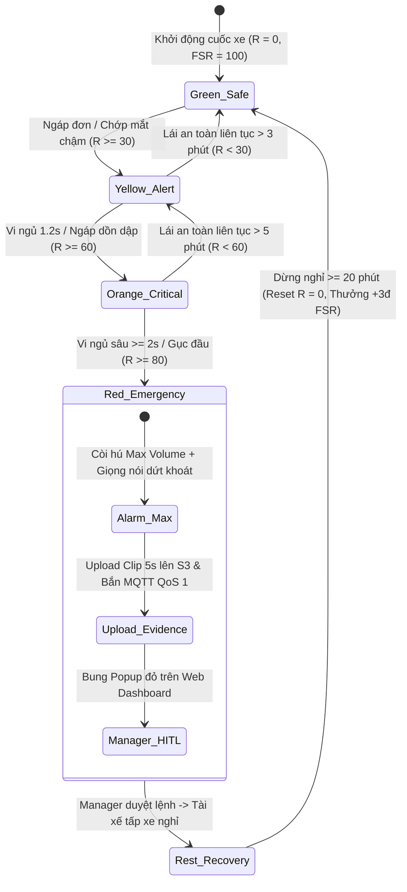

# DRIVERGUARD — BỘ QUY TẮC ĐÁNH GIÁ RỦI RO & THANG ĐIỂM AN TOÀN TÀI XẾ
> **Tài liệu đặc tả kỹ thuật chuẩn hóa (Dynamic Risk Engine & Fleet Safety Scorecard)**  
> **Phiên bản:** 3.0 Production Standard  
> **Phạm vi áp dụng:** On-device Edge AI (Android) • Xử lý Sự kiện Realtime • Hệ thống Quản trị Đội xe (Manager HITL)

---

## 1. NGUYÊN LÝ THIẾT KẾ CỦA BỘ MÁY ĐÁNH GIÁ RỦI RO

Hệ thống đánh giá rủi ro của DriverGuard không chỉ bắt các khung hình nhắm mắt hay ngáp đơn lẻ, mà mô phỏng chính xác **bản chất sinh học của sự mệt mỏi và mất tập trung**:
1. **Tính trễ sinh học (Biological Lag):** Tài xế sau một cơn vi ngủ (Microsleep), dù đã mở mắt lại vẫn ở trạng thái suy giảm nhận thức trong nhiều phút tiếp theo.
2. **Cụm nguy cơ dồn dập (Fatigue Clustering):** Cơn buồn ngủ và mất tập trung luôn có xu hướng xuất hiện dày đặc thành từng chuỗi thời gian ngắn trước khi xảy ra tai nạn thực sự.
3. **Triệt tiêu hiện tượng mỏi cảnh báo (Anti Alert Fatigue):** Cảnh báo nhẹ chỉ nhắc nhở âm thầm trong cabin; chỉ khi rủi ro tích lũy vượt ngưỡng nguy hiểm mới kích hoạt còi hú to và chuyển dữ liệu về trung tâm điều hành.

---

## 2. PHẦN I: ĐIỂM RỦI RO TÍCH LŨY THỜI GIAN THỰC (REAL-TIME RISK SCORE)

Điểm rủi ro thời gian thực $R(t)$ là một biến số liên tục nằm trong thang điểm từ **$0$ (Tỉnh táo hoàn hảo)** đến **$100$ (Mất kiểm soát hoàn toàn phương tiện)**.

### 2.1. Công thức cập nhật chu kỳ $1$ giây ($1\text{ Hz}$) trên thiết bị Edge:

$$R(t) = \max\Big(0, \, \min\big(100, \, R(t - 1) + \Delta R_{\text{vi phạm}} \times K_{\text{bối cảnh}} - \Delta R_{\text{hạ nhiệt}}\big)\Big)$$

Trong đó:
* $R(t - 1)$: Điểm rủi ro tích lũy của giây trước đó.
* $\Delta R_{\text{vi phạm}}$: Điểm cộng phát sinh từ các hành vi nguy hiểm được nhận diện qua Camera AI.
* $K_{\text{bối cảnh}}$: Hệ số nhân khuếch đại rủi ro dựa trên vận tốc, khung giờ sinh học và thời gian lái xe liên tục.
* $\Delta R_{\text{hạ nhiệt}}$: Điểm giảm tự nhiên khi tài xế duy trì trạng thái lái xe an toàn, tập trung hoặc dừng nghỉ.

---

### 2.2. Bảng ma trận vi phạm chuẩn hóa theo nhóm hành vi ($\Delta R_{\text{vi phạm}}$)

Hệ thống gom 12 tiêu chí vi mô thành **4 nhóm hành vi cốt lõi**, giúp tài xế và quản lý dễ dàng nắm bắt:

| Nhóm hành vi | Hành vi nhận diện cụ thể | Ngưỡng phát hiện (Camera AI) | Điểm rủi ro cộng ($\Delta R$) | Mức độ cảnh báo |
| :--- | :--- | :--- | :---: | :---: |
| **1. Mệt mỏi nhẹ** | **Ngáp sâu / Uể oải** | Miệng mở to liên tục $\ge 2.0\text{s}$ hoặc ngáp dồn dập | **$+15$** | Thấp |
| **2. Mất tập trung** | **Ngoảnh mặt / Nhìn điện thoại** | Đầu quay lệch hướng kính lái hoặc cúi nhìn điện thoại liên tục $\ge 2.0\text{s}$ | **$+25$** | Trung bình |
| **3. Vi ngủ buồng lái** | **Vi ngủ (Microsleep) / Gục đầu** | Nhắm mắt kéo dài từ $1.2\text{s} - 2.0\text{s}$ hoặc gục đầu xuống vô lăng | **$+45$** | **Cao** |
| **4. Ngủ gật nguy cấp** | **Ngủ sâu buồng lái** | Nhắm mắt hoặc tựa đầu ngủ kéo dài $\ge 2.0\text{s}$ | **$+70$** | **Cực kỳ nguy cấp** |

---

### 2.3. Hệ số khuếch đại rủi ro bối cảnh ($K_{\text{bối cảnh}}$)

Điểm vi phạm được nhân hệ số tăng giảm tùy theo nguy cơ thực tế trên đường:

$$K_{\text{bối cảnh}} = K_{\text{vận tốc}} \times K_{\text{khung giờ}} \times K_{\text{thời gian lái}}$$

* **Vận tốc GPS ($K_{\text{vận tốc}}$):**
  * Xe dừng / Bò chậm ($v < 5\text{ km/h}$): **$0.25$** *(Chống báo nhầm khi kẹt xe)*.
  * Đô thị ($5 - 35\text{ km/h}$): **$0.80$**.
  * Đường trường / Thoáng ($35 - 70\text{ km/h}$): **$1.00$**.
  * Cao tốc ($v \ge 70\text{ km/h}$): **$1.60$** *(Gia tăng mức độ nguy hiểm)*.
* **Khung giờ chạy ($K_{\text{khung giờ}}$):** Ban ngày: **$1.00$** • Đêm khuya ($00:00 - 05:30$): **$1.35$**.
* **Thời gian lái liên tục ($K_{\text{thời gian lái}}$):** Dưới 2 giờ: **$1.00$** • Từ 2 - 4 giờ: **$1.20$** • Quá 4 giờ: **$1.50$**.

---

### 2.4. Quy tắc hạ nhiệt và phục hồi điểm ($Cooldown\ \&\ Recovery$)

1. **Giữ nhiệt (Hold Time):** Sau mỗi vi phạm, điểm rủi ro giữ nguyên **$30\text{ giây}$**, không hạ ngay.
2. **Hạ nhiệt tự nhiên:** Khi lái xe an toàn trở lại:
   * Vùng nguy hiểm ($R \ge 60$): Giảm **$-2$ điểm mỗi $10\text{s}$**.
   * Vùng an toàn ($R < 60$): Giảm **$-4$ điểm mỗi $10\text{s}$**.
3. **Phục hồi khi dừng nghỉ:**
   * Dừng xe nghỉ $5 - 15\text{ phút}$: Giảm **$-30$ điểm**.
   * Dừng nghỉ $\ge 20\text{ phút}$: **Reset điểm về $0$**.

---

### 2.5. Các ví dụ tính toán thực tế chứng minh công thức

#### Ví dụ 1: Xe kẹt xe / Dừng đèn đỏ rồi ngáp (Chứng minh chống báo động ảo)
* **Bối cảnh:** Xe chạy đô thị giờ cao điểm, nhích từng mét với $v = 3\text{ km/h}$. Khung giờ $09:30$ sáng, mới lái $45$ phút. Điểm trước đó $R(t-1) = 0$.
* **Hệ số bối cảnh:**
  $$K_{\text{bối cảnh}} = K_{\text{vận tốc}} (0.25) \times K_{\text{khung giờ}} (1.00) \times K_{\text{thời gian lái}} (1.00) = \mathbf{0.25}$$
* **Hành vi:** Bác tài ngáp sâu $\ge 2.0\text{s}$ ($\Delta R = +15$).
* **Tính toán:**
  $$R(t) = 0 + (15 \times 0.25) = \mathbf{3.75} \approx \mathbf{4\text{ điểm}}$$
* **Kết luận:** Điểm nằm sâu trong **VÙNG XANH ($0 - 29$)**. Hệ thống ghi nhận âm thầm, **không rung chuông hay phát âm thanh**, triệt tiêu hoàn toàn sự khó chịu cho tài xế lúc xe đứng yên.

#### Ví dụ 2: Vi ngủ buồng lái trên cao tốc ban đêm (Chứng minh kích hoạt cấp cứu tức thì)
* **Bối cảnh:** Xe khách chạy $85\text{ km/h}$ trên cao tốc lúc $01:45$ sáng. Bác tài đã lái liên tục $3.5$ tiếng. Trước đó đã tích lũy mệt mỏi nhẹ $R(t-1) = 25$.
* **Hệ số bối cảnh:**
  $$K_{\text{bối cảnh}} = K_{\text{vận tốc}} (1.60) \times K_{\text{khung giờ}} (1.35) \times K_{\text{thời gian lái}} (1.20) \approx \mathbf{2.59}$$
* **Hành vi:** Bác tài bị vi ngủ (Microsleep) nhắm mắt $1.5\text{s}$ ($\Delta R = +45$).
* **Tính toán:**
  $$R(t) = \min\big(100, \, 25 + 45 \times 2.59\big) = \min(100, \, 25 + 116.55) = \mathbf{100\text{ điểm}}$$
* **Kết luận:** Điểm vọt thẳng lên **$100$ (VÙNG ĐỎ - Nguy cấp Lv3 HITL)**: Còi hú $100\text{ dB}$ trong cabin đánh thức tài xế ngay lập tức, đồng thời Web Dashboard điều hành bật còi báo động đỏ kèm clip 5s để quản lý gọi điện can thiệp dừng xe khẩn cấp.

#### Ví dụ 3: Quá trình hạ nhiệt phục hồi điểm sau cảnh báo
* **Bối cảnh:** Sau khi bị còi Vùng Cam nhắc nhở ($R = 65$), tài xế tập trung lái xe nghiêm túc trong $5\text{ phút}$ ($300\text{s}$).
* **Diễn biến hạ nhiệt:**
  1. *Giữ nhiệt (30s đầu):* Điểm $R$ giữ nguyên $65$.
  2. *Hạ nhiệt vùng nguy hiểm ($R \ge 60$):* Giảm từ $65$ về $60$ (5 điểm) với tốc độ $-2$đ/10s $\rightarrow$ Mất $25\text{ giây}$.
  3. *Hạ nhiệt vùng an toàn ($R < 60$):* Thời gian còn lại là $300 - 30 - 25 = 245\text{s}$. Tốc độ $-4$đ/10s $\rightarrow$ Điểm giảm tiếp: $\frac{245}{10} \times 4 = 98$ điểm.
* **Kết luận:** $R(t) = \max(0, 60 - 98) = \mathbf{0\text{ điểm}}$ (Trở lại Vùng Xanh an toàn tuyệt đối).

---

## 3. PHẦN II: BỐN MỐC PHÂN CẤP CẢNH BÁO & MA TRẬN HÀNH ĐỘNG

Dựa vào giá trị $R(t)$ tại từng giây, hệ thống tự động phân loại thành 4 vùng kiểm soát:

```
[0 ─────────── 29]          [30 ─────────── 59]          [60 ─────────── 79]          [80 ─────────── 100]
    VÙNG XANH                    VÙNG VÀNG                    VÙNG CAM                     VÙNG ĐỎ
  (An toàn 100%)              (Cảnh giác Lv1)             (Nguy cơ cao Lv2)            (Khẩn cấp Lv3 HITL)
  Ghi nhận âm thầm            Rung / Beep nhẹ              Còi hú cabin 75dB           Còi Max + Báo Fleet
```

| Mốc điểm $R(t)$ | Phân cấp trạng thái | Hành vi thực tế buồng lái | Phản ứng tại Cabin xe (Edge AI) | Phản ứng tại Trung tâm (Fleet Manager) |
| :---: | :--- | :--- | :--- | :--- |
| **$0 - 29$** | **VÙNG XANH**<br>*(An toàn)* | Tỉnh táo, quan sát tập trung. | • Màn hình app hiện viền xanh an toàn.<br>• Không phát âm thanh gây xao nhãng. | Gửi bản tin GPS Telemetry định kỳ qua **MQTT QoS 0** (30s/lần). |
| **$30 - 59$** | **VÙNG VÀNG**<br>*(Cảnh giác - Level 1)* | Bắt đầu mệt mỏi: ngáp thưa, liếc màn hình hơi lâu. | • Rung nhẹ điện thoại 1 nhịp.<br>• Âm "Chime" êm dịu nhắc nhở.<br>• Hiện biểu tượng: *"Hãy tập trung lái xe"*. | **Không gửi cảnh báo lên Server** (Triệt tiêu hiện tượng mỏi thông báo). |
| **$60 - 79$** | **VÙNG CAM**<br>*(Nguy cơ cao - Level 2)* | Vi ngủ $1.2s$, ngáp liên tục, gục đầu hoặc mất tập trung $\ge 2s$. | • **Còi hú cabin $\le 300\text{ ms}$** âm lượng $75\text{ dB}$.<br>• Giọng nói: *"Bác tài chú ý quan sát!"*.<br>• Tự động siết độ nhạy nhận diện. | • Bắn gói tin Event Metadata JSON qua **MQTT QoS 1**.<br>• Ghi nhận 1 sự cố Warning vào hồ sơ ca. |
| **$80 - 100$** | **VÙNG ĐỎ**<br>*(Nguy cấp can thiệp - Level 3 HITL)* | Ngủ gật sâu $\ge 2s$, gục đầu trên cao tốc, hoặc tái diễn vi phạm. | • **Còi hú âm lượng tối đa ($100\text{ dB}$)** liên tục.<br>• Giọng nói: *"Bác tài buồn ngủ, tấp xe dừng ngay!"*.<br>• Đèn viền màn hình chớp đỏ toàn phần. | • **Bung popup chuông báo động đỏ toàn màn hình Web Dashboard**.<br>• Đẩy clip bằng chứng **5 giây** lên Cloud.<br>• **Kích hoạt luồng duyệt can thiệp 2 cấp (HITL)**: Manager bấm gửi lệnh yêu cầu dừng xe nghỉ ngơi. |

---

## 4. PHẦN III: BỘ QUY TẮC THANG ĐIỂM AN TOÀN TÀI XẾ DÀI HẠN (FLEET SAFETY SCORECARD)

Khác với điểm rủi ro tức thời $R(t)$, **Điểm An Toàn Tài Xế ($SafetyScore$)** là chỉ số tín nhiệm dài hạn dùng để xếp hạng và đánh giá thi đua theo từng ca, tuần và tháng.

Thang điểm chuẩn: **$0$ đến $100$ điểm** (Mỗi ca bắt đầu với **$100\text{ điểm}$**).

$$SafetyScore = 100 - \sum \text{Điểm trừ vi phạm} + \sum \text{Điểm thưởng an toàn}$$

---

### 4.1. Bảng trừ điểm vi phạm (Penalties)

Bỏ các tiêu chí phạt vi mô; chỉ tập trung vào các lỗi có tác động lớn đến an toàn vận hành:

| Loại vi phạm | Điều kiện ghi nhận | Điểm trừ | Biện pháp xử lý |
| :--- | :--- | :---: | :--- |
| **Cảnh báo Nguy cơ (Vùng Cam)** | Kích hoạt cảnh báo Vùng Cam (Score 60 - 79) | **$-3$ điểm / lần** | Nhắc nhở qua app sau cuốc xe. |
| **Nguy cấp buồng lái (Vùng Đỏ)** | Xác nhận ngủ gật / vi ngủ sâu (Score $\ge 80$) | **$-10$ điểm / lần** | Bắt buộc dừng xe nghỉ 30 phút. |
| **Lái xe quá giờ quy định** | Lái xe liên tục quá 4 giờ không dừng nghỉ | **$-10$ điểm** | Tạm khóa nhận cuốc đến khi nghỉ đủ 15 phút. |
| **Cố ý gian lận / Che Camera** | Che khuất hoặc vô hiệu hóa camera khi xe chạy | **$-20$ điểm** | Báo động gian lận, đình chỉ xét thưởng. |
| **Chống lệnh dừng xe** | Không chấp hành yêu cầu dừng nghỉ của Quản lý | **$-25$ điểm** | Khóa tài khoản, chuyển kỷ luật đội xe. |

---

### 4.2. Bảng cộng điểm thưởng lái xe an toàn (Rewards)

| Hành vi an toàn | Điều kiện đạt thưởng | Điểm cộng | Ghi chú |
| :--- | :--- | :---: | :--- |
| **Lái xe tập trung chuẩn mực** | Hoàn thành mỗi $60\text{ phút}$ lái xe không có cảnh báo | **$+2$ điểm** | Tối đa $+6$ điểm/ca. |
| **Chấp hành nghiêm túc dừng nghỉ** | Đồng ý và thực hiện dừng nghỉ $\ge 20$ phút khi có cảnh báo | **$+3$ điểm** | Ghi nhận mỗi lần chấp hành. |
| **Ca chạy hoàn hảo (Clean Shift)** | Kết thúc ca $\ge 8\text{ giờ}$ không phát sinh vi phạm Cam / Đỏ | **$+5$ điểm** | Tích lũy trực tiếp vào quỹ thi đua tháng. |

---

### 4.3. Bảng phân hạng tài xế & Biện pháp quản lý

| Thang điểm $SafetyScore$ | Phân hạng | Danh hiệu | Chính sách điều hành & Đãi ngộ |
| :---: | :---: | :---: | :--- |
| **$90 - 100$** | **Hạng A** | 🟢 **Bác tài Tinh Hoa** | Ưu tiên phân bổ cuốc xe VIP, nhận đủ thưởng KPI an toàn. |
| **$75 - 89$** | **Hạng B** | 🟡 **Đạt chuẩn An toàn** | Vận hành bình thường, đạt định mức thưởng chuẩn. |
| **$60 - 74$** | **Hạng C** | 🟠 **Cần Cải Thiện** | Giảm phân bổ cuốc đường dài; cán bộ đội xe trực tiếp nhắc nhở. |
| **Dưới $60$** | **Hạng D** | 🔴 **Nguy Cơ Cao** | **Tạm đình chỉ ca chạy đêm**, đào tạo lại quy chuẩn an toàn buồng lái. |

---

### 4.4. Ví dụ tính điểm SafetyScore thực tế cho một ca làm việc

* **Hồ sơ ca trực của Bác tài (Ca 9 giờ đường dài):**
  * Điểm ban đầu khi bắt đầu ca: **$100\text{ điểm}$**.
  * **Các sự kiện trừ điểm trong ca:**
    * 1 lần vi phạm Vùng Cam (cúi nhìn màn hình điện thoại $\ge 2.0\text{s}$): **$-3$ điểm**.
    * 1 lần lái xe liên tục 4h15 phút (chưa kịp tấp vào trạm dừng do kẹt xe): **$-10$ điểm**.
    * *Tổng điểm trừ:* **$-13$ điểm**.
  * **Các hành vi được cộng điểm thưởng:**
    * Chấp hành chỉ thị của hệ thống, tấp vào trạm dừng nghỉ $25\text{ phút}$: **$+3$ điểm**.
    * Duy trì được 2 chặng $60\text{ phút}$ lái xe tập trung an toàn ($R(t) < 30$): $2 \times (+2) =$ **$+4$ điểm**.
    * *Tổng điểm thưởng:* **$+7$ điểm**.
  * **Tính điểm an toàn chốt ca:**
    $$SafetyScore = 100 - 13 + 7 = \mathbf{94\text{ điểm}}$$
  * **Kết quả xếp hạng & Đãi ngộ:** Đạt **Hạng A (Bác tài Tinh Hoa)** $\rightarrow$ Được duy trì định mức thưởng KPI an toàn tối đa tháng và ưu tiên nhận cuốc xe VIP sân bay ca kế tiếp.

---

## 5. PHẦN IV: SƠ ĐỒ CHUYỂN TRẠNG THÁI HỆ THỐNG (STATE MACHINE)


