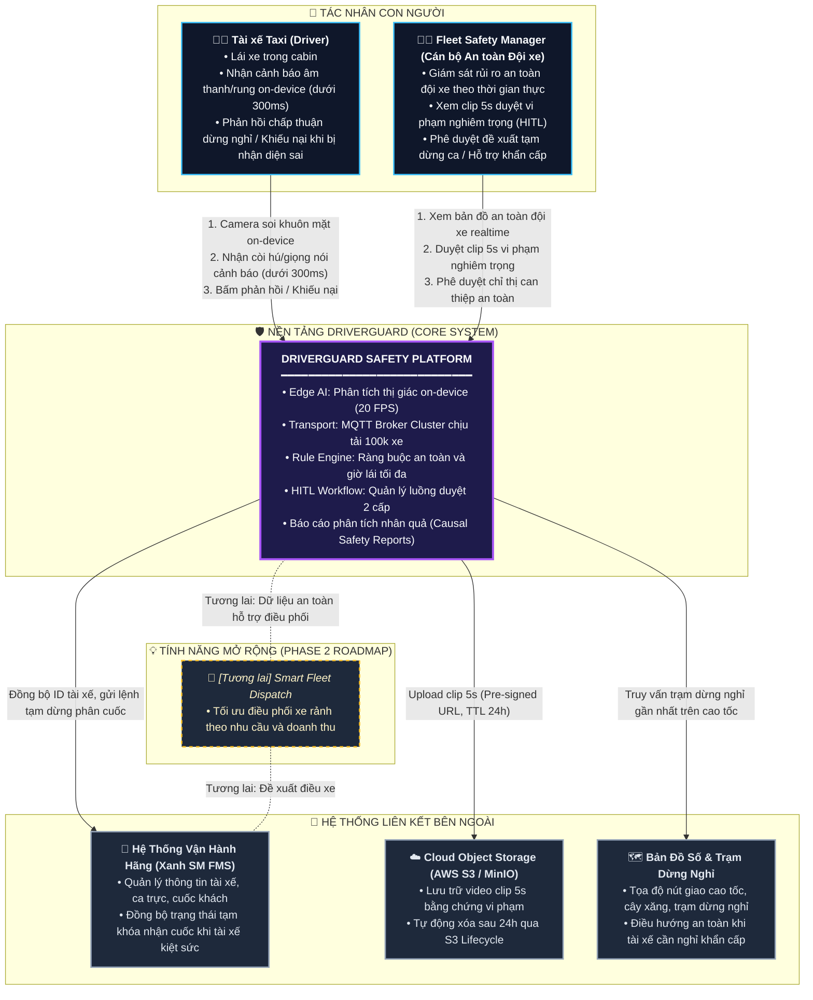
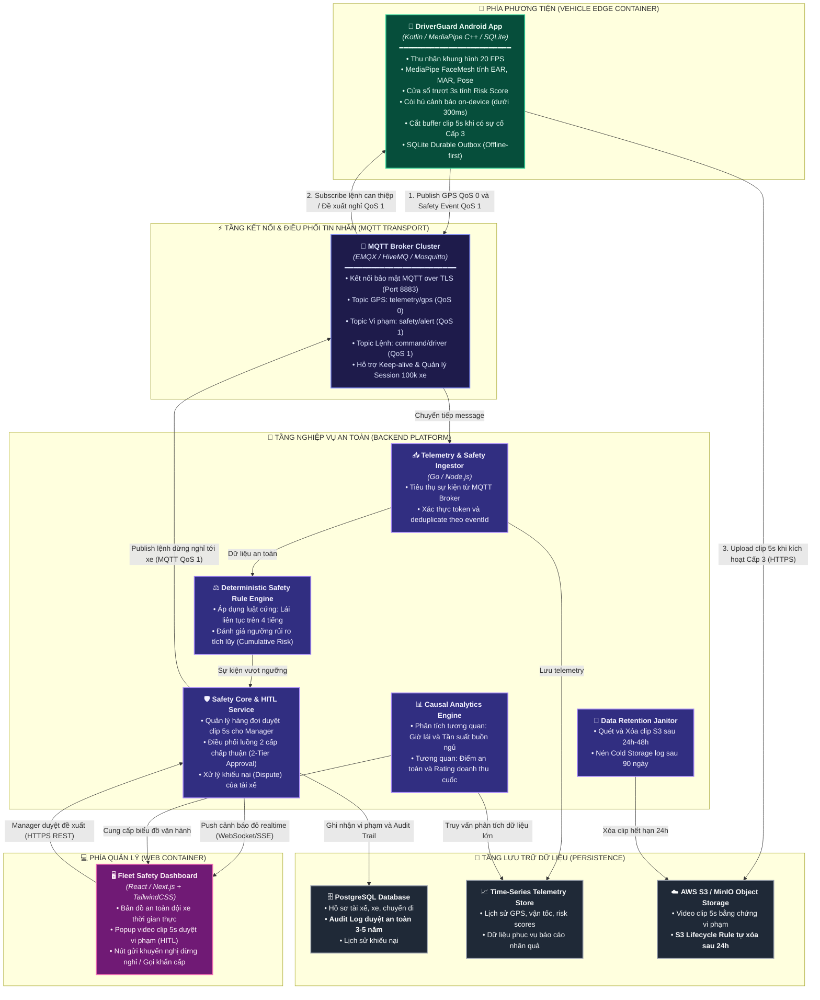
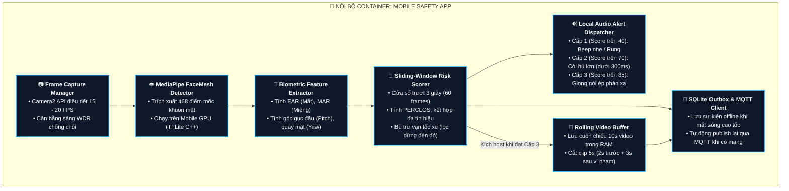
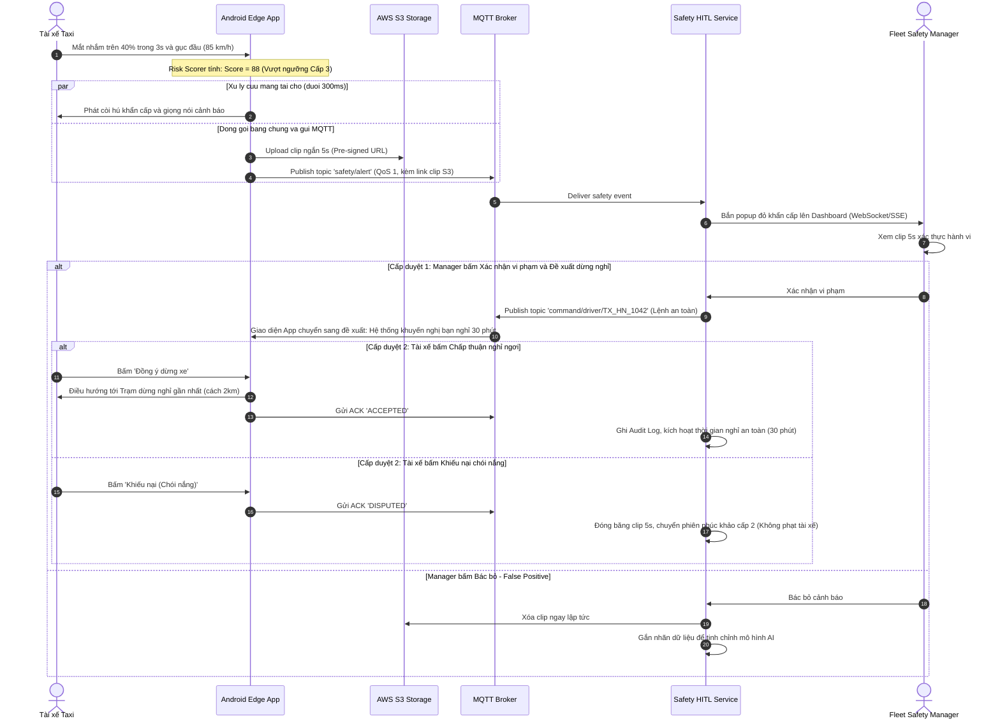
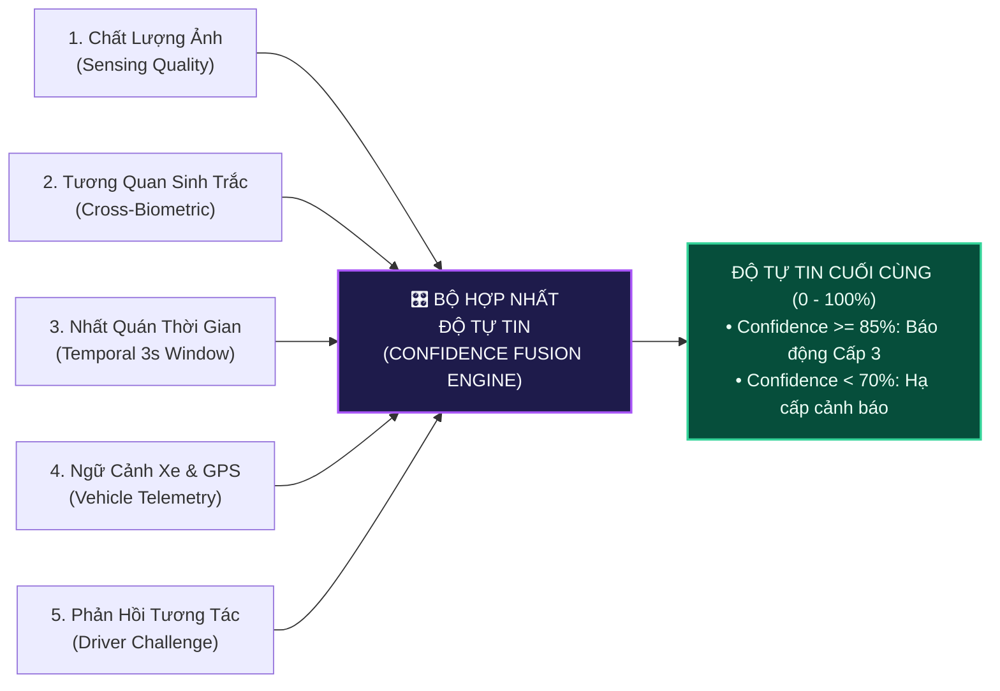

# DRIVERGUARD SOFTWARE ARCHITECTURE DOCUMENT (SAD)
## Tài Liệu Thiết Kế Kiến Trúc Phần Mềm Thống Nhất — Chuẩn C4 Model & Nền Tảng MQTT

| Thuộc tính | Nội dung |
| :--- | :--- |
| **Dự án** | **DriverGuard** — Nền tảng Giám sát An toàn Tài xế & Vận hành Đội xe |
| **Trọng tâm cốt lõi (Core Scope)** | **Safety Core:** Giám sát camera on-device, cảnh báo vi ngủ/buồn ngủ $\le 300\text{ ms}$, luồng duyệt an toàn 2 cấp (HITL) |
| **Phạm vi mở rộng (Phase 2 Roadmap)** | **Smart Fleet Dispatch:** Tối ưu hóa điều phối xe theo nhu cầu và doanh thu (Non-core) |
| **Quy mô mục tiêu** | 100.000 phương tiện kết nối đồng thời (Điển hình: Đội xe điện Xanh SM) |
| **Nền tảng công nghệ chính** | Android Edge AI (MediaPipe), **MQTT over TLS (QoS 0/1)**, Deterministic Rule Engine, PostgreSQL + S3 |
| **Phiên bản tài liệu** | **3.0 — Unified Master Edition** (Hợp nhất triết lý bài toán an toàn & hạ tầng kỹ thuật v2) |
| **Trạng thái** | Sẵn sàng cho Architecture & MVP Review |

---

## 1. BÀI TOÁN CỐT LÕI & NGUYÊN TẮC THIẾT KẾ (PROBLEM FRAMING)

### 1.1. Tuyên bố Bài toán & Sứ mệnh
Tài xế taxi vận hành theo ca dài (8–10 tiếng), đặc biệt ca tối hoặc đi cao tốc, thường bị suy giảm mức độ tỉnh táo sinh học dẫn đến hiện tượng **vi ngủ (micro-sleep)** trong 2–3 giây. Ở vận tốc $80\text{ km/h}$, 2 giây xe trôi tự do gần $50\text{ mét}$.

Hệ thống **DriverGuard** được xây dựng với sứ mệnh:
> **"Bảo vệ tính mạng tài xế và hành khách bằng hệ thống cảnh báo tức thời tại biên (On-device Edge AI), đồng thời chuyển đổi dữ liệu an toàn thành hành động can thiệp có kiểm soát của con người (Human-in-the-Loop) thông qua giao thức kết nối MQTT tối ưu cho 100.000 xe."**

### 1.2. Phân định Ranh giới Phạm vi (Scope Boundary)
* 🔴 **TRỌNG TÂM CỐT LÕI (CORE MVP):**
  1. *Edge Safety:* Camera AI phát hiện nhắm mắt kéo dài ($PERCLOS$), gục đầu, ngáp ngủ; còi hú cảnh báo tại chỗ $\le 300\text{ ms}$ (Offline-first, không phụ thuộc mạng).
  2. *Connected Fleet Transport:* Sử dụng **MQTT over TLS** để truyền telemetry và sự kiện an toàn nhẹ, bền bỉ, tiết kiệm pin.
  3. *Quy trình Duyệt 2 Cấp (2-Tier Approval):* Quản lý duyệt can thiệp an toàn $\rightarrow$ Tài xế tự nguyện chấp thuận dừng nghỉ.
  4. *Chính sách Dữ liệu An toàn:* Clip 5s tự hủy sau 24h, Audit log lưu trữ 3–5 năm phục vụ phân tích nhân quả và kiểm toán.
* ⚪ **TÍNH NĂNG MỞ RỘNG (PHASE 2 ROADMAP):**
  * Tự động dự báo nhu cầu khách (Demand Model) và gợi ý điều phối xe rảnh tăng doanh thu. (Module này tách riêng, không nằm trong luồng core MVP).

### 1.3. Nguyên tắc Bất biến (Architectural Invariants)
1. **An toàn tại biên là tối thượng:** Cảnh báo cứu mạng trên xe không bao giờ được chờ phản hồi từ Cloud hoặc kết nối mạng.
2. **Không stream video liên tục:** 99% dữ liệu là JSON metadata. Chỉ trích xuất clip ngắn 5 giây khi có vi phạm khẩn cấp.
3. **Quyền quyết định thuộc về con người:** AI chỉ phát hiện và đề xuất; Manager duyệt chiến thuật; Tài xế có quyền chấp thuận/từ chối hành động áp dụng cho bản thân.
4. **Kỷ luật bằng chứng:** Mọi cảnh báo, quyết định can thiệp và phản hồi của tài xế đều được lưu vết bất biến trong Audit Log.

---

## 2. KIẾN TRÚC MỨC C1: SYSTEM CONTEXT (BỐI CẢNH HỆ THỐNG)

Biểu đồ C1 định vị DriverGuard trong môi trường vận hành thực tế, tương tác với Tài xế, Quản lý đội xe và các hệ thống ngoài.



---

## 3. KIẾN TRÚC MỨC C2: CONTAINER DIAGRAM (CÁC KHỐI ỨNG DỤNG)

Phân rã hệ thống thành các Container độc lập. Kiến trúc chuyển đổi toàn diện sang **MQTT over TLS** để giải quyết triệt để bài toán 100.000 xe.



---

## 4. KIẾN TRÚC MỨC C3: COMPONENT DIAGRAM (CHI TIẾT NỘI BỘ)

### 4.1. Nội bộ Mobile Safety App (On-Vehicle Edge)
Trách nhiệm xử lý camera on-device, tính Risk Score và điều phối còi báo cục bộ $\le 300\text{ ms}$:



---

## 5. THIẾT KẾ MỨC C4: CODE LEVEL DESIGN & DATA CONTRACTS

### 5.1. Thuật toán Cốt lõi: Cửa Sổ Trượt Tính Risk Score (`AggregateRiskScorer.ts`)

```typescript
export interface FrameBiometrics {
  timestampMs: number;
  ear: number;            // Eye Aspect Ratio (Mắt mở bình thường ~0.3; Nhắm mắt < 0.20)
  mar: number;            // Mouth Aspect Ratio (Miệng bình thường < 0.35; Ngáp > 0.60)
  headPitchDeg: number;   // Góc cúi gục đầu (Gục xuống: < -20 độ)
  headYawDeg: number;     // Góc ngoảnh mặt khỏi đường (Quay trái/phải: > 30 độ)
  isPhoneDetected: boolean;
  vehicleSpeedKmh: number;// Vận tốc xe từ GPS
}

export enum SafetyAlertLevel {
  NORMAL = "NORMAL",                     // 0 - 39 điểm
  LEVEL_1_WARNING = "LEVEL_1_WARNING",   // 40 - 69 điểm (Beep nhẹ on-device)
  LEVEL_2_CRITICAL = "LEVEL_2_CRITICAL", // 70 - 84 điểm (Còi to on-device <=300ms)
  LEVEL_3_ESCALATION = "LEVEL_3_HITL"    // 85 - 100 điểm (Gửi Clip 5s duyệt HITL)
}

export class AggregateRiskScorer {
  private readonly WINDOW_FRAMES = 60; // 3 giây ở tần số 20 FPS
  private buffer: FrameBiometrics[] = [];

  public processFrame(current: FrameBiometrics): { score: number; level: SafetyAlertLevel } {
    this.buffer.push(current);
    if (this.buffer.length > this.WINDOW_FRAMES) {
      this.buffer.shift();
    }

    // 1. Tính toán PERCLOS (% thời gian mắt nhắm trong 3s)
    const closedEyesFrames = this.buffer.filter(f => f.ear < 0.20).length;
    const perclos = closedEyesFrames / this.buffer.length;

    // 2. Kiểm tra gục đầu hoặc quay mặt kéo dài
    const headDeviationFrames = this.buffer.filter(
      f => f.headPitchDeg < -20 || Math.abs(f.headYawDeg) > 30
    ).length;
    const headDeviationRatio = headDeviationFrames / this.buffer.length;

    // 3. Hệ số bù trừ tốc độ GPS (Lọc kẹt xe / dừng đèn đỏ)
    const speedFactor = current.vehicleSpeedKmh < 5.0 ? 0.35 : 1.0;

    // 4. Cộng dồn thang điểm rủi ro đa biến (0 - 100)
    let score = 0;
    if (perclos >= 0.40) score += 40;
    else if (perclos >= 0.25) score += 20;

    if (headDeviationRatio >= 0.50) score += Math.round(30 * speedFactor);
    if (current.mar > 0.60 && perclos > 0.15) score += 15; // Ngáp thật khi mắt nheo
    if (current.isPhoneDetected) score += Math.round(25 * speedFactor);

    score = Math.min(100, Math.max(0, score));

    // 5. Xác định cấp độ cảnh báo
    let level = SafetyAlertLevel.NORMAL;
    if (score >= 85) level = SafetyAlertLevel.LEVEL_3_ESCALATION;
    else if (score >= 70) level = SafetyAlertLevel.LEVEL_2_CRITICAL;
    else if (score >= 40) level = SafetyAlertLevel.LEVEL_1_WARNING;

    return { score, level };
  }
}
```

---

### 5.2. Data Contract: MQTT Payload Sự Kiện An Toàn (`safety/alert`)

```json
{
  "eventId": "evt_98f4c2e1-7b0a-4a21-9d22-12f5a8901bca",
  "eventType": "safety.drowsiness.escalation.v1",
  "occurredAt": "2026-09-28T15:30:00.120Z",
  "deviceId": "DEV_ANDROID_8841",
  "driverId": "TX_HN_1042",
  "vehiclePlate": "29E-888.99",
  "tripId": "TRIP_20260928_88412",
  "telemetry": {
    "latitude": 21.028511,
    "longitude": 105.854444,
    "speedKmh": 85.5,
    "roadType": "HIGHWAY_EXPRESSWAY"
  },
  "metrics": {
    "perclos3s": 0.55,
    "headPitchDeg": -24.5,
    "headYawDeg": 3.8,
    "riskScore": 88
  },
  "evidence": {
    "hasVideoClip": true,
    "clipDurationSec": 5,
    "clipS3Url": "https://s3.fleet.driverguard.io/clips/20260928/TX_HN_1042_evt_98f4c2e1.mp4",
    "clipExpiresAt": "2026-09-29T15:30:00.120Z"
  }
}
```

---

## 6. SƠ ĐỒ LUỒNG RUNTIME: QUY TRÌNH DUYỆT 2 CẤP (2-TIER HITL APPROVAL)

Minh họa quy trình xử lý nhân văn và chặt chẽ khi tài xế ngủ gật trên cao tốc:



---

## 7. CHÍNH SÁCH LƯU TRỮ DỮ LIỆU & BẢO VỆ RIÊNG TƯ (RETENTION POLICY)

| Loại dữ liệu | Vị trí lưu trữ | Vòng đời (TTL) | Cơ chế xóa / chuyển vùng | Mục đích sử dụng |
| :--- | :--- | :--- | :--- | :--- |
| **Video Clip ngắn (5s)** | AWS S3 / MinIO | **24 giờ – 48 giờ** | Tự động xóa (Auto-expire qua S3 Lifecycle) | Phục vụ Manager xác thực vi phạm, xóa ngay để bảo vệ quyền riêng tư |
| **Raw Telemetry (GPS thô)** | Time-Series DB | **30 ngày** | Sau 30 ngày tự động nén hoặc downsampling | Phục vụ đối soát sự cố và đánh giá ca chạy |
| **Audit Log (Lịch sử duyệt & Khiếu nại)** | PostgreSQL (Append-only) | **3 – 5 năm** | Không xóa tự động; lưu vết ID tài xế, quyết định duyệt | Phục vụ kiểm toán an toàn, pháp lý giao thông |
| **Aggregated Metrics** | Data Warehouse | **Vĩnh viễn** | Dữ liệu dạng số đã ẩn danh: heat-map mệt mỏi, điểm an toàn tuần | Phục vụ nghiên cứu nhân quả và báo cáo vận hành |

---

## 8. NĂNG LỰC HỆ THỐNG VỚI KỊCH BẢN 100.000 XE (CAPACITY SCENARIO)

* **Giao thức MQTT:** 100.000 kết nối thường trực duy trì keep-alive (60 giây/lần) chỉ tiêu tốn khoảng **$1.667\text{ pings/giây}$**, RAM trên cụm EMQX/HiveMQ chỉ mất khoảng **$1.5 - 2\text{ GB RAM}$** (hoàn toàn chịu tải nhẹ nhàng so với việc duy trì 100k kết nối WebSocket truyền thống).
* **Băng thông Video:** Chỉ có tối đa $0.5\% - 1\%$ số xe vi phạm Cấp 3 mỗi ngày. Trung bình 1 ngày hệ thống chỉ tiếp nhận khoảng $500 - 1.000$ clip 5s (mỗi clip ~1.5MB $\approx 1.5\text{ GB/ngày}$), chi phí lưu trữ S3 chỉ tốn vài chục nghìn VNĐ/tháng.

---

## 9. ĐÁNH GIÁ ĐÁP ỨNG TOÀN DIỆN CÁC RÀNG BUỘC CỦA MENTOR

1. **Khắc phục triệt để lỗi WebSocket quá tải:** Sử dụng **MQTT over TLS (Port 8883)** phân chia rõ ràng QoS 0 cho GPS và QoS 1 cho vi phạm an toàn.
2. **Khắc phục lỗi cảnh báo phiền hà (False Alarms):** Áp dụng thuật toán **Cửa sổ trượt 3 giây** tính điểm rủi ro tổng hợp ($PERCLOS + Head Pose + GPS Speed$).
3. **Giải quyết bài toán Chi phí & Quyền riêng tư:** Áp dụng cơ chế **Buffer 5s upload S3 tự hủy sau 24h** thay cho WebRTC cồng kềnh.
4. **Bảo đảm quyền con người:** Luồng **HITL 2 cấp chấp thuận** đảm bảo hệ thống không độc đoán phạt oan tài xế.
5. **Tiến độ khả thi cho MVP tuần tới:** Tập trung 100% tài nguyên làm xong **Safety Core** chạy thông luồng từ Mobile $\rightarrow$ MQTT $\rightarrow$ Dashboard.

---

## 10. DANH MỤC CHI TIẾT CÔNG NGHỆ SỬ DỤNG (FULL TECH STACK SPECIFICATION)

Hệ thống được thiết kế theo nguyên tắc tối ưu hóa hiệu năng, chịu tải cao và phù hợp nguồn lực phát triển:

| Tầng kiến trúc | Thành phần | Công nghệ lựa chọn | Vai trò & Lý do kỹ thuật |
| :--- | :--- | :--- | :--- |
| **Edge / Mobile** | Mobile Safety App | **Android (Kotlin / Java)** | Hệ điều hành phổ biến nhất trên thiết bị tài xế taxi, dễ tích hợp camera native và quản lý sensor nền. |
| | Vision AI Engine | **Google MediaPipe Tasks (FaceMesh)** | Trích xuất 468 điểm mốc khuôn mặt, chạy cực nhẹ trên Mobile GPU/NPU qua TFLite C++, đạt 20 FPS ổn định. |
| | Local Database | **SQLite / Room Database** | Cơ chế Durable Outbox lưu trữ sự kiện an toàn khi mất sóng 4G/cao tốc (Offline-first), tự sync khi có mạng. |
| **Transport** | IoT Message Broker | **EMQX Cluster (hoặc HiveMQ / Mosquitto)** | Broker MQTT mã nguồn mở hiệu năng cao nhất hiện nay, hỗ trợ 100k kết nối với độ trễ thấp, tiêu tốn ít RAM. |
| | Giao thức mạng | **MQTT v5.0 over TLS (Port 8883)** | Giao thức tiêu chuẩn cho Connected Vehicle; hỗ trợ QoS 0 (GPS), QoS 1 (Sự cố), Keep-alive tiết kiệm 90% pin so với HTTP. |
| **Backend Platform** | Ingestion & Core API | **Golang (hoặc Node.js Fastify)** | Xử lý I/O bất đồng bộ cực nhanh, Goroutine tiêu thụ rất ít RAM, throughput tiếp nhận hàng chục ngàn event/giây. |
| | Business Rule Engine | **Node.js / Python (JSON Rules Engine)** | Thực thi luật cứng xác định (Deterministic rules: giờ lái > 4h, lặp lại vi phạm) có versioning rõ ràng. |
| **Data & Storage** | Operational & Audit DB | **PostgreSQL (v15+)** | Đảm bảo tính toàn vẹn ACID tuyệt đối; lưu trữ hồ sơ tài xế, chuyến đi và **Audit Log duyệt an toàn (3–5 năm)**. |
| | Telemetry & Analytics | **ClickHouse (hoặc TimescaleDB)** | Cơ sở dữ liệu cột chuyên dụng cho Time-series GPS/tốc độ/PERCLOS; quét hàng trăm triệu bản ghi trong vài mili-giây. |
| | Object Storage | **AWS S3 (hoặc MinIO On-Premise)** | Lưu trữ video clip 5s vi phạm; tích hợp **S3 Lifecycle Rule tự động xóa vĩnh viễn sau 24h** để bảo vệ quyền riêng tư. |
| **Dashboard UI** | Web Dashboard | **React.js / Next.js + TailwindCSS** | Giao diện Single Page Application hiện đại cho Fleet Manager; hiển thị bản đồ số và popup video review HITL. |
| | Realtime Push | **Server-Sent Events (SSE) / WebSocket** | Đẩy cảnh báo đỏ tức thời từ server về màn hình Manager ngay khi xe gặp sự cố. |

---

## 11. BỘ NGƯỠNG ĐỊNH LƯỢNG KÍCH HOẠT GỬI LOG VỀ SERVER (ESCALATION THRESHOLDS)

> **Nguyên tắc:** Để chống nghẽn mạng và chống quá tải thông báo (Alert Fatigue), **KHÔNG GỬI** dữ liệu của từng frame hay các cảnh báo nhẹ cục bộ. Hệ thống phân chia 3 cấp độ kích hoạt rõ ràng:

```
[Camera 20 FPS] ──► [Tính Risk Score on-device]
                           │
       ┌───────────────────┼───────────────────┐
       ▼                   ▼                   ▼
 [Score < 40]       [40 <= Score < 70]   [Score >= 70 / >= 85]
   Bình thường         CẤP 1: CẢNH BÁO       CẤP 2 & CẤP 3:
 (Không ghi log)      (Xử lý Local 100%)    (GỬI VỀ SERVER)
                      • Beep nhẹ / Rung     • Cấp 2: Gửi Event JSON
                      • KHÔNG gửi server    • Cấp 3: Gửi JSON + Clip 5s
```

### Bảng Định Lượng Chi Tiết Các Ngưỡng Kích Hoạt

| Cấp độ sự kiện | Ngưỡng sinh trắc & Động lực học | Hành động tại xe (On-Device) | Dữ liệu gửi về Server qua MQTT | Mục đích vận hành |
| :--- | :--- | :--- | :--- | :--- |
| **Cấp 0 — Bình thường** | $PERCLOS < 0.25$, $EAR \ge 0.22$, Đầu nhìn thẳng. | Không có | **Không gửi gì cả.** (Chỉ gửi GPS định kỳ QoS 0 mỗi 30–60s). | Tiết kiệm băng thông tối đa. |
| **Cấp 1 — Nhắc nhở (Warning)** | • $40 \le Score < 70$<br>• Nhắm mắt chớp dài $0.8s - 1.2s$<br>• Quay mặt đi $1.5s - 2.0s$ | Rung điện thoại hoặc Beep nhẹ cục bộ. | **Không gửi về server.** Chỉ lưu vào bộ đếm mệt mỏi nội bộ trong RAM. | Đánh thức nhẹ tài xế, không làm phiền điều phối viên. |
| **Cấp 2 — Vi phạm Đáng ngờ (Critical Event)** | • $Score \ge 70$ (Duy trì $\ge 2$ giây)<br>• $PERCLOS \ge 0.40$ trong 3s<br>• Gục đầu $\ge 20^\circ$ quá 1.5s khi $v \ge 30\text{ km/h}$ | Phát còi hú khẩn cấp to dần $\le 300\text{ ms}$. | **Gửi Event Metadata JSON (QoS 1):**<br>`{driverId, timestamp, speed, perclos, riskScore}` | Lưu vết vi phạm an toàn; cập nhật điểm an toàn tuần của tài xế. |
| **Cấp 3 — Khẩn cấp Cần duyệt (HITL Escalation)** | Thỏa **ít nhất 1 trong 4 điều kiện**: <br>1. $Score \ge 85$ (Vi ngủ sâu $\ge 2.5s$).<br>2. Tài xế **không phản hồi còi báo quá 3s**.<br>3. Vi phạm Cấp 2 lặp lại $\ge 3$ lần trong 15 phút.<br>4. Vi phạm Cấp 2 khi đang trên **Cao tốc ($v \ge 70\text{ km/h}$)**. | Còi hú max volume + Giọng nói dứt khoát: *"Bác tài buồn ngủ, bật Hazard!"*. | **Gửi Event Metadata + Upload Clip 5s:**<br>• Link S3 clip 5s (TTL 24h)<br>• Bắn popup khẩn cấp lên Dashboard. | Đưa vào hàng đợi duyệt của Manager để gọi điện cứu nạn hoặc ra lệnh dừng xe. |

---

## 12. PHƯƠNG PHÁP TÍNH TOÁN ĐỘ CHÍNH XÁC CỦA HỆ THỐNG (EVALUATION METRICS)

Trong bài toán an toàn giao thông, việc đo lường độ chính xác **không thể dùng Accuracy thông thường** vì dữ liệu bị mất cân bằng trầm trọng (99% thời gian tài xế lái xe bình thường, chỉ 1% xảy ra buồn ngủ/sự cố). Nếu model đoán "Bình thường" 100% thời gian thì Accuracy vẫn đạt 99% nhưng vô giá trị!

Do đó, độ chính xác của DriverGuard được đo lường bằng **Ma trận nhầm lẫn (Confusion Matrix) chuyên dụng**:

```
                              THỰC TẾ (GROUND TRUTH)
                         Tài xế Buồn Ngủ      Tài xế Bình Thường
                      ┌────────────────────┬────────────────────┐
MODEL      Cảnh báo   │ True Positive (TP) │ False Positive(FP) │
DỰ ĐOÁN    Buồn ngủ   │  (Bắt đúng lỗi)    │  (Cảnh báo rác)    │
                      ├────────────────────┼────────────────────┤
           Không báo  │ False Negative(FN) │ True Negative (TN) │
           (Bình thg) │  (BỎ SÓT LỖI - ⚠️) │  (Lái xe an toàn)  │
                      └────────────────────┴────────────────────┘
```

### 1. Chỉ số Recall / Sensitivity (Độ nhạy — QUAN TRỌNG NHẤT):
$$Recall = \frac{TP}{TP + FN}$$
* **Ý nghĩa:** Trong 100 lần tài xế thực sự buồn ngủ hoặc ngủ gật, hệ thống phát hiện được bao nhiêu lần?
* **Mục tiêu chấp nhận:** **$Recall \ge 92\% - 95\%$**. 
* **Lý do:** $FN$ (Bỏ sót cơn buồn ngủ) là rủi ro chết người, tai nạn sẽ xảy ra nếu bỏ sót. Do đó hệ thống ưu tiên tối đa việc không để lọt $FN$.

### 2. Chỉ số Precision (Độ xác thực):
$$Precision = \frac{TP}{TP + FP}$$
* **Ý nghĩa:** Trong 100 lần hệ thống hú còi báo động, có bao nhiêu lần tài xế thực sự buồn ngủ?
* **Mục tiêu chấp nhận:** **$Precision \ge 85\%$**.
* **Lý do:** Nếu $FP$ (Cảnh báo sai) quá nhiều, tài xế sẽ bực mình, mất niềm tin và tắt ứng dụng (hội chứng "Cậu bé chăn cừu").

### 3. Chỉ số F1-Score (Cân bằng điều hòa):
$$F_1 = 2 \times \frac{Precision \times Recall}{Precision + Recall}$$
* Đánh giá tổng thể hiệu năng của mô hình AI khi cân bằng giữa việc không bỏ sót tai nạn và không làm phiền tài xế. Mục tiêu: **$F_1 \ge 0.88$**.

### 4. Tần suất cảnh báo sai trên 100 giờ lái (False Alarm Rate - FAR):
$$FAR = \frac{\text{Tổng số lần False Positive (báo sai)}}{\text{Tổng số giờ lái xe}} \times 100\text{ giờ}$$
* **Chỉ tiêu kiểm định thực tế:** **$FAR \le 1.5$ lần / 100 giờ lái xe**. Nếu vượt quá 2 lần/100h, thuật toán cần được tinh chỉnh lại ngưỡng.

### 5. Độ trễ phát hiện và cảnh báo (Latency):
* Thời gian từ lúc mắt tài xế thỏa mãn điều kiện vi ngủ đến khi loa điện thoại phát ra tiếng còi: **$\le 300\text{ ms}$**.

---

## 13. CƠ CHẾ KẾT HỢP ĐIỀU KIỆN ĐA TÍN HIỆU ĐỂ TĂNG ĐỘ TỰ TIN (MULTIMODAL CONFIDENCE FUSION)

Để loại bỏ cảnh báo sai và khẳng định độ tự tin (Confidence) của mô hình trước khi ra quyết định, DriverGuard áp dụng cơ chế **Hợp nhất đa tín hiệu (Multimodal Feature Fusion)** qua 5 lớp điều kiện:



### Chi Tiết 5 Lớp Điều Kiện Hợp Nhất:

#### 1. Lớp 1: Kiểm định Chất lượng Cảm biến (Visual Sensing Quality Check)
* **Face Detection Confidence:** Độ tự tin của MediaPipe khi phát hiện khuôn mặt phải $\ge 0.75$.
* **Độ sáng môi trường (Lighting Check):** Kiểm tra biểu đồ sáng (Histogram). Nếu cabin quá tối ($< 20\text{ lux}$) hoặc bị ngược nắng chói lóa, hệ thống gắn cờ `SENSOR_UNCERTAIN` thay vì vội vàng kết luận là tài xế nhắm mắt.
* **Góc lệch khuôn mặt (Pose Validation):** Nếu góc quay mặt $Yaw > 45^\circ$ (camera chỉ nhìn thấy 1 mắt), không áp dụng công thức $EAR$ thông thường mà chuyển sang theo dõi tư thế đầu.

#### 2. Lớp 2: Tương quan Sinh trắc học Đồng thời (Cross-Biometric Correlation)
Tránh bắt lỗi đơn lẻ; một hành vi chỉ được coi là có độ tự tin cao khi các bộ phận trên mặt phản ứng tương thích với sinh lý con người:
* **Ngáp ngủ thật vs. Nói chuyện / Hát:** 
  * Ngáp thật: Độ mở miệng $MAR \ge 0.60$ **ĐỒNG THỜI** mắt nheo lại ($EAR \le 0.18$) duy trì $> 1.5$ giây $\rightarrow$ **Confidence 90%**.
  * Nói chuyện/cười: $MAR \ge 0.60$ nhưng mắt mở to ($EAR \ge 0.25$) $\rightarrow$ **Confidence ngáp giảm về 10%** (Lọc bỏ báo sai).
* **Gục đầu ngủ gật vs. Nhìn đồng hồ táp-lô:**
  * Gục đầu ngủ: Góc gục $Pitch \le -20^\circ$ **ĐỒNG THỜI** $EAR < 0.20$ (mắt nhắm) $\rightarrow$ **Confidence 95%**.
  * Nhìn gương/táp-lô: Đầu cúi nhẹ nhưng mắt vẫn đảo nhìn đường theo nhịp chớp $\rightarrow$ **Confidence 20%**.

#### 3. Lớp 3: Tính nhất quán theo thời gian (Temporal Smoothing qua Cửa sổ trượt 3s)
* Sinh học người chớp mắt bình thường chỉ kéo dài $100 - 200\text{ ms}$ (khoảng 2–4 frames ở 20 FPS).
* Mô hình **tuyệt đối không kết luận từ 1–2 frame đơn lẻ**. Độ tự tin chỉ đạt đỉnh khi hiện tượng bất thường duy trì liên tục qua **cửa sổ trượt 60 frames (3 giây)** với chỉ số $PERCLOS \ge 0.40$ (nhắm mắt trên 40% thời gian của cửa sổ).

#### 4. Lớp 4: Tích hợp Ngữ cảnh Động lực học Xe (Vehicle Telemetry Fusion)
* **Vận tốc GPS ($v$):**
  * Khi $v < 5\text{ km/h}$ (xe dừng đèn đỏ, dừng trả khách, kẹt xe): Giảm trọng số phạt quay đầu hoặc nhìn xuống điện thoại xuống $65\%$, tránh hú còi làm phiền lúc tài xế đang dừng chờ hợp pháp.
  * Khi $v \ge 70\text{ km/h}$ (trên cao tốc): Mọi dấu hiệu nhắm mắt $> 1.5$s đều được tự động **nhân hệ số khẩn cấp $1.5\times$**, đẩy nhanh độ tự tin lên mức tối đa.

#### 5. Lớp 5: Phản hồi Tương tác Nhận thức (Cognitive Challenge Response)
* Khi còi báo Cấp 2 hú, hệ thống kích hoạt đồng hồ đếm ngược 3 giây:
  * Nếu tài xế bấm nút trên màn hình hoặc hô *"Tôi tỉnh"* trong $< 1.0$ giây $\rightarrow$ **Model tự động hạ Risk Score**, ghi nhận tài xế vẫn tỉnh táo (Tránh leo thang lên Manager).
  * Nếu sau **3.0 giây tài xế hoàn toàn bất động** (không bấm, không nói, mắt vẫn nhắm) $\rightarrow$ **Độ tự tin khẳng định Ngủ sâu / Ngất xỉu đạt 100%**, lập tức kích hoạt luồng Cấp 3 báo động đỏ cho Fleet Manager.

