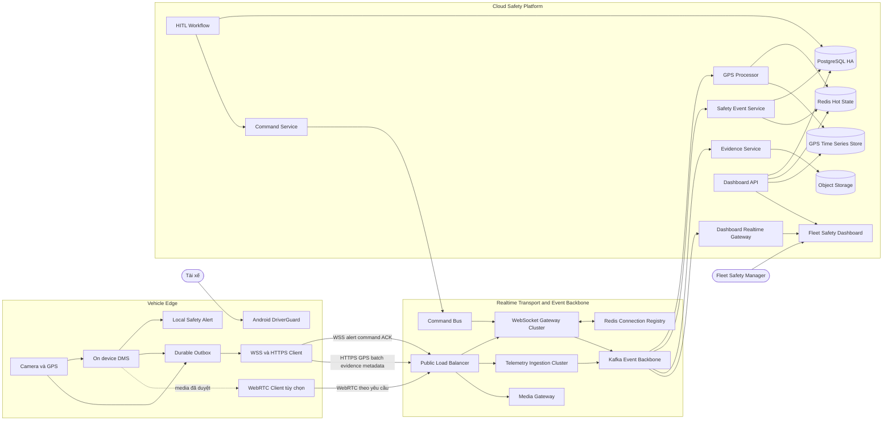
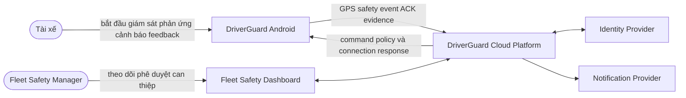
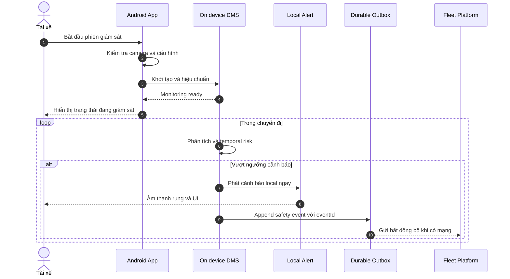
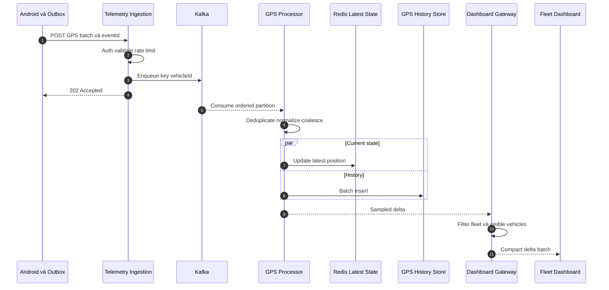
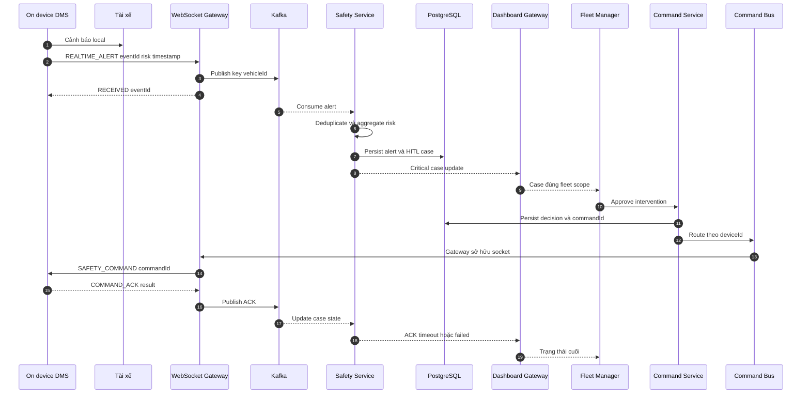
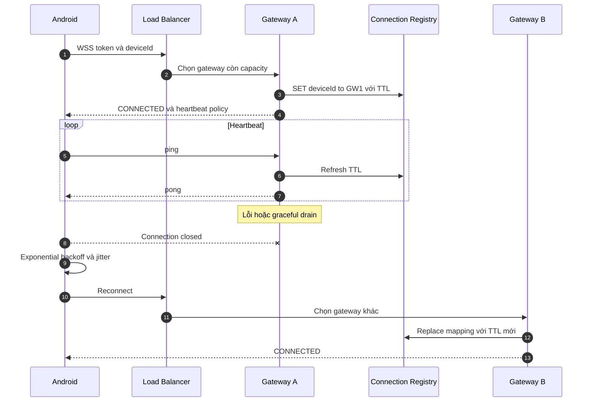
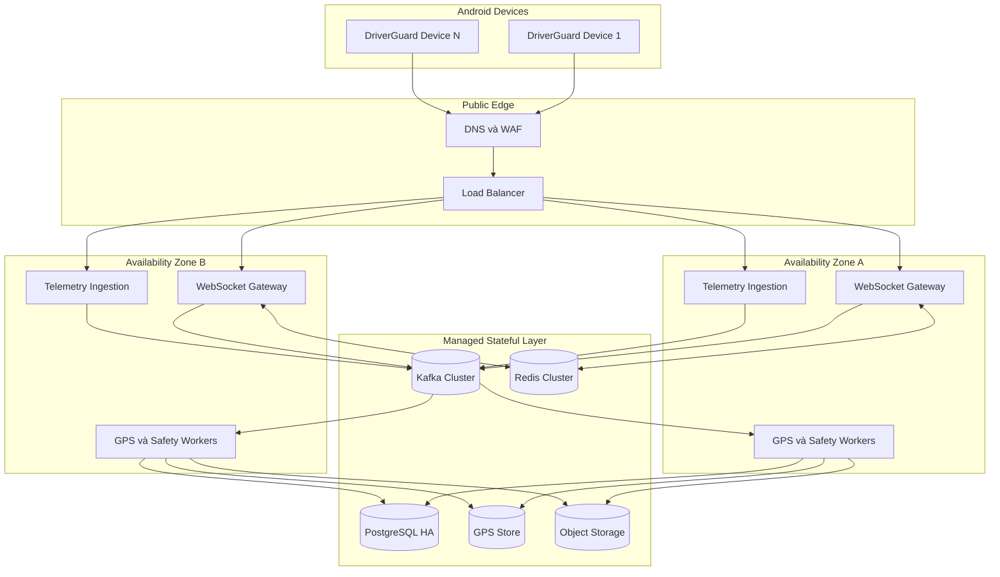

# DriverGuard Software Architecture Document

> **Hệ thống giám sát an toàn tài xế tại thiết bị và nền tảng quản lý đội xe**  
> **Loại tài liệu:** Software Architecture Document  
> **Trạng thái:** Draft for architecture review  
> **Phạm vi:** Kiến trúc mục tiêu cho Safety Core và Connected Fleet  
> **Lưu ý:** Tài liệu mô tả kiến trúc đích; không đồng nghĩa mọi thành phần đã được triển khai trong prototype.

---

## 1. Mục đích và phạm vi

DriverGuard phát hiện dấu hiệu mất tỉnh táo hoặc mất tập trung ngay trên thiết bị Android, cảnh báo tài xế tại chỗ và, khi Fleet Mode được bật, đồng bộ sự kiện an toàn với nền tảng quản lý đội xe. Kiến trúc ưu tiên an toàn tại biên: cảnh báo local không được phụ thuộc kết nối mạng hoặc tính sẵn sàng của cloud.

SAD này hợp nhất bức tranh kiến trúc, các động lực thiết kế, ranh giới thành phần, mô hình dữ liệu, luồng runtime quan trọng, chiến lược scale và các thuộc tính chất lượng. Các Use Case Specification và Sequence Diagram chi tiết vẫn được giữ ở file riêng để tránh một tài liệu thay đổi vì quá nhiều lý do.

### 1.1 Trong phạm vi

- Phiên giám sát tài xế và DMS chạy on-device.
- Cảnh báo local bằng âm thanh, rung và UI.
- Local outbox, retry, deduplication và phục hồi kết nối.
- Thu nhận GPS và safety event ở quy mô đội xe.
- Dashboard an toàn, critical case và Human in the Loop.
- Command có phê duyệt, routing, timeout và ACK.
- Evidence image hoặc media theo yêu cầu với kiểm soát riêng tư.
- Observability, scalability, backpressure, bảo mật và disaster recovery ở cấp kiến trúc.

### 1.2 Ngoài phạm vi

- Điều khiển trực tiếp tay lái, phanh hoặc hệ thống vận hành xe.
- Điều phối chuyến, giá cước, thanh toán và tối ưu doanh thu.
- Stream video liên tục từ toàn bộ phương tiện.
- Huấn luyện mô hình AI production và quy trình MLOps chi tiết.
- Thiết kế UI mức màn hình và hợp đồng API mức field.

---

## 2. Tóm tắt kiến trúc

DriverGuard được chia thành ba miền có khả năng vận hành và scale độc lập:

1. **Vehicle Edge:** camera, GPS, DMS, cảnh báo local, session và durable outbox.
2. **Realtime Transport and Event Backbone:** load balancer, WebSocket gateway, telemetry ingestion, connection registry, command bus và Kafka.
3. **Cloud Safety Platform:** xử lý GPS, safety event, HITL, evidence, dashboard, các data store và platform operations.



### 2.1 Nguyên tắc bất biến

- Cảnh báo local phải hoạt động khi cloud hoặc mạng không khả dụng.
- Video không được stream liên tục; media chỉ mở theo yêu cầu và policy.
- Ingestion xác thực, giới hạn tải và enqueue; không chờ từng lần ghi database.
- GPS có thể batch, giảm mẫu hoặc coalesce; critical safety event và command không dùng chính sách drop đó.
- Mọi event quan trọng có `eventId`; mọi command có `commandId` để hỗ trợ idempotency.
- Dashboard chỉ nhận dữ liệu thuộc authorization scope của fleet hoặc vehicle liên quan.
- HITL là lớp phê duyệt; hệ thống không biến đề xuất thành quyết định tự động.

---

## 3. Architecture drivers

### 3.1 Mục tiêu nghiệp vụ

| Driver | Hệ quả kiến trúc |
| --- | --- |
| Cảnh báo đủ sớm cho tài xế | DMS và alert chạy tại thiết bị, không đi qua cloud trong critical path |
| Quản lý chỉ xử lý đúng critical case | Safety Service tổng hợp risk; dashboard ưu tiên critical workflow |
| Hỗ trợ nhiều xe kết nối đồng thời | Gateway, ingestion, worker và media được tách cụm và scale theo workload |
| Không đánh đổi riêng tư để lấy khả năng quan sát | Không stream mặc định; evidence và media có policy, audit và retention |
| Hoạt động trong mạng di động không ổn định | Durable outbox, batch, retry có jitter, heartbeat và reconnect |
| Không báo thành công giả | Command phải có ACK hoặc trạng thái timeout, failed, unreachable rõ ràng |

### 3.2 Architecturally significant requirements

| ID | Yêu cầu kiến trúc | Cách đáp ứng |
| --- | --- | --- |
| ASR-01 | Local alert không phụ thuộc cloud | On-device DMS và Alert Player nằm trong Vehicle Edge |
| ASR-02 | Không mất safety event khi mất mạng ngắn hạn | Durable local outbox và Kafka replay |
| ASR-03 | Giữ thứ tự event theo xe | Partition event backbone theo `vehicleId` |
| ASR-04 | Command tới đúng socket hiện hành | Redis Connection Registry ánh xạ `deviceId` đến `gatewayId` với TTL |
| ASR-05 | GPS throughput không làm nghẽn OLTP | Ingestion bất đồng bộ và GPS store chuyên time-series |
| ASR-06 | Dashboard không bị ngập update | Fleet-scoped subscription và coalesce GPS delta |
| ASR-07 | Dữ liệu critical có audit trail | PostgreSQL lưu alert, HITL decision, command lifecycle và actor |
| ASR-08 | Media có giới hạn và kiểm soát | Cụm Media Gateway riêng, WebRTC on-demand và giới hạn concurrency |

---

## 4. System context và actor



### 4.1 Actor và mục tiêu

| Actor | Mục tiêu chính | Use case |
| --- | --- | --- |
| Tài xế | Bắt đầu giám sát và nhận cảnh báo đủ sớm | UC-001, UC-002 |
| Tài xế | Báo cảnh báo sai sau khi xe đã an toàn | UC-003 |
| Fleet Safety Manager | Xem trạng thái và critical case đúng phạm vi fleet | UC-101 |
| Fleet Safety Manager | Đánh giá và phê duyệt hành động can thiệp | UC-102 |

### 4.2 Trust boundaries

- **TB-01 Device boundary:** camera, GPS, model output, session và local outbox nằm trên thiết bị không hoàn toàn tin cậy.
- **TB-02 Public network:** mọi WSS, HTTPS và WebRTC đi qua mạng công cộng; bắt buộc mã hóa và xác thực.
- **TB-03 Edge ingress:** load balancer và gateway là ranh giới đầu vào có rate limit, validation và admission control.
- **TB-04 Fleet authorization:** dashboard, subscription, API và command phải kiểm tra fleet scope.
- **TB-05 Data boundary:** evidence, telemetry, workflow và identity có retention và quyền truy cập khác nhau.

---

## 5. Phân rã thành phần

### 5.1 Vehicle Edge

| Thành phần | Trách nhiệm | Dữ liệu chính | Không chịu trách nhiệm |
| --- | --- | --- | --- |
| Camera and GPS adapters | Thu nhận frame và vị trí | Frame tạm, location sample | Quyết định risk cấp fleet |
| On-device DMS | Suy luận và temporal risk | Feature, alert candidate | Chờ server mới cảnh báo |
| Local Alert | Âm thanh, rung, UI | Alert state | Workflow HITL |
| Trip and Driver Session | Ngữ cảnh chuyến và người lái | tripId, driverId, timestamps | Lưu lịch sử cloud |
| Durable Outbox | Ghi event, retry, dedup, batch | Event envelope | Giữ event vô hạn |
| Network Client | WSS, HTTPS, heartbeat, ACK | Token, event, command | Business workflow cloud |
| Optional Media Client | Phiên WebRTC theo yêu cầu | Media stream tạm thời | Stream liên tục |

### 5.2 Transport và backbone

| Thành phần | Trách nhiệm | Scale signal | Failure isolation |
| --- | --- | --- | --- |
| Public Load Balancer | TLS, routing, rate limit | Requests, connections | Loại node lỗi khỏi pool |
| WebSocket Gateway | Connection, heartbeat, alert và command ACK | Connection count, queue, event-loop lag | Không ghi DB hoặc chạy workflow |
| Telemetry Ingestion | Auth, validate, enqueue, HTTP 202 | Request rate, p95 latency | Không chờ GPS store |
| Connection Registry | `deviceId` đến `gatewayId`, TTL | Key count, latency | Mapping hết hạn tự động |
| Kafka | Buffer, replay, ordered partition | Throughput, lag, disk | Consumer tách độc lập |
| Command Bus | Route lệnh tới gateway sở hữu socket | Command latency | Timeout và retry riêng |
| Media Gateway | Điều phối phiên video giới hạn | Active session, bitrate | Cụm độc lập với telemetry |

### 5.3 Cloud services

| Service | Trách nhiệm | Store sử dụng |
| --- | --- | --- |
| Identity and Device Auth | Xác thực user, device và token | Identity store hoặc PostgreSQL |
| Fleet Service | Fleet, driver, vehicle và authorization scope | PostgreSQL |
| Trip Service | Lifecycle phiên và trip | PostgreSQL |
| GPS Processor | Dedup, normalize, coalesce, batch | Redis và GPS Store |
| Safety Event Service | Chuẩn hóa alert, aggregate risk, tạo case | PostgreSQL và Redis |
| HITL Workflow | Trình bày lựa chọn, lưu quyết định, audit | PostgreSQL |
| Command Service | Idempotency, route, timeout, ACK state | PostgreSQL và Command Bus |
| Evidence Service | Presigned upload và metadata | Object Storage và PostgreSQL |
| Dashboard API | Query theo fleet scope | PostgreSQL, Redis, GPS Store |
| Dashboard Gateway | Subscription và realtime fan-out | Redis hoặc event stream |
| Notification Service | Thông báo critical case | Provider bên ngoài và audit metadata |

---

## 6. Runtime views

### 6.1 Bắt đầu phiên và cảnh báo local



**Bất biến:** việc gửi cloud, nhận ACK hoặc Fleet Mode không nằm trên đường critical của cảnh báo local.

### 6.2 GPS telemetry ingestion



### 6.3 Critical alert và Human in the Loop



### 6.4 WebSocket recovery



---

## 7. Dữ liệu và lưu trữ

### 7.1 Phân tách theo workload

| Store | Dữ liệu | Access pattern | Retention định hướng |
| --- | --- | --- | --- |
| PostgreSQL HA | User, fleet, vehicle, trip, alert, HITL, command, audit | OLTP, transaction, relational query | Theo policy nghiệp vụ và audit |
| Redis Cluster | Latest vehicle state, connection registry, cache | Read write độ trễ thấp, TTL | Ngắn hạn hoặc rebuild được |
| TimescaleDB hoặc ClickHouse | GPS history và telemetry | Append, time-range query, downsampling | Partition, retention và aggregate |
| Object Storage | Evidence image, export, media artifact được phép | Presigned upload và download | Lifecycle rule theo classification |
| Local Outbox | Event chưa ACK và feedback offline | Append, retry, delete sau ACK | Bounded theo dung lượng và tuổi event |

### 7.2 Event envelope tối thiểu

```json
{
  "eventId": "uuid",
  "eventType": "safety.alert.v1",
  "occurredAt": "ISO-8601 UTC",
  "deviceId": "device-id",
  "vehicleId": "vehicle-id",
  "tripId": "trip-id",
  "schemaVersion": 1,
  "payload": {}
}
```

Quy tắc dữ liệu:

- `eventId` duy nhất ở nguồn và được dùng để deduplicate xuyên suốt.
- `occurredAt` phản ánh thời điểm tại thiết bị; server bổ sung thời điểm received và processed.
- Event critical không bị ghi đè bởi event mới hơn.
- GPS có thể coalesce theo `vehicleId` trên đường realtime nhưng lịch sử tuân theo policy riêng.
- Evidence binary không nằm trực tiếp trong bảng nghiệp vụ.

---

## 8. Giao thức và contract cấp kiến trúc

| Kênh | Mục đích | Delivery semantics | Ghi chú |
| --- | --- | --- | --- |
| WSS | Connection, safety alert, command, ACK | At least once với idempotency ở message quan trọng | Heartbeat, reconnect và token rotation |
| HTTPS REST | GPS batch, auth, nghiệp vụ, evidence metadata | HTTP 202 sau khi enqueue | Batch khi phục hồi mạng |
| Kafka | Event backbone và replay | Partition theo `vehicleId` | Schema compatibility, retry topic và DLQ |
| Command Bus | Route lệnh độ trễ thấp | commandId, timeout, ACK state | Không phụ thuộc sticky session |
| WebRTC | Media theo yêu cầu | Session có thời hạn | Không dùng UDP JPEG trực tiếp qua Internet |

Hướng phát triển có thể chuyển telemetry fleet sang MQTT cluster. Nếu migrate, phải version giao thức, đo song song trong thời gian hữu hạn và có kế hoạch tắt đường cũ; không duy trì hai pipeline đầy đủ vô thời hạn.

---

## 9. Scalability và capacity

### 9.1 Scale unit

| Cụm | Scale theo | Metric quyết định |
| --- | --- | --- |
| WebSocket Gateway | Connection và outbound queue | Connection count, memory, event-loop lag |
| Telemetry Ingestion | Request throughput | Request/s, p95 latency, rate-limit count |
| Kafka | Partition throughput | Broker network, disk, consumer lag |
| GPS Processor | Consumer concurrency | Lag, rows/s, batch latency |
| Safety Worker | Critical processing rate | Alert lag và processing latency |
| Dashboard Gateway | Subscription và outbound bytes | Slow consumer, queue size, dropped GPS delta |
| PostgreSQL | Transaction workload | Commit latency, pool saturation, IOPS, replica lag |
| GPS Store | Telemetry history | Ingest rate, partition size, query latency |
| Media Gateway | Concurrent media session | Bitrate, packet loss, CPU và network |

### 9.2 Capacity model

```text
GPS events/s      = active vehicles / GPS interval in seconds
GPS events/day    = active vehicles * 86400 / GPS interval
WS memory         = active connections * measured memory per connection
Dashboard fanout  = coalesced updates * relevant subscribers
Storage/day       = events/day * measured row size including index and compression
```

Ví dụ 10.000 xe gửi mỗi 5 giây tạo khoảng 2.000 GPS event mỗi giây và 172,8 triệu event mỗi ngày nếu hoạt động liên tục. Đây là input cho benchmark, không phải tuyên bố hệ thống hiện tại đã chịu được tải đó.

---

## 10. Reliability backpressure và degraded modes

| Tình huống | Hành vi bắt buộc | Dữ liệu được ưu tiên |
| --- | --- | --- |
| Mất mạng trên xe | Alert local tiếp tục; outbox retry có backoff và jitter | Safety event trước GPS |
| Gateway lỗi | Reconnect qua load balancer; mapping cũ hết TTL | Command và ACK |
| Reconnect storm | Admission control và randomized backoff | Critical connection trước media |
| Kafka lag | Ingestion dùng bounded queue hoặc rate limit; mobile giữ event chưa ACK | Safety topic được ưu tiên tài nguyên |
| GPS Store chậm | Consumer lag tăng; ingress không chờ store | Latest state có thể cập nhật độc lập |
| PostgreSQL chậm | Circuit breaker bảo vệ pool; event còn trong Kafka | Workflow quan trọng, không nhận tải GPS raw |
| Dashboard chậm | Coalesce GPS cũ; đóng client vượt buffer | Không drop critical case |
| Event trùng | Deduplicate theo `eventId` | Giữ một kết quả hợp lệ |
| Command timeout | Hiển thị timeout hoặc unreachable; không báo thành công | Audit decision và trạng thái command |

---

## 11. Security và privacy architecture

### 11.1 Kiểm soát chính

- TLS cho HTTPS và WSS; WebRTC dùng transport security phù hợp.
- Xác thực riêng cho user và device; token có thời hạn và cơ chế thu hồi.
- Authorization theo fleet, vehicle và action; subscription realtime phải kiểm tra scope.
- Secrets nằm trong secret manager, không nằm trong source, log hoặc tài liệu vận hành.
- Audit event cho login nhạy cảm, quyền, HITL decision, command và truy cập evidence.
- Encryption at rest cho store chứa dữ liệu nhạy cảm và backup.
- Presigned URL thời hạn ngắn cho evidence; metadata và binary được phân quyền độc lập.
- Rate limit, input validation, schema validation và kích thước payload tối đa ở ingress.

### 11.2 Privacy rules

1. Frame camera được xử lý trên thiết bị và không mặc định lưu hoặc upload.
2. Evidence chỉ được tạo theo event hoặc policy đã xác định, có classification và retention.
3. Video on-demand cần quyền phù hợp, mục đích rõ, giới hạn thời gian và audit.
4. False alert feedback không mặc định yêu cầu ảnh hoặc video.
5. Dashboard không cung cấp dữ liệu của fleet khác và phải đánh dấu dữ liệu stale.
6. Dữ liệu GPS và evidence không được lưu vô thời hạn nếu không có căn cứ nghiệp vụ hoặc pháp lý.

---

## 12. Observability và vận hành

### 12.1 Tín hiệu tối thiểu

| Miền | Metrics | Logs and traces |
| --- | --- | --- |
| Device | DMS state, outbox depth, reconnect count, ACK latency | Session, eventId và commandId; không log frame |
| Gateway | Active connection, event-loop lag, queue, auth failure | Connect, disconnect, route và correlation ID |
| Ingestion | Request rate, validation failure, enqueue latency | eventId, deviceId, status; không log token |
| Kafka | Partition lag, broker health, DLQ count | Topic, partition và consumer group |
| GPS | Batch size, processing lag, store latency | vehicleId được bảo vệ và trace ID |
| Safety | Alert lag, dedup count, case creation latency | eventId, caseId, risk transition |
| Command | Route latency, ACK, timeout, duplicate | commandId và workflow state |
| Dashboard | Subscribers, outbound bytes, slow clients | fleet-scoped access và subscription audit |

### 12.2 SLO định hướng

Các giá trị cụ thể phải được benchmark và phê duyệt trong NFR hoặc SLO document. SAD chỉ xác định nhóm SLI bắt buộc:

- Local alert detection to notification latency.
- Safety event accepted latency và end-to-end case visibility latency.
- Command approval to device delivery và ACK latency.
- GPS latest-state freshness.
- WebSocket availability và reconnect recovery time.
- Data durability, RPO và RTO theo loại store.

---

## 13. Deployment view



### 13.1 MVP và production target

| Khía cạnh | MVP hoặc demo | Production target |
| --- | --- | --- |
| Gateway | Một instance | Cluster multi-zone và graceful drain |
| Ingestion | Một service | Nhiều stateless instance và rate limit |
| Broker | Broker nhỏ hoặc managed dev | Replication, schema compatibility, retry và DLQ |
| Data | PostgreSQL và Redis; GPS partitioned | PostgreSQL HA, Redis Cluster, GPS store chuyên dụng |
| Dashboard | Latest state cơ bản | Fleet-scoped fan-out, slow-consumer control |
| Media | Có thể chưa triển khai | Cụm WebRTC riêng với concurrency limit |
| Operations | Log và health check cơ bản | SLO, alerting, tracing, backup restore, DR exercise |

---

## 14. Architecture decisions và open questions

### 14.1 Quyết định hiện tại

| ID | Quyết định | Lý do |
| --- | --- | --- |
| AD-01 | DMS và local alert chạy on-device | Loại cloud khỏi safety critical path |
| AD-02 | GPS đi qua asynchronous event backbone | Hấp thụ burst và tách ingress khỏi storage |
| AD-03 | Partition event theo `vehicleId` | Giữ thứ tự trong phạm vi một xe |
| AD-04 | Redis giữ latest state và connection registry | Truy cập độ trễ thấp, TTL và routing |
| AD-05 | PostgreSQL không lưu toàn bộ raw GPS ở production lớn | Bảo vệ workload OLTP và khả năng mở rộng |
| AD-06 | WebRTC thay UDP JPEG trực tiếp trên Internet | Bảo mật, NAT traversal và quản lý phiên tốt hơn |
| AD-07 | HITL phê duyệt hành động fleet | Duy trì trách nhiệm con người và auditability |

Các quyết định có vòng đời dài nên được tách thành ADR khi cần đánh giá option và consequence chi tiết.

### 14.2 Open questions

- Ngưỡng phân loại critical case và policy escalation được quản lý ở đâu.
- Retention cụ thể cho GPS, evidence, alert và audit theo thị trường triển khai.
- Cơ chế device provisioning, certificate rotation và remote revocation.
- Giới hạn local outbox theo dung lượng, tuổi event và loại dữ liệu.
- Mức độ hỗ trợ offline cho trip lifecycle và driver identity.
- Khi nào chuyển WebSocket và REST telemetry sang MQTT.
- SLO, RPO và RTO định lượng cho từng workload.
- Cách version model AI và liên kết model version với event để điều tra false alert.

---

## 15. Traceability và tài liệu liên quan

| Chủ đề | Tài liệu chi tiết |
| --- | --- |
| Cấu trúc hệ thống | [System Architecture](architecture/SYSTEM_ARCHITECTURE.md) |
| Actor và user goal | [Use Case Model](use-cases/USE_CASE_MODEL.md) |
| Bắt đầu phiên giám sát | [UC-001](use-cases/UC-001_START_MONITORED_TRIP.md) |
| Phản ứng với cảnh báo | [UC-002](use-cases/UC-002_RESPOND_TO_SAFETY_ALERT.md) |
| Báo cảnh báo sai | [UC-003](use-cases/UC-003_REPORT_FALSE_ALERT.md) |
| Theo dõi đội xe | [UC-101](use-cases/UC-101_MONITOR_FLEET_SAFETY.md) |
| Xử lý critical case | [UC-102](use-cases/UC-102_HANDLE_CRITICAL_SAFETY_CASE.md) |
| GPS ingestion | [SEQ-001](sequences/SEQ-001_GPS_TELEMETRY_INGESTION.md) |
| Critical alert và HITL | [SEQ-002](sequences/SEQ-002_CRITICAL_ALERT_HITL.md) |
| WebSocket recovery | [SEQ-003](sequences/SEQ-003_WEBSOCKET_CONNECTION_RECOVERY.md) |

### 15.1 Thứ tự review đề xuất

1. Xác nhận phạm vi, actor và outcome trong Use Case Model.
2. Review architecture drivers và nguyên tắc bất biến của SAD.
3. Review system context, trust boundary và component responsibility.
4. Walkthrough ba runtime flow critical.
5. Chốt data ownership, protocol, backpressure và degraded modes.
6. Chuyển các open question quan trọng thành ADR, NFR hoặc work item có owner.

---

## 16. Definition of architecture ready

SAD được xem là đủ để bước sang HLD hoặc TDD khi:

- System boundary và non-goals đã được Product, Engineering và Safety xác nhận.
- Mỗi thành phần có trách nhiệm rõ và không có hai nguồn sự thật cho cùng dữ liệu.
- Critical path local alert không phụ thuộc cloud.
- GPS, safety event, command và media có delivery policy riêng.
- Trust boundary, authorization scope và privacy rule đã được Security review.
- Sizing assumption, benchmark plan và failure test đã có owner.
- Các open question chặn triển khai đã được giải quyết hoặc đưa vào ADR.
- Sequence chi tiết không tạo component mới ngoài kiến trúc đã phê duyệt.
