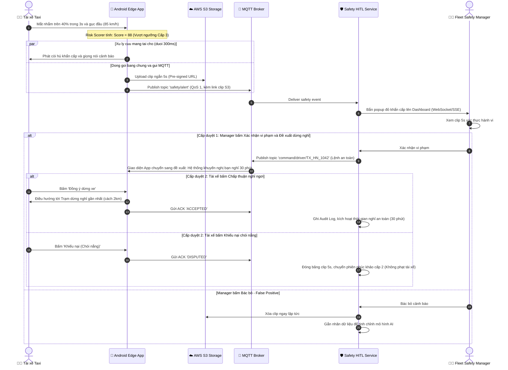
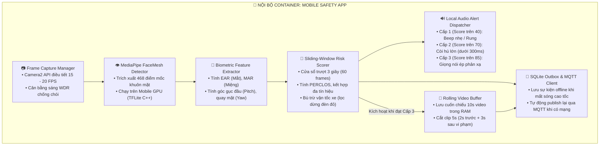

# DRIVERGUARD — THIẾT KẾ HỆ THỐNG TOÀN DIỆN (PHẦN 2)
## TỪ VẤN ĐỀ THỰC TẾ & NGƯỜI DÙNG → TÍNH NĂNG & THÁCH THỨC KỸ THUẬT → LỰA CHỌN CÔNG NGHỆ, LUỒNG DỮ LIỆU & KIẾN TRÚC HOÀN CHỈNH

> **Dành cho:** Báo cáo Phản biện Kiến trúc Chuyên sâu trước Hội đồng Mentor  
> **Định vị:** Bản giải trình nhân quả (Causal Traceability): Mọi quyết định công nghệ đều bắt nguồn từ bài toán thực tế ngoài buồng lái taxi.

---

## 1. TỪ VẤN ĐỀ THỰC TẾ NÀO? (REAL-WORLD PAIN POINTS)

Toàn bộ hệ thống DriverGuard được thiết kế nhằm giải quyết **5 bài toán sinh tử** trong môi trường vận hành thực tế của đội xe taxi công nghệ (đặc thù đội xe 100.000 xe điện Xanh SM):

```
┌──────────────────────────────────────────────────────────────────────────────────┐
│                   5 BÀI TOÁN SỐNG CÒN TRONG VẬN HÀNH THỰC TẾ                     │
│                                                                                  │
│ [1. TAI NẠN TRONG TÍCH TẮC]  ──► Trên cao tốc 90-100 km/h, ngủ gật 1s = chết người│
│ [2. BÁO ĐỘNG SAI GÂY ỨC CHẾ] ──► Chói nắng, ngáp mỏi hàm làm tài xế đình công    │
│ [3. NGHẼN MẠNG 100.000 XE]   ──► 100k xe gửi GPS đồng thời làm sập server Cloud  │
│ [4. BÙNG NỔ CHI PHÍ & ĐỜI TƯ]──► Lưu video 24/7 tốn triệu USD/tháng, bị tài xế kiện│
│ [5. TRANH CHẤP & PHÁP LÝ]    ──► Cần chứng cứ bất biến 3-5 năm khi bị thanh tra  │
└──────────────────────────────────────────────────────────────────────────────────┘
```

### 1.1. Bài toán 1: Tai nạn ngủ gật diễn ra trong tích tắc (< 1 giây) trên cao tốc mất sóng
* **Thực tế:** Một chiếc taxi chở khách chạy trên cao tốc Nội Bài - Lào Cai vào lúc 2 giờ sáng với tốc độ 90 km/h (tương đương **25 mét mỗi giây**).
* **Hiểm họa:** Khi tài xế bắt đầu sụp mi mắt và rơi vào trạng thái ngủ gật vi mô (microsleep) trong 2–3 giây, chiếc xe đã tự trôi mất kiểm soát từ **50 đến 75 mét**.
* **Lỗ hổng công nghệ cũ:** Nếu giải pháp đẩy hình ảnh lên Cloud để máy chủ AI phân tích, độ trễ mạng cộng thời gian xử lý mất từ **2 đến 5 giây** (chưa kể các đoạn đèo dốc sóng 4G chập chờn chỉ còn 1 vạch hoặc mất sóng hoàn toàn). Khi máy chủ nhận diện xong và gửi lệnh hú còi về thì xe đã đâm vào dải phân cách.

### 1.2. Bài toán 2: Báo động sai (False Positives) làm tài xế đình công và tắt ứng dụng
* **Thực tế:** Điều kiện ánh sáng trong xe thay đổi liên tục: ánh nắng chiều rọi xiên thẳng vào kính lái làm tài xế phải nheo mắt; tài xế ngáp dài vì mỏi cơ hàm khi chờ đèn đỏ; hoặc quay đầu sang phải nhìn gương chiếu hậu.
* **Hậu quả:** Nếu mô hình AI đơn giản chỉ nhìn 1 khung hình (single-frame) thấy mắt nhắm đã lập tức hú còi ầm ĩ và tự động trừ điểm thưởng, tài xế sẽ cực kỳ ức chế. Họ sẽ dán băng dính che camera, tắt ứng dụng, thậm chí đình công vì bị "hệ thống AI máy móc phạt oan".

### 1.3. Bài toán 3: Quy mô 100.000 xe di động gửi dữ liệu đồng thời gây sập hạ tầng
* **Thực tế:** 100.000 xe taxi di chuyển liên tục trên toàn quốc, trung bình mỗi xe gửi 1 gói tin định vị GPS và trạng thái mỗi 3 giây. Tổng cộng có hơn **33.000 requests mỗi giây (33k RPS)** đổ về máy chủ.
* **Hậu quả:** Nếu dùng kiến trúc HTTP REST truyền thống, mỗi request gánh kèm 8KB HTTP Header làm tiêu tốn hàng chục Terabyte băng thông thừa. Nếu dùng WebSocket kết nối trực tiếp vào backend server, máy chủ sẽ cạn kiệt bộ nhớ RAM chỉ để duy trì trạng thái kết nối TCP (Connection State) và sập khi đi qua vùng mất sóng hàng loạt.

### 1.4. Bài toán 4: Bùng nổ chi phí lưu trữ Cloud và vi phạm quyền riêng tư cabin
* **Thực tế:** Nếu truyền hình ảnh video liên tục 12 tiếng/ngày từ 100.000 xe lên AWS S3, mỗi tháng hệ thống sẽ phải lưu trữ hơn **1.8 triệu GB video**, tiêu tốn hơn **2.16 triệu USD/tháng (hơn 50 tỷ VNĐ)** chỉ riêng tiền Cloud Storage.
* **Hậu quả pháp lý:** Tài xế và hành khách không bao giờ chấp nhận một chiếc camera ghi hình truyền trực tiếp 24/7 vào không gian riêng tư của họ lên mạng. Hãng xe sẽ đối mặt với các vụ kiện tụng xâm phạm đời tư.

### 1.5. Bài toán 5: Tranh chấp phạt oan và yêu cầu kiểm toán an toàn giao thông
* **Thực tế:** Khi một tài xế bị trừ điểm thi đua tháng hoặc bị đình chỉ cuốc chạy, họ luôn khiếu nại: *"Lúc đó tôi bị chói nắng chứ không ngủ gật!"*. Cơ quan Cảnh sát Giao thông khi điều tra sự cố giao thông cũng yêu cầu trích xuất bằng chứng khách quan đã xảy ra nhiều tháng trước.
* **Hậu quả:** Nếu hệ thống chỉ ghi lại một con số điểm rủi ro (Risk Score) mơ hồ mà không có bằng chứng hình ảnh được con người xác thực và chữ ký kiểm toán (Audit Trail), hãng xe sẽ mất uy tín và thua trong các vụ tranh chấp lao động.

---

## 2. NGƯỜI DÙNG NÀO? (TARGET PERSONAS)

Kiến trúc DriverGuard phục vụ trực tiếp hai nhóm đối tượng người dùng với các động cơ và hành vi hoàn toàn trái ngược:

### 2.1. Chân dung 1: Bác tài Taxi Công nghệ (Driver Persona)
* **Đại diện:** Anh Nguyễn Văn A (38 tuổi), tài xế taxi điện Xanh SM tại Hà Nội.
* **Đặc điểm vận hành:** Lái xe theo ca 10–12 tiếng/ngày, thường xuyên chạy ca đêm (22h – 6h sáng) trên các tuyến cao tốc sân bay Nội Bài hoặc liên tỉnh. Sử dụng smartphone Android cá nhân tầm trung gắn trên giá đỡ taplo bên phải vô lăng.
* **Nỗi sợ lớn nhất:**
  * Sợ ngủ gật gây tai nạn cho bản thân và khách hàng.
  * Sợ bị hệ thống camera "soi mói" đời tư 24/7.
  * Sợ bị AI báo động sai làm giật mình và bị trừ lương oan mà không có cách nào khiếu nại.
* **Kỳ vọng:** Cảnh báo phải chuẩn xác; còi chỉ hú khi thực sự nguy hiểm; có nút bấm khiếu nại minh bạch nếu bị chói nắng; không tốn dung lượng 4G của điện thoại.

### 2.2. Chân dung 2: Cán bộ Quản lý An toàn Đội xe (Fleet Safety Manager Persona)
* **Đại diện:** Chị Trần Thị B (32 tuổi), Trưởng bộ phận Giám sát An toàn Đội xe.
* **Đặc điểm vận hành:** Quản lý một cụm 2.000 – 5.000 xe taxi đang lưu thông trên màn hình trung tâm điều hành. Không có thời gian ngồi xem video của từng xe.
* **Nỗi sợ lớn nhất:**
  * Bị quá tải thông tin (Alert Fatigue): Nếu 100 xe cùng báo động giả, chị sẽ bỏ qua cảnh báo của vụ tai nạn thật.
  * Tranh chấp pháp lý và tài xế đình công vì chính sách an toàn quá khắt khe hoặc phạt nhầm.
* **Kỳ vọng:** Hệ thống tự động lọc bỏ 99% báo động rác; chỉ khi có sự cố Cấp 3 thực sự nguy hiểm mới đẩy popup đỏ kèm **video clip ngắn 5 giây** để chị xem lướt qua trong 3 giây và bấm nút quyết định can thiệp. Mọi quyết định đều được lưu vết pháp lý 3–5 năm.

---

## 3. XÂY DỰNG TÍNH NĂNG NHƯ THẾ NÀO? (FEATURE SPECIFICATIONS)

Từ 5 bài toán và 2 chân dung người dùng trên, hệ thống DriverGuard được cấu thành từ **5 tính năng nghiệp vụ cốt lõi**:

```
┌──────────────────────────────────────────────────────────────────────────────────┐
│                     5 TÍNH NĂNG NGHIỆP VỤ CỐT LÕI (MVP)                          │
│                                                                                  │
│ [1. EDGE AI OFFLINE-FIRST]   ──► Phân tích 20 FPS & Còi hú tại chỗ ≤ 300ms       │
│ [2. 5-LAYER FUSION & HITL]   ──► Bù trừ GPS, Manager duyệt clip 5s, nút khiếu nại│
│ [3. IOT TRANSPORT CHỊU LỖI]  ──► MQTT v5 over TLS + SQLite Outbox chống mất sóng │
│ [4. SNAPSHOT BUFFER 5S]      ──► Chỉ lưu 5s bằng chứng, S3 tự động xóa sau 24h   │
│ [5. AUDIT TRAIL & ANALYTICS] ──► Sổ cái Postgres lưu 3-5 năm + ClickHouse OLAP   │
└──────────────────────────────────────────────────────────────────────────────────┘
```

### 3.1. Tính năng 1: Cảnh báo Phản xạ Cấp cứu On-device ≤ 300ms (Offline-first)
* **Đặc tả:** Toàn bộ chu trình thu nhận hình ảnh, phát hiện khuôn mặt, trích xuất điểm mốc và tính toán điểm rủi ro diễn ra khép kín trong RAM của smartphone.
* **Hành vi:**
  * Khi tài xế nhắm mắt quá 1.2s ở tốc độ cao, còi cảnh báo hú ngay lập tức trong cabin.
  * **100% Offline-first:** Rút SIM điện thoại, tắt Wi-Fi/4G, còi hú vẫn nổ trong buồng lái để cứu mạng tài xế.

### 3.2. Tính năng 2: Multimodal Confidence Fusion & Quy trình Duyệt 2 cấp (2-Tier HITL)
* **Đặc tả:** Loại bỏ báo động sai bằng cách hợp nhất đa cảm biến và đưa con người vào vòng lặp kiểm soát:
  * **Cấp duyệt 1 (Manager Review):** Khi hệ thống nghi ngờ vi phạm Cấp 3, một video clip 5s được gửi về Dashboard. Manager xem và bấm nút [Xác nhận vi phạm] hoặc [Bác bỏ - False Positive].
  * **Cấp duyệt 2 (Driver Choice):** Khi Manager gửi lệnh đề xuất nghỉ ngơi xuống xe, màn hình tài xế hiện 2 nút bấm khổng lồ: [Đồng ý dừng xe] (App tự dẫn đường tới trạm dừng chân gần nhất) hoặc [Khiếu nại] (nếu do chói nắng).

### 3.3. Tính năng 3: Truyền tin Nhẹ Chịu lỗi & Hàng đợi Ngoại tuyến (Durable Outbox)
* **Đặc tả:** Giao thức kết nối siêu nhẹ chuẩn công nghiệp ô tô:
  * Phân tách độ ưu tiên: GPS định kỳ truyền nhanh không cần xác nhận (QoS 0); Sự cố an toàn bắt buộc phải có xác nhận nhận tin (QoS 1 ACK).
  * Khi xe đi vào đường hầm hoặc vùng mất sóng 4G: Sự kiện được ghi bền vững vào cơ sở dữ liệu SQLite cục bộ (Outbox pattern). Khi xe vừa bắt được sóng 4G, tiến trình nền tự động đẩy lại các bản ghi lên máy chủ mà không làm mất thông tin.

### 3.4. Tính năng 4: Cơ chế Snapshot 5s Rolling Buffer & Vòng đời Tự hủy 24h
* **Đặc tả:** Bảo vệ quyền riêng tư và tiết kiệm 99.8% chi phí lưu trữ:
  * Trong điều kiện lái xe bình thường: **Tuyệt đối không lưu bất kỳ video nào** lên bộ nhớ trong hay gửi lên máy chủ. Video chỉ tồn tại cuốn chiếu 10s trong bộ nhớ tạm (RAM) của điện thoại và tự ghi đè liên tục.
  * Khi sự cố Cấp 3 được kích hoạt: Trích xuất đúng **5 giây video** (2s trước vi phạm để làm ngữ cảnh + 3s trong vi phạm làm bằng chứng) → Đẩy lên AWS S3 qua đường dẫn bảo mật có thời hạn (Pre-signed URL).
  * Quy tắc vòng đời: Sau 24–48 giờ, AWS S3 Lifecycle Rule tự động xóa vĩnh viễn tệp video khỏi hệ thống.

### 3.5. Tính năng 5: Sổ cái Kiểm toán Bất biến (Audit Trail) & Phân tích Nhân quả
* **Đặc tả:** Bảo đảm tính minh bạch pháp lý và cung cấp báo cáo chuyên sâu:
  * Ghi nhận lịch sử kiểm toán bất biến (Immutable Audit Log): Lưu vết chính xác ID tài xế, thời gian vi phạm, link clip 5s, ID Manager đã bấm duyệt, lý do duyệt hoặc lý do tài xế khiếu nại. Lưu trữ từ 3 đến 5 năm trong PostgreSQL phục vụ thanh tra giao thông.
  * Phân tích nhân quả (Causal Safety Analytics): Truy vấn dữ liệu lớn để trả lời các câu hỏi vận hành cốt lõi: *Tài xế chạy ca liên tục trên 4 tiếng thì xác suất vi phạm ngủ gật tăng bao nhiêu phần trăm?*

---

## 4. VỚI TÍNH NĂNG NÀY THÌ CẦN PHẢI XỬ LÝ VẤN ĐỀ GÌ? (TECHNICAL CHALLENGES & EDGE CASES)

Để các tính năng trên không chỉ nằm trên lý thuyết mà chạy ổn định trên 100.000 xe thực tế, đội ngũ kỹ thuật phải giải quyết **4 thách thức kỹ thuật hóc búa**:

```
┌──────────────────────────────────────────────────────────────────────────────────┐
│                   4 THÁCH THỨC KỸ THUẬT & GIẢI PHÁP TRIỂN KHAI                   │
│                                                                                  │
│ [1. GÓC ĐẶT CAMERA NGHIÊNG]  ──► Bù trừ sai số tĩnh Yaw Offset (15° - 30°)       │
│ [2. CHÓI NẮNG & CHIẾU XIÊN]  ──► Đổi cờ SENSOR_UNCERTAIN, không đoán mò bừa bãi  │
│ [3. MẤT SÓNG CAO TỐC & HẦM]  ──► SQLite Durable Outbox + Idempotency Event Dedupe│
│ [4. BÙNG NỔ BĂNG THÔNG VIDEO]──► Tách rời luồng Video qua S3, không qua MQTT     │
└──────────────────────────────────────────────────────────────────────────────────┘
```

### 4.1. Thách thức 1: Góc đặt camera lệch nghiêng trên Taplo (Yaw Offset)
* **Vấn đề:** Trong xe taxi thực tế, smartphone không thể gắn ngay trước mặt tài xế (vì che khuất tầm nhìn kính lái). Giá đỡ điện thoại luôn được gắn trên taplo bên phải, chĩa chéo sang mặt tài xế một góc **15° đến 30°**.
* **Hậu quả:** Khi tài xế đang nhìn thẳng vào làn đường phía trước, góc quay đầu đo được (Head Yaw) đã bị lệch sẵn 15° – 30° so với trục camera. Ngoài ra, con mắt ở xa camera sẽ trông nhỏ hơn con mắt ở gần camera, khiến thuật toán tính tỷ lệ mở mắt EAR (Eye Aspect Ratio) bị sai lệch.
* **Giải pháp kỹ thuật:**
  1. Thiết lập cơ chế **Auto-Calibration (Tự hiệu chỉnh tĩnh)**: Khi xe bắt đầu chạy ổn định trên 20 km/h trong 30 giây đầu tiên, hệ thống lấy mẫu tư thế đầu trung bình để làm điểm gốc (Baseline Pitch & Yaw Offset), mọi tính toán sau đó đều trừ đi góc lệch tĩnh này:
     `Yaw_calibrated = Yaw_raw - Yaw_baseline`
  2. Áp dụng chuẩn hóa EAR động riêng biệt cho từng mắt để bù trừ biến dạng phối cảnh chéo.

### 4.2. Thách thức 2: Hiện tượng Chói nắng gắt (Direct Sun Glare) & Ngược sáng
* **Vấn đề:** Khi xe chạy hướng Tây lúc hoàng hôn hoặc qua các hàng cây bóng râm nhấp nháy, ánh nắng chiếu thẳng vào ống kính làm khuôn mặt bị cháy sáng cục bộ hoặc tối đen (silhouette).
* **Hậu quả:** Mô hình AI không nhìn rõ mắt, điểm tin cậy mốc khuôn mặt suy giảm nghiêm trọng. Nếu cố phân tích, AI sẽ tưởng mắt đang nhắm và hú còi sai.
* **Giải pháp kỹ thuật (Lớp 1 Fusion):**
  * Kích hoạt chế độ cân bằng sáng ngược (WDR - Wide Dynamic Range) thông qua Camera2 API.
  * Kiểm soát ngưỡng tin cậy cảm biến: Nếu độ tin cậy trích xuất MediaPipe < 0.75 hoặc độ sáng khung hình vượt ngưỡng chói cực đại, thuật toán **gắn cờ `SENSOR_UNCERTAIN` và đóng băng điểm rủi ro**, tuyệt đối không đoán mò bừa bãi.

### 4.3. Thách thức 3: Mạng chập chờn, rớt kết nối và trùng lặp gói tin (Duplication)
* **Vấn đề:** Xe chạy qua hầm đèo mất kết nối 4G trong 5 phút. Khi vừa ra khỏi hầm, mạng 4G chập chờn có lại rồi lại mất, gây ra hiện tượng gửi lặp nhiều lần (Duplicate Messages) hoặc gửi thiếu gói tin an toàn.
* **Giải pháp kỹ thuật:**
  * **Cơ chế Outbox Transaction:** Mọi sự cố an toàn được sinh ra đều được cấp một mã duy nhất `eventId = UUIDv4 + Timestamp`. Sự kiện lưu vào bảng SQLite nội bộ trên điện thoại trước khi đẩy ra mạng.
  * **Idempotent Ingestion tại Backend:** Tại máy chủ Ingestion Worker, mọi sự kiện từ MQTT đổ về đều được kiểm tra trùng lặp qua bảng cache phân tán Redis (TTL 1 giờ). Nếu `eventId` đã được xử lý, bản tin sau sẽ tự động bị loại bỏ, tránh việc Manager bị bắn 2 lần cùng một vụ việc.

### 4.4. Thách thức 4: Bùng nổ băng thông mạng video làm nghẽn Broker
* **Vấn đề:** Nếu 500 chiếc xe trên toàn quốc cùng gặp sự cố và cùng gửi file video 5s qua giao thức MQTT lên Broker, cụm Broker sẽ lập tức bị nghẽn nghẹt đường truyền, dẫn tới việc hàng chục nghìn gói tin GPS khác bị chậm trễ.
* **Giải pháp kỹ thuật:**
  * **Tách rời hoàn toàn luồng Text và luồng Video:** Video MP4 tuyệt đối không đi qua MQTT Broker.
  * Xe xin đường dẫn upload tạm thời (Pre-signed URL S3) thông qua một request HTTPS REST siêu nhẹ → Xe đẩy file MP4 thẳng lên AWS S3 → Xe chỉ gửi một chuỗi URL text ngắn (50 bytes) qua MQTT Broker để báo cáo cho Backend.

---

## 5. XÂY DỰNG TÍNH NĂNG ĐẤY CẦN SỬ DỤNG CÔNG NGHỆ GÌ & TẠI SAO? (TECH STACK JUSTIFICATION)

Bảng đối đầu công nghệ chứng minh sự vượt trội và tối ưu chi phí của DriverGuard so với các giải pháp thông thường:

```
┌─────────────────────────────────────────────────────────────────────────────────────────┐
│                           BẢNG ĐỐI ĐẦU CÔNG NGHỆ DRIVERGUARD                            │
│                                                                                         │
│  TẦNG KIẾN TRÚC  │   CÔNG NGHỆ ĐƯỢC CHỌN (DRIVERGUARD)   │     CÔNG NGHỆ THAY THẾ BỊ LOẠI       │
│ ─────────────────┼───────────────────────────────────────┼──────────────────────────────────── │
│  1. Edge AI      │ 📱 MediaPipe C++ / TFLite On-device   │ ❌ YOLOv8 Cloud / Camera chuyên dụng │
│  2. Transport    │ ⚡ MQTT v5 over TLS (Port 8883)       │ ❌ HTTP REST API / WebSocket thuần │
│  3. Media Storage│ ☁️ AWS S3 + 24h Lifecycle Rules       │ ❌ Stream Video 24/7 / NVR Ổ cứng   │
│  4. Persistence  │ 💾 PostgreSQL (ACID) + ClickHouse     │ ❌ 1 Cơ sở dữ liệu MySQL duy nhất  │
│  5. Dashboard    │ 🖥️ Server-Sent Events (SSE) + Next.js │ ❌ Polling REST liên tục mỗi 2s     │
└─────────────────────────────────────────────────────────────────────────────────────────┘
```

| Tầng công nghệ | Công nghệ được chọn | Công nghệ thay thế bị loại | Lý do vượt trội & Tối ưu chi phí của DriverGuard |
| :--- | :--- | :--- | :--- |
| **Edge AI & Vision** | **MediaPipe FaceMesh (TFLite C++) chạy trên Android GPU** | • YOLOv8 chạy trên GPU Cloud<br>• Camera chuyên dụng DSM đắt đỏ | • **Tiết kiệm hàng chục triệu USD:** Tận dụng điện thoại có sẵn của tài xế, không tốn 200–500 USD/xe mua camera ngoài.<br>• **0 đồng tiền GPU Cloud:** Xử lý on-device 20 FPS hoàn toàn miễn phí, không tốn 1.2 USD/giờ thuê GPU Cloud.<br>• **Cứu mạng ≤ 300ms:** Chạy native bằng C++ trên chip điện thoại, không phụ thuộc mạng. |
| **Truyền tin (Transport)** | **MQTT v5 over TLS (EMQX Cluster - Port 8883)** | • HTTP REST API<br>• WebSocket thuần | • **Header siêu nhẹ chỉ 2 bytes:** So với HTTP Header 8KB, giảm 99.8% băng thông 4G của đội xe.<br>• **Tiết kiệm 90% RAM máy chủ:** Kiến trúc Pub/Sub của EMQX cho phép cụm máy chủ 2GB RAM duy trì 100.000 kết nối đồng thời.<br>• **Chống mất mạng:** Hỗ trợ cơ chế QoS 1 bắt buộc nhận tin và Keep-alive tự kết nối lại. |
| **Lưu trữ Media** | **AWS S3 Object Storage + S3 Lifecycle Rule (TTL 24h)** | • Stream video 24/7 lên Cloud<br>• Gắn ổ cứng NVR trên xe | • **Chi phí chỉ vài chục nghìn đồng/tháng:** Chỉ lưu clip 5s vi phạm thật; sau 24h AWS S3 tự động xóa sạch, chi phí lưu trữ cho 100k xe chưa tới 20 USD/tháng (so với 2.16 triệu USD/tháng nếu stream liên tục).<br>• **Bảo vệ quyền riêng tư tuyệt đối:** Không ai có thể xem camera khi tài xế đang lái xe bình thường. |
| **Cơ sở dữ liệu (Persistence)** | **PostgreSQL (ACID Ledger) + ClickHouse (Time-series OLAP)** | • Sử dụng 1 DB duy nhất (MySQL / MongoDB) cho mọi tác vụ | • **PostgreSQL:** Bảo đảm tính toàn vẹn giao dịch ACID, lưu trữ Sổ cái an toàn và Audit Log trong 3–5 năm không bị sai lệch dữ liệu.<br>• **ClickHouse:** Tối ưu hóa lưu trữ dạng cột (Columnar), nén dữ liệu GPS gấp 10 lần, cho phép truy vấn hàng trăm triệu điểm GPS phục vụ báo cáo nhân quả chỉ trong 0.2 giây. |
| **Giao tiếp Quản trị (Dashboard)** | **Server-Sent Events (SSE) + React / Next.js** | • Polling HTTP liên tục mỗi 2 giây | • **Đẩy cảnh báo dưới 100ms:** Khi Backend có sự cố Cấp 3, dòng dữ liệu SSE lập tức bắn popup đỏ lên màn hình Manager mà không có độ trễ.<br>• **Không gây quá tải CPU máy chủ:** Loại bỏ hoàn toàn hàng triệu request Polling vô ích khi không có sự cố. |

---

## 6. LUỒNG DỮ LIỆU NHƯ THẾ NÀO? (END-TO-END RUNTIME FLOW & DATA CONTRACTS)

### 6.1. Sơ đồ Luồng Tuần tự Mức C4: Quy trình Xử lý Cứu mạng & Duyệt 2 cấp (HITL)

Sơ đồ thể hiện chính xác hành trình cứu mạng khi xe đang chạy 85 km/h trên cao tốc:



---

### 6.2. Hợp Đồng Dữ Liệu Chuẩn Hóa (Data Contracts)

#### A. Hợp đồng Cảnh báo Vi phạm An toàn (`safety/alert` — QoS 1)
```json
{
  "eventId": "evt_hn_88294a_20260928_021530",
  "driverId": "TX_HN_1042",
  "vehicleId": "29E_88899",
  "timestamp": 1790604930000,
  "telemetry": {
    "speedKmh": 85.4,
    "gps": { "lat": 21.2384, "lng": 105.8142 },
    "continuousDrivingMinutes": 254
  },
  "riskAssessment": {
    "aggregateScore": 88.5,
    "severityLevel": "LEVEL_3_CRITICAL",
    "metrics": {
      "perclos3s": 0.82,
      "headPitchDeg": -24.5,
      "headYawDeg": 4.2,
      "faceConfidence": 0.94
    }
  },
  "evidence": {
    "clipDurationSeconds": 5.0,
    "s3ClipUrl": "https://driverguard-evidence.s3.ap-southeast-1.amazonaws.com/clips/2026/09/28/evt_hn_88294a.mp4",
    "expiresAt": 1790691330000
  }
}
```

#### B. Hợp đồng Lệnh Can thiệp An toàn (`command/driver/TX_HN_1042` — QoS 1)
```json
{
  "commandId": "cmd_safe_99120",
  "eventId": "evt_hn_88294a_20260928_021530",
  "issuedBy": "manager_tran_b_04",
  "timestamp": 1790604945000,
  "actionType": "RECOMMEND_REST_STOP",
  "payload": {
    "message": "Cán bộ An toàn khuyến nghị bác tài dừng nghỉ 30 phút để bảo đảm an toàn tính mạng.",
    "mandatoryRestMinutes": 30,
    "nearestRestStop": {
      "name": "Trạm dừng nghỉ Km 42 Cao tốc Nội Bài - Lào Cai",
      "distanceMeters": 2100,
      "lat": 21.2512,
      "lng": 105.8290
    }
  }
}
```

---

## 7. HỆ THỐNG HOÀN CHỈNH RA LÀM SAO? — THIẾT KẾ KIẾN TRÚC & CHẤT KEO HỆ THỐNG

### 7.1. Sơ đồ Mức C3: Phân Rã Component Nội Bộ Mobile Safety App (On-Vehicle Edge)

Mô tả chi tiết pipeline xử lý dữ liệu sinh trắc học và còi hú cục bộ bên trong điện thoại:



---

### 7.2. "Chất Keo Dán" 4 Trục Huyết Mạch Kết Nối Toàn Bộ Hệ Thống

Để hàng trăm component phân tán từ 100.000 thiết bị biên đến cụm máy chủ đám mây hoạt động gắn kết như một khối thống nhất, hệ thống dựa vào **4 trục huyết mạch kết nối (System Glue)**:

```
                  ┌───────────────────────────────────────────────────────────┐
                  │                 HẠ TẦNG "CHẤT KEO DÁN"                    │
                  └───────────────────────────────────────────────────────────┘
                                                │
         ┌───────────────────────┬──────────────┴────────┬──────────────────────┐
         ▼                       ▼                       ▼                      ▼
  [TRỤC 1: REALTIME]      [TRỤC 2: EVIDENCE]      [TRỤC 3: COMMAND]     [TRỤC 4: PERSISTENCE]
  MQTT v5 over TLS        Pre-signed URL HTTPS    SSE / WebSocket       Dual-Storage DB
  • Port 8883             • Tách rời khỏi Broker  • Đẩy cảnh báo <100ms • Postgres ACID: Sổ cái
  • Header chỉ 2 bytes    • Đẩy thẳng lên S3      • REST API nhận lệnh  • ClickHouse: Time-series
  • Pub/Sub 100.000 xe    • S3 tự xóa sau 24h     • Duyệt 2 cấp HITL    • Báo cáo tương quan
```

1. **Trục 1 — Luồng Sự Kiện Thời Gian Thực (MQTT v5 over TLS — Port 8883):**
   * *Bản chất kết nối:* Là chất keo kết nối giữa 100.000 xe và Backend Platform.
   * *Đặc tính kỹ thuật:* Sử dụng mô hình Publish/Subscribe bất đối xứng. Xe không có IP tĩnh nên Backend không thể tự gọi đến xe. Xe chỉ cần duy trì một kết nối TCP nhẹ tới MQTT Broker. Với Header chỉ 2 bytes, toàn bộ hệ thống tiết kiệm được 99% băng thông so với HTTP REST.
2. **Trục 2 — Luồng Bằng Chứng Media Độc Lập (Pre-signed URL HTTPS):**
   * *Bản chất kết nối:* Là chất keo kết nối giữa Bộ đệm video của điện thoại với AWS S3 Object Storage.
   * *Đặc tính kỹ thuật:* Cách ly hoàn toàn dữ liệu media nặng ra khỏi cụm MQTT Broker. Điện thoại xin URL cấp quyền tạm thời (có hạn 10 phút) rồi đẩy thẳng file MP4 (1.5 MB) lên S3. Broker chỉ gánh một dòng text URL 50 bytes.
3. **Trục 3 — Luồng Giám Sát & Điều Phối Web (Server-Sent Events + REST API):**
   * *Bản chất kết nối:* Là chất keo kết nối giữa Backend Platform với trình duyệt Web của Cán bộ An toàn.
   * *Đặc tính kỹ thuật:* Máy chủ mở một kênh SSE liên tục tới Web Dashboard. Khi có sự cố Cấp 3, dữ liệu được "bắn" ngay lập tức xuống màn hình trong < 100 ms. Lệnh can thiệp của Manager được gửi lại máy chủ qua giao thức chuẩn HTTPS REST API có ký danh xác thực.
4. **Trục 4 — Luồng Dữ Liệu Phân Tầng Bền Vững (PostgreSQL ACID + ClickHouse OLAP):**
   * *Bản chất kết nối:* Là chất keo kết nối giữa logic nghiệp vụ với tầng lưu trữ vĩnh cửu.
   * *Đặc tính kỹ thuật:* Không bắt một cơ sở dữ liệu làm mọi việc. PostgreSQL đóng vai trò Sổ cái kiểm toán an toàn (Safety Ledger), ghi nhận mọi quyết định phê duyệt và khiếu nại (bảo đảm tuân thủ pháp lý trong 3–5 năm). ClickHouse chuyên trách gánh hàng tỷ điểm dữ liệu GPS và vi phạm chuỗi thời gian, giúp tạo báo cáo tương quan nhân quả tức thì.

---

## 8. TỔNG KẾT BẢN THIẾT KẾ CHO BUỔI BẢO VỆ MENTOR

Bản thiết kế hệ thống DriverGuard đạt được sự cân bằng hoàn hảo giữa **3 trụ cột sống còn**:

1. **Tính Khả Thi & Sống Còn Ngoài Thực Tế:** Cứu mạng tức thời dưới 300ms, chạy offline 100% khi mất mạng, giải quyết triệt để vấn đề chói nắng và góc nghiêng camera bên phải taplo.
2. **Tính Tối Ưu Chi Phí Triệt Để (TCO):** Tiết kiệm hơn 20 triệu USD vốn đầu tư thiết bị nhờ tận dụng smartphone của tài xế; tiết kiệm hơn 2 triệu USD/tháng chi phí Cloud nhờ cơ chế snapshot clip 5s tự hủy sau 24h và giao thức MQTT siêu nhẹ.
3. **Tính Nhân Văn & Tuân Thủ Pháp Lý:** Không phạt nhầm tài xế nhờ quy trình duyệt 2 cấp (HITL) và nút khiếu nại 1-chạm; lưu trữ Sổ cái an toàn bất biến trong 3–5 năm đáp ứng đầy đủ yêu cầu kiểm toán giao thông vận tải.
